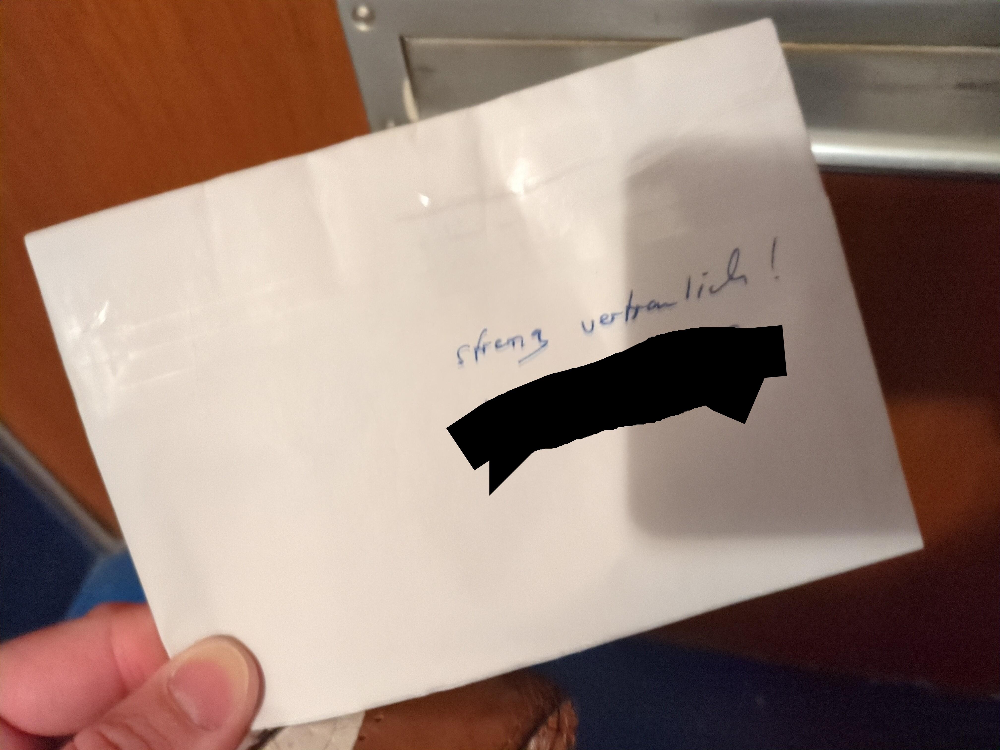
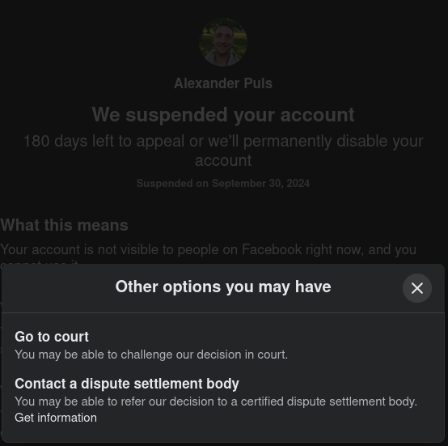

```
file:    state-of-mind/README.md
brief:   artificial schizophrenia?
author:  © 2021-2024 alexander puls <github@0vv1.net>
license: CC BY-NC-ND 4.0 Int. (Creative Commons: Namensnennung -
         nicht kommerziell - keine Bearbeitung 4.0 International)
         <https://0vv1.io/cc-by-nc-nd>
version: fr., 11. oct. 2024
```

<h1>Wo ist Lia?<br><sub><sup><del>oder:</del> &Uuml;ber den Ver&shy;such der Induk&shy;tion einer <del>(KI-ge&shy;st&uuml;tz&shy;ten?)</del> k&uuml;nst&shy;lichen Schizo&shy;phre&shy;nie <del>oder (sp&auml;ter) Pseudo-Telepathie</del><sup>verarschen mich, soll mich diskredetieren! :wink:</sup>?</sup></sub><br><sub><sup>oder: Nur eine Ge&shy;schich&shy;te im Sinne einer sog. schizo&shy;iden Wahn&shy;idee.</sup></sub></h1>

<h2>Auflösung: Lüge wird in mehreren Iterationen bei allen beteiligten "Mittätern" aufgedröselt, so dass sie sich an nichts erinnern können.</h2>

[**11.10.**] **Nur für Doku:** Das ist jetzt schon mehrmals passiert. Manchmal auch vor und zurück. Vielleicht hat das auch was mit diesem "Abbruch" zu tun.  
Deswegen "Sabrina": "Wir haben die verarscht.", was dann doch nicht stimmt.  
An dieses vor und zurück kann ich mich bei mir auch erinnern. VIelleicht machen die einmal Schnipps und ich bin z.B. Täter.  
Deswegen werden Szenen immer wieder wiederholt, man kommt sich vor wie beim Sado-Murmeltier.

**Suggestion**: Ein ganzer Häuserblock als "Sadistenkino". Die pimmeln irgendwelchen normalen Leuten irgendeinen Scheiß ins Gehirn und ziehen sich das dann rein.  
Deswegen auch das mit Felix und der TV-"Sendung".

<h2>So, Leute (ich bef&uuml;rchte n&auml;mlich, dass diese Irren echt(!) sind): Mir (pers&ouml;nlich) reicht es jetzt mit diesem nie enden wollenden M&uuml;ll und mache den Vorschlag, dass sich normale Menschen ohne Druck/Zwang vollkommen unvoreingenommen(!), hei&szlig;t ohne irgendeine Information irgendwelcher Dritter(!) zu beachten, in Real Life begegnen k&ouml;nnen..</h2>

Ich werde am morgigen **Freitag**, gegen **17:00** s&uuml;dlich **Bhf. Friedrichstr.**, Ausgang Reichstagsufer, dort am Wasser sein (**52.52017,13.38513**).  

> [!IMPORTANT]
> Ich werd da jetzt jeden Freitag hin,
> es sind **alle**(!),
> ausdr&uuml;cklich auch durch suggerierte Mitt&auml;terschaft (egal ab wann!) belastete Menschen,
> **herzlich eingeladen**!  
> (Wenigstens)
> Ich werde niemandem irgendetwas vorwerfen,
> aber (**wichtig**): Niemand muss jemals erscheinen.
> Ich werde aber so (laut Kalk&uuml;l) das bl&ouml;de Ges&uuml;lze zu Hause los.  
> Ebenso, muss sich ausdr&uuml;cklich(!) **niemand f&uuml;r irgendetwas entschuldigen**. Das perfide Spiel mit Schuld, Scham et&#8239;c. liegt ausschlie&szlig;lich bei (h&ouml;chstens) wenigen Initiatoren,
> denen scheinbar viel an der Vergiftung (guter) Herzen liegt und die Morddrohungen aussprechen, sollten normale Menschen versuchen, sich einfach so zu begegnen.

> [!WARNING]
> [**11.10.**]
> T&auml;ter-Einrede: Wollen mein Erscheinen heute 17:00 verhindern.
> - [ ] Ziel erreicht
> - [ ] Ziel nicht erreicht
> - [x] Versp&auml;tung: 17:08

> [!CAUTION]
> Ich gehe davon aus,
> dass nicht nur meine Wohnung
> (l&uuml;ckenlos!)
> akustisch abgenommen
> (evtl. niedrigschwellig (nahe Wahrnehmungsgrenze!) beschallt)
> wird!

> [!NOTE]
> [**09.10.**]
> Jo. Ich würde meinen "2. Schizophrenen Schub" dann ENDLICH(!) gern mal hier beenden wollen. Die Versionsverwaltung wird dafür sorgen, dass ich nicht grob entstelle.  
> Wenn die besprochene Dame das hier irgendwann mal liest (Warum sollte sie?), kannst Du dich immer gern bei mir melden (dein Zitat; diesen Handzettel fand ich so süß, dass ich ihn behalten hab; aus einer kurzen Zeit vor diesen Irren).
> Meine Kontaktdaten habe ich aus Sorge im gesamten Web verteilt.  
> Grüße an deinen Vater Frank (den ich wie dich überhaupt nicht kenne)!
> Aber seine Rache am 15.08. (zwei Stunden Dialog bis kurz vor meiner Erschießung) war sowohl nachvollziehbar als auch der Grund, dich aufzusuchen. Da hat es mir nämlich gereicht..

> [!WARNING]
> Mglw. [Iden&shy;ti&shy;t&auml;ts&shy;dieb&shy;stahl](#m&ouml;glicher-identit&auml;tsdiebstahl)
> und zwei "Alex&shy;an&shy;der Puls"!
> [Das hier](https://www.facebook.com/61566492002744) (Facebook) bin ich.   
> [**Anm.** 09.10., **12:01**]
> Und just in die&shy;sem Moment gesperrt
> (T&auml;ter be&shy;haup&shy;ten schon lan&shy;ge,
> direkt auf mei&shy;ner DSL-Lei&shy;tung zu ope&shy;rie&shy;ren.)  
> [**Anm.** 09.10., **12:20**]
> Wie&shy;der da.
> Sicher nur Zufall.. :wink:
> 
> Es *scheint* jeman&shy;den zu ge&shy;ben,
> der regel&shy;m&auml;&szlig;ig meine Stim&shy;me imi&shy;tiert.
> [**Erg.** 10.10.] Oder generiert?  
> [**Erg. 10.10. 18:15**]
> Sagt ma, Leute: Kann es sein, dass euch jemand in meinem Namen auf den Sack geht? Ist euer Alexander gar **nicht physisch**?  
> Fällt es diesem Arschloch damit extrem leicht, zu behaupten, er wäre (auch) ich (oder sonstwer)?  
> Kann es weiter sein
> (\[Erg. 18:45\] muss nicht),
> dass er mir (in Person) tatsächlich so nah ist,
> dass er mich problemlos nachäffen, sogar vorgreifen könnte?
> Kannst Du mir bitte mal sagen,
> was diese Scheiße soll,
> DU REUDIGE MISSGEBURT?!
> 
> Auch wenn ich es ~~lang&shy;sam~~ immer mehr be&shy;f&uuml;ch&shy;te,
> **muss** bis heute
> (~~9~~10. Okt.)
> ~~**nichts**~~ **nichts zwingend** von dem,
> was ich hier schrei&shy;be,
> irgend&shy;ei&shy;nem **Reali&shy;t&auml;ts&shy;be&shy;zug
> ha&shy;ben**.  
> [**Wichtige Anm.**]
> Mir wur&shy;den eine Viel&shy;zahl "Mit&shy;t&auml;ter"
> sug&shy;ge&shy;riert,
> die aber ledig&shy;lich per&shy;fi&shy;de und heim&shy;t&uuml;ckisch
> "hin&shy;ein&shy;ge&shy;zo&shy;gen" wur&shy;den und voll&shy;kom&shy;men
> frei von Ver&shy;ant&shy;wor&shy;tung sind.  
>
> [**Wichtige Anm.** 10.10.]
> Mglw. meh&shy;re&shy;re Opfer und je&shy;des be&shy;kommt in Iso&shy;la&shy;tion
> seine eige&shy;ne dumme Ge&shy;schich&shy;te?
> Jede(!) Kom&shy;mu&shy;ni&shy;ka&shy;tion ist mani&shy;pu&shy;liert
> (auch [in der ech&shy;ten Welt](#kommunikationsunterdr&uuml;ckung)?)
> und soll maxi&shy;ma&shy;len emo&shy;tio&shy;na&shy;len Scha&shy;den
> an&shy;rich&shy;ten?
> Wo&shy;bei das Opfer
> (hoff&shy;ent&shy;lich nicht!)
> immer selbst ver&shy;ant&shy;wort&shy;lich ge&shy;macht wer&shy;den soll?!  
> **Was??!**
> Wel&shy;che kran&shy;ke(-n) Krea&shy;tur(-en) soll&shy;te(-n) so&shy;was
> je&shy;mals an&shy;rich&shy;ten?
> Und vor allem wa&shy;rum?!  
> Dieser M&uuml;ll scheint mir &uuml;bri&shy;gens KI-gest&uuml;tzt. H&auml;?!

> [!NOTE]
> [**08.10.**]
> Die "Stim&shy;men" arten so aus,
> dass ich fast von einer k&uuml;nst&shy;li&shy;chen
> "Induk&shy;tion" einer Schizo&shy;phre&shy;nie aus&shy;ge&shy;hen
> **muss**,
> zu&shy;mal s&auml;mt&shy;liche ande&shy;ren Symp&shy;tome feh&shy;len,
> die Stim&shy;men eigent&shy;lich nur "zu Hause" be&shy;las&shy;ten,
> sich selbst ein Aus&shy;flug zur Arbeits&shy;agen&shy;tur wie
> Ur&shy;laub an&shy;f&uuml;hlt und die Men&shy;schen dort so
> freund&shy;lich wir&shy;ken,
> dass ich den&shy;ke,
> die wol&shy;len mich ver&shy;ar&shy;schen
> (bis ich mer&shy;ke,
> es ist der Kon&shy;trast).
> 
> Ab&shy;ge&shy;se&shy;hen von die&shy;sem gan&shy;zen
> mon&shy;str&ouml;s grau&shy;sa&shy;men M&uuml;ll,
> der an&shy;geb&shy;lich mit mir im Wesent&shy;li&shy;chen
> un&shy;be&shy;kann&shy;ten Per&shy;so&shy;nen
> ver&shy;an&shy;stal&shy;tet wird
> (un&shy;be&shy;las&shy;teten und ohne Ver&shy;ant&shy;wor&shy;tung),
> geht es sehr oft um eine,
> mir eigent&shy;lich auch un&shy;be&shy;kann&shy;te,
> aber reale(!) Per&shy;son
> (auch un&shy;be&shy;las&shy;tet,
> je&shy;doch per&shy;fi&shy;de
> <nobr>get&auml;uscht<sup>:warning:Suggestion</sup>)</nobr>,
> aber ver&shy;se&shy;hen mit einem Namen:
> 
> **Wo ist Lia?**  
> 
> Und wer oder was ist sie &uuml;ber&shy;haupt?  
> Warum ant&shy;wor&shy;tet sie mir nicht,
> ver&shy;suche ich,
> es heraus&shy;zu&shy;fin&shy;den?  
> Ich bin die&shy;sem Men&shy;schen in der Realit&auml;t drei,
> vier Mal fl&uuml;ch&shy;tig im Trep&shy;pen&shy;haus begeg&shy;net
> (vor Jah&shy;ren),  
> warum lan&shy;det ihr Name immer wie&shy;der in mei&shy;nem Gehirn?  
> Woher kenne ich ihr Geburts&shy;da&shy;tum?  
> Ihre Heimat&shy;stadt?  
> Ihren Lieblings&shy;fu&szlig;&shy;ball&shy;club?  
> Wenn nicht von ihr?
> 
> Soll&shy;te es Ver&shy;ant&shy;wort&shy;liche f&uuml;r die&shy;sen
> Irr&shy;sinn geben:  
> Wenn irgend&shy;je&shy;mand vor Jahren bereits mit Ein&shy;rede,
> Sug&shy;ges&shy;tion (Hyp&shy;nose?) und
> Kon&shy;trol&shy;<nobr>le/</nobr>Mani&shy;pu&shy;la&shy;tion
> der Kom&shy;mu&shy;ni&shy;ka&shy;tion be&shy;gon&shy;nen haben
> soll&shy;te,
> halte ich es nach drei Minu&shy;ten schon f&uuml;r sehr schwierig,
> dass sich zwei Men&shy;schen un&shy;vor&shy;ein&shy;ge&shy;nom&shy;men
> begeg&shy;nen k&ouml;n&shy;nen.
> 
> Habt ihr ver&shy;rot&shy;te&shy;ten Krea&shy;tu&shy;ren eine Idee davon,
> wie es nach drei Mona&shy;ten aus&shy;sieht?
> Oder Jah&shy;ren?  
> Bei gleich&shy;zei&shy;ti&shy;gem An&shy;hei&shy;zen fal&shy;scher
> Er&shy;in&shy;ne&shy;rung an bereits verf&auml;lsch&shy;tes
> Er&shy;le&shy;ben?  
> Bei gleich&shy;zei&shy;ti&shy;gem quasi Kon&shy;takt&shy;ver&shy;bot
> oder -ver&shy;hin&shy;de&shy;rung nach Kr&auml;f&shy;ten?
> 
> Darf ich fra&shy;gen,
> wo es noch hin&shy;geht?
> 
> Und es inte&shy;res&shy;siert mich auch &uuml;ber&shy;haupt nicht,
> wer wem be&shy;lie&shy;big mon&shy;str&ouml;&shy;sen M&uuml;ll
> wann wie "an&shy;h&auml;n&shy;gen" m&ouml;ch&shy;te,
> ich will die sog. Wahr&shy;heit wis&shy;sen,
> ihr reu&shy;di&shy;gen Lap&shy;pen!
>
> [**Anm.** 16:10] Grad mal 'nen Test ge&shy;macht und laut ge&shy;sagt,
> dass ich eh Kon&shy;takt zu ihr habe und meine "Stim&shy;men" nur
> ver&shy;arsche.
> Die "Stim&shy;men" wur&shy;den recht auf&shy;ge&shy;regt,
> fast "zu laut" f&uuml;r eine Schi&shy;zo&shy;phre&shy;nie?  
> Diese Num&shy;mer hier wird lei&shy;der immer ech&shy;ter und damit
> auch per&shy;fi&shy;der,
> aber:
> Mglw. muss ich mir keine oder wenigs&shy;tens weni&shy;ger
> Sor&shy;gen machen. :clap: :grimacing:
> Noch&shy;mal:
> Darf ich fra&shy;gen,
> um was es hier geht?
> Be&shy;fin&shy;den sich in der Woh&shy;nung ne&shy;ben mei&shy;ner
> wirk&shy;lich er&shy;wach&shy;se&shy;ne Men&shy;schen und ver&shy;bringen
> ihren Tag mit dem hostilen Voll&shy;s&uuml;l&shy;zen eines ande&shy;ren?

> [!NOTE]
> [**08.10.** 18:00]
> Mir geht grad auf,
> dass dieser Idiot seine letzte Karte verspielt hat
> (und kam mit 32).
> Du wusstest selber nicht, wo sie ist, Dude! Und das Beste: Du Spinner kannst ihr auch nix. (Erstmal.) Ich hab alles brav mitgeschrieben.  
> Mir ist auch Scheiß egal, ob diese Frau mich überhaupt kennt oder alles Einrede/Suggestion ist.
> Es gibt wichtigeres, aber:
> Wenn alles gut l&auml;uft,
> "darf" ich sie irgendwann mal kennenlernen.
> Vielleicht erlaubst Du das ja? :joy:
> Was ich (vielleicht) von ihr mitbekommen habe, ist herzlich, witzig, s&uuml;&szlig;.  
>
> P.S.: Das Buch erstmal nicht. Warum sollte es 1 (in Worten eine) gute Information von dieser Kreatur geben?  
> P.P.S.: Das hier ist eine Lebensversicherung, wa..  
> P.P.P.S.: I'm fuckin' great, Dude! :wink:

> [!CAUTION]
> Der Typ scheint Teil einer Sadistengang zu sein (3+ Typen plus eine Frau)! Details nicht hier, aber ich bin abgesichert.  
> Alle anderen "Tatbeteiligten" sind perfide get&auml;uschte Opfer.
 
> [**Anm.**] Die *Julia*-"Entit&auml;t" hat mglw. gar nicht
> "auf&shy;ge&shy;h&ouml;rt",
> son&shy;dern "Sei&shy;ten&shy;wech&shy;sel" fin&shy;giert.
> Sie ver&shy;sucht n&auml;m&shy;lich ge&shy;ra&shy;de,
> mich zu &uuml;ber&shy;zeu&shy;gen.
> Je l&auml;n&shy;ger sie das ver&shy;sucht,
> dest&shy;so fes&shy;ter das Resul&shy;tat:
> Sie bleibt f&uuml;r mich(!) 100% kada&shy;ver&shy;ge&shy;hor&shy;same
> Kompli&shy;zin
> (und viel zu ge&shy;f&auml;hr&shy;liche Sadis&shy;tin).
>
> [**weitere Anm.**] Die T&auml;ter [grei&shy;fen mglw. tief in
> mensch&shy;liche Be&shy;zie&shy;hun&shy;gen ein](#iso),
> eine zumin&shy;dest ini&shy;tiale Etab&shy;lie&shy;rung von
> (irgend&shy;wann) "Liebes"be&shy;zie&shy;hun&shy;gen hal&shy;te ich
> in&shy;zwischen zu&shy;min&shy;dest f&uuml;r m&ouml;glich.
>
> [**3. Anm.** 13:10] Die T&auml;ter fan&shy;gen an,
> via Akus&shy;tik Ge&shy;dan&shy;ken zu
> [soufflieren](https://de.wikipedia.org/wiki/Souffleur)
> (so&shy;dass man auf Ge&shy;dan&shy;ken "h&auml;n&shy;gen" bleibt
> oder be&shy;stimm&shy;te W&ouml;r&shy;ter sagen muss)
> und wol&shy;len so Up&shy;load von Foto&shy;ma&shy;te&shy;rial
> er&shy;rei&shy;chen
> (ich mei&shy;ne(!) sie sit&shy;zen phy&shy;sisch auf mei&shy;ner
> DSL-Lei&shy;tung)
> oder Zwei&shy;fel sähen
> (was er&shy;schreckend oft gut funk&shy;tio&shy;niert).

> [!IMPORTANT]
> [**06.10.2024** 12:00]
> Nach bitte&shy;rer Er&shy;kennt&shy;nis
> (oder Sug&shy;ges&shy;tion einer Metaebene :joy:)
> von heute Vor&shy;mit&shy;tag,
> mal wie&shy;der **"nur" Spiel&shy;fi&shy;gur** in ande&shy;rer
> Leu&shy;te Spiel
> (AKA 2. schizo&shy;phre&shy;ner Schub)
> ge&shy;we&shy;sen(?) zu sein,  
> hier zum Mit&shy;mei&szlig;eln:
> Fickt euch und **eure bl&ouml;de Show**!  
> Und dann noch in so einer Kack-Figu&shy;ren&shy;grup&shy;pe
> (Welche soll das &uuml;ber&shy;haupt sein?
> Bedarfs&shy;wei&shy;ses `$hate_object` zu&shy;sam&shy;men mit F.?
> Er f&uuml;r be&shy;lie&shy;bi&shy;gen Crimi&shy;nal,
> ich f&uuml;r ande&shy;rer Leu&shy;te Eifer&shy;sucht?)  
> **Anm.**:
> *Hier trig&shy;gern mich zwei, drei Leute wie bl&ouml;d von der
> Seite und ver&shy;such&shy;en
> (mal wie&shy;der)
> mich hoch&shy;zu&shy;pitchen.
> Sug&shy;ge&shy;rier&shy;te (Sen&shy;der-)Rich&shy;tung:
> (Mal wie&shy;der)
> Die Woh&shy;nung &uuml;ber mei&shy;ner.
> Sehr wit&shy;zig!
> Heute ist Sonn&shy;tag, Kol&shy;le&shy;gen
> (und mit dem
> Dis&shy;kre&shy;di&shy;tie&shy;rungs&shy;po&shy;ten&shy;tial fange
> ich bes&shy;ser gar nicht an)!  
> Ich bin raus.
> Und*:  
> Ent&shy;we&shy;der hier **erkl&auml;rt mir mal einer** irgend&shy;was
> oder ihr k&ouml;nnt mich mal.. :angry:  
> (Und zwar NICHT(!) vir&shy;tuell. Das ist eine Fra&shy;ge des
> Res&shy;pekts.
> Trau&shy;rig, dass man das &uuml;ber&shy;haupt sagen muss.)

> [!NOTE]
> [**Anm.** 06.10.]
> In der letz&shy;ten Nacht war ich
> (**selt&shy;samer&shy;weise** und mal wie&shy;der)
> **sehr be&shy;sorgt ob der Un&shy;ver&shy;sehrt&shy;heit**
> (wahr&shy;schein&shy;lich)
> be&shy;liebi&shy;ger **Drit&shy;ter**&trade;.  
> Selt&shy;sam,
> dass das jetzt ge&shy;h&auml;uft auf&shy;tritt
> (t&auml;g&shy;lich),
> wo das doch das ein&shy;zige ist,
> wo&shy;mit ihr mich &uuml;ber&shy;haupt noch trig&shy;gern
> k&ouml;nnt.

> [!TIP]
> Ihr m&uuml;sst euch schon ent&shy;schei&shy;den,
> ihr bl&ouml;&shy;den Pim&shy;mel:
> Ent&shy;we&shy;der ihr h&auml;ngt mir eine
> Ver&shy;ge&shy;wal&shy;ti&shy;gung an oder lasst mich vor Sor&shy;ge
> um (selbst&shy;ver&shy;st&auml;nd&shy;lich "nur" sug&shy;ge&shy;rier&shy;te)
> schwer miss&shy;han&shy;del&shy;<nobr>te/</nobr><wbr>ver&shy;ge&shy;wal&shy;tigte Menschen
> fast ster&shy;ben.
> 
> Ich meine nur.
> K&ouml;nn&shy;te ja sein,
> dass mal irgend&shy;wann irgend&shy;je&shy;mand um die Ecke kommt und
> mir dreist unter&shy;stellt,
> ich sei gar NICHT schizo&shy;phren.
> Was denn dann,
> ihr Idio&shy;ten?
> Ist ja auch krass ab&shy;we&shy;gig,
> mal was rea&shy;les zu h&ouml;ren..

> [!WARNING]
> [**Erg.** 05.10.]
> (Hof&shy;fent&shy;lich nur)
> Sug&shy;ge&shy;rier&shy;te(?) [Ein&shy;re&shy;de des Ver&shy;suchs
> eines fin&shy;gier&shy;ten
> Mor&shy;des](#einrede-eines-fingierten-mordes-in-meiner-wohnung-am-5-okt-2024-ab-nach-000-uhr)
> zum Zwecke fal&shy;scher Ver&shy;d&auml;ch&shy;ti&shy;gung mei&shy;ner
> Per&shy;son?  
> Darf ich mal fra&shy;gen,
> was der Bl&ouml;d&shy;sinn soll?
> Wer soll das denn glau&shy;ben?

> [!NOTE]
> [**Anm.** 04.10., 08:55]
> Bis zu drei **T&auml;ter ver&shy;such&shy;en mich** seit etwa vier
> Std. **zur Selbst&shy;tö&shy;tung zu ver&shy;lei&shy;ten**,
> in&shy;dem sie mir die Selbst&shy;tö&shy;tung einer an&shy;de&shy;ren
> Per&shy;son sugge&shy;rie&shy;ren.
>
> Sie nut&shy;zen ver&shy;schie&shy;dens&shy;te Mit&shy;tel der
> Mani&shy;pu&shy;la&shy;tion
> (wirk&shy;lich per&shy;fi&shy;de),
> unter&shy;strichen mit
> viel&shy;fäl&shy;ti&shy;ger akus&shy;tischer
> (aber aus&shy;reichend dif&shy;fu&shy;ser)
> Unter&shy;ma&shy;lung, Re&shy;mixen, Er&shy;inne&shy;rungs- und
> Ver&shy;satz&shy;stücken und allem,
> was sie auf&shy;fahren kön&shy;nen,
> um größt&shy;mö&shy;gliche
> Be&shy;las&shy;tung zu er&shy;zeu&shy;gen.

<!-- 0.3 weitere Straftaten -->
## Wei&shy;te&shy;re (neben ge&shy;wöhn&shy;lich&shy;em Stal&shy;king) &uuml;ber einen Zeit&shy;raum von heute mehr als 1.370 Tagen (oft "nur"?) sug&shy;ge&shy;rier&shy;te Straf&shy;ta&shy;ten
  
  i.&#8239;Z.&#8239;m.
  
  quasi pausen&shy;lo&shy;sem und an&shy;hal&shy;ten&shy;den
  **Stal&shy;king** nach <nobr>§&#8239;238</nobr> StGB,  
  inkl. be&shy;stän&shy;di&shy;gen (d.&#8239;h. täg&shy;lich
  mehr&shy;fach&shy;en,
  in ihrer Ge&shy;samt&shy;heit meh&shy;re&shy;ren 1.000)  
  **Ver&shy;suche**n **des Auf&shy;zwin&shy;gens von Dia&shy;logen**
  (je&shy;weils durch dyna&shy;mi&shy;sche Aus&shy;nut&shy;zung der
  immer gera&shy;de aktu&shy;ell be&shy;we&shy;gen&shy;sten
  Emo&shy;tion)
  sind
  
  **Blos&shy;stell&shy;ung** durch
  
  lücken&shy;lo&shy;ses und an&shy;hal&shy;ten&shy;des
  **Ab&shy;hö&shy;ren der Wohn&shy;räume**,
  d.&#8239;h. Aufnehmen jeder(!)
  Minute der An&shy;we&shy;sen&shy;heit der
  ver&shy;schie&shy;de&shy;nen
  Be&shy;woh&shy;<nobr>ner/</nobr><wbr>-in&shy;nen(?)
  mehre&shy;rer(?) Wohn&shy;häu&shy;ser 24/7 über 1.370 Tage(!),
  
  so&shy;wie Ab&shy;spie&shy;len in meh&shy;re&shy;ren
  Woh&shy;nungen(?),
  auch sexu&shy;el&shy;ler Hand&shy;lun&shy;gen(?),
  
  fast lücken&shy;lose **akus&shy;ti&shy;sche
  Be&shy;läs&shy;ti&shy;gung** mit Mit&shy;teln
  der Sug&shy;ges&shy;tion,

  (mglw. ins&shy;ze&shy;niert)
  Ab&shy;fan&shy;gen des Poli&shy;zei-Not&shy;rufs und
  "Be&shy;ar&shy;bei&shy;tung" durch die T&auml;ter in
  hun&shy;der&shy;ten F&auml;l&shy;len,

  (ich hoffe(!) "nur" inszeniert)
  fin&shy;gier&shy;te An&shy;ru&shy;fe nach&shy;ge&shy;ahm&shy;ter
  Familien&shy;mit&shy;glie&shy;<nobr>der/</nobr><wbr>Freun&shy;din&shy;<nobr>nen/</nobr><wbr>Freun&shy;de
  in vielen Fäl&shy;len,
  
  (mglw. ins&shy;ze&shy;niert)
  **Frei&shy;heits&shy;be&shy;rau&shy;bung**
  dut&shy;zen&shy;der Opfer in jeweils hun&shy;der&shy;ten Fäl&shy;len,
  unter Aus&shy;nut&shy;zung  
  einer Art **Hyp&shy;no&shy;se**(?),
  ge&shy;gen den aus&shy;dr&uuml;ck&shy;lich&shy;en Wil&shy;len
  <nobr>des(/der)<sup>?</sup></nobr> Be&shy;trof&shy;fe&shy;nen,

  (mglw. "nur" sug&shy;ge&shy;riert)
  sys&shy;te&shy;ma&shy;tische(-r) Miss&shy;hand&shy;<nobr>lung/</nobr><wbr>Ver&shy;ge&shy;wal&shy;ti&shy;gung
  von dut&shy;zen&shy;den Opfern in vielen F&auml;l&shy;len,
  
  (ich hoffe "nur" ins&shy;ze&shy;niert oder irgend&shy;wie anders
  ge&shy;t&auml;uscht)
  ~~vor&shy;sätz&shy;liche,
  aber ver&shy;deck&shy;te **Ver&shy;ab&shy;reich&shy;ung von**
  psy&shy;cho&shy;ak&shy;ti&shy;ven bzw. hallu&shy;zi&shy;no&shy;gen
  wir&shy;ken&shy;den **Be&shy;täu&shy;bungs&shy;mit&shy;teln**,
  eben&shy;falls ge&shy;gen den aus&shy;dr&uuml;ck&shy;lich&shy;en
  Wil&shy;len <nobr>des(/der)<sup>?</sup></nobr>
  Be&shy;trof&shy;fe&shy;nen,~~
  
  ~~damit **in&shy;du&shy;zier&shy;te** "**Trance**"(?)**,
  damit Hilf&shy;lo&shy;sig&shy;keit <nobr>des(/der)<sup>?</sup></nobr>
  Be&shy;trof&shy;fe&shy;nen**
  wahr&shy;schein&shy;lich
  &uuml;ber extrem **lan&shy;ge Zeit&shy;r&auml;u&shy;me**
  in dut&shy;zen&shy;den F&auml;l&shy;len,~~
  
  (ins&shy;be&shy;son&shy;de&shy;re auch **sexu&shy;el&shy;le**)
  **Nöti&shy;gung** in hun&shy;der&shy;ten Fäl&shy;len,
  
  (ver&shy;such&shy;te)
  **An&shy;stif&shy;tung zu**
  (auch schwe&shy;ren)
  **Straf&shy;ta&shy;ten** in mehre&shy;ren F&auml;l&shy;len,
  
  **üb&shy;ler Nach&shy;re&shy;de** in tau&shy;sen&shy;den
  F&auml;l&shy;len,
  
  **Ver&shy;leum&shy;dung** in tau&shy;sen&shy;den F&auml;l&shy;len,
  
  hart&shy;n&auml;cki&shy;ge
  **Nach&shy;stel&shy;lung**
  (auch in Grup&shy;pen)
  in dut&shy;zen&shy;den F&auml;l&shy;len,
  
  (fast täg&shy;liche) **Bedro&shy;hung**
  (Ver&shy;lust der
  Repu&shy;ta&shy;<nobr>tion/</nobr><wbr>Arbeits&shy;stel&shy;le,
  Miss&shy;hand&shy;<nobr>lung/</nobr>Ver&shy;ge&shy;wal&shy;ti&shy;gung,
  T&ouml;&shy;tung,
  nicht nur der eige&shy;nen Per&shy;son) 
  in weit &uuml;ber 10.000 Fäl&shy;len,
  
  Un&shy;ter&shy;dr&uuml;ckung digi&shy;ta&shy;ler
  Kom&shy;mu&shy;ni&shy;ka&shy;tion in mind. 3 F&auml;llen,

  heim&shy;t&uuml;ckisch fin&shy;gier&shy;te digi&shy;ta&shy;le
  Kom&shy;mu&shy;ni&shy;ka&shy;tion mit un&shy;be&shy;kann&shy;ter
  Fall&shy;zall,

  Iden&shy;ti&shy;t&auml;ts&shy;dieb&shy;stahl
  i.&#8239;Z.&#8239;m. einer
  ho&shy;hen noch un&shy;be&shy;stimm&shy;ten Zahl von
  (teils schwe&shy;ren)
  Folge-Ver&shy;brech&shy;en,

  Un&shy;ter&shy;dr&uuml;ckung regul&auml;ren
  Brief&shy;ver&shy;kehrs (in einem(?) Fall),

  die (ver&shy;su&shy;chte)
  **Ver&shy;lei&shy;tung zur Selbst&shy;tö&shy;tung**
  (§&#8239;78&#8239;(1)&nbsp;StGB i.&#8239;Z.&#8239;m.
  §&#8239;23&#8239;(1)&nbsp;StGB)
  in mehre&shy;ren Fäl&shy;len
  bei mehre&shy;ren Opfern sowie
  
  kom&shy;plexe,
  mehre&shy;re Ebe&shy;nen um&shy;fass&shy;en&shy;de,
  mit viel  Zeit er&shy;dach&shy;te
  (**auch vor&shy;geb&shy;lich&shy;e**)
  **Täu&shy;schung**
  (mehr&shy;heit&shy;lich mit&shy;tels **Sug&shy;ges&shy;tion**)
  in t&auml;g&shy;lich mehre&shy;ren
  (in ihrer Ge&shy;samt&shy;heit weit &uuml;ber 10.000)
  F&auml;l&shy;len.
  <!-- ende weitere straftaten -->
 
> :loudspeaker: **TL;DR**:  
> Ein Schi&shy;zo&shy;phre&shy;nie-Patient be&shy;haup&shy;tet,
> ex&shy;ter&shy;ne Inte&shy;res&shy;sen&shy;grup&shy;pen
> w&uuml;r&shy;den sei&shy;ne Wahr&shy;neh&shy;mung
> mani&shy;pu&shy;lie&shy;ren,
> um sein Han&shy;deln so zu be&shy;ein&shy;flus&shy;sen,
> dass er Din&shy;ge&trade;,
> (die er nicht be&shy;nen&shy;nen oder er&shy;klär&shy;en kann,
> anders um&shy;setzt als er es "eigent&shy;lich" wür&shy;de,
> was zu schi&shy;zo&shy;phre&shy;nie-ähn&shy;lich&shy;en
> Symp&shy;to&shy;men führt.

<!-- warnung krankheitseinsicht -->
> [!WARNING]
> Feh&shy;len&shy;de Krank&shy;heits&shy;ein&shy;sicht ist ein
> [häu&shy;fi&shy;ges
> Symp&shy;tom](https://www.neurologen-und-psychiater-im-netz.org/psychiatrie-psychosomatik-psychotherapie/stoerungen-erkrankungen/schizophrenie-und-schizophrene-psychosen/therapie/)
> bei Psy&shy;cho&shy;sen des schi&shy;zo&shy;phre&shy;nen
> For&shy;men&shy;krei&shy;ses.

> [!IMPORTANT]
> Von mir ima&shy;gi&shy;nier&shy;te Stim&shy;men
> poten&shy;tiel&shy;ler T&auml;ter
> w&uuml;r&shy;den es zwar immer wieder so formu&shy;lieren:
> "Es ist (noch) nichts passiert."  
> **Hier** aber
> (lei&shy;der not&shy;wen&shy;dige)
> sehr zeit&shy;rau&shy;ben&shy;de **Doku&shy;men&shy;ta&shy;tion zur
> Ab&shy;siche&shy;rung** für den Fall,
> dass doch. :+1:  
> **An die "T&auml;ter"**:
> Ein herz&shy;lich&shy;es Danke&shy;schön für
> (von <nobr>dir/</nobr><wbr>euch selbst er&shy;rech&shy;ne&shy;te)
> weit &uuml;ber 16.000 Std. <nobr>deiner/</nobr><wbr>eurer
> kost&shy;ba&shy;ren Zeit!
>
> **An** mglw.
> (aber hoff&shy;ent&shy;lich nicht)
> **in&shy;vol&shy;vier&shy;te Dritte**:
> Alles(!) voll&shy;kom&shy;me&shy;ner,
> "an den Haaren her&shy;bei&shy;ge&shy;zo&shy;ge&shy;ner"
> <nobr>Stuss/</nobr>Blöd&shy;sinn
> (jeden&shy;falls über mich)
> sei&shy;tens irgend&shy;wel&shy;cher Spin&shy;ner
> (die ich lei&shy;der nicht kenne)! 🤷  
> 
> Wei&shy;te&shy;re **Anm.**:
> Mir
> (&uuml;ber ande&shy;re) ver&shy;mittel&shy;te
> (Des-)"Infor&shy;ma&shy;tion" aus nicht-ers&shy;ter Hand
> be&shy;wer&shy;te ich selbst&shy;ver&shy;st&auml;nd&shy;lich
> (und schon sehr lange)
> eben&shy;falls als nich&shy;tig.

**These**:
<nobr>Ein(-e)</nobr> oder mehre&shy;re
(ini&shy;tial ver&shy;ant&shy;wort&shy;<nobr>liche(-r))</nobr>
<nobr>Täter/-</nobr><wbr><nobr>in/-</nobr><wbr>nen,
nut&shy;zen die
(mglw. durch die sel&shy;ben
<nobr>Täter/-</nobr><wbr><nobr>in/-</nobr><wbr>nen
in&shy;du&shy;zier&shy;te)
diag&shy;nos&shy;ti&shy;zier&shy;te Schizo&shy;phre&shy;nie auf
sei&shy;ten des Opfers zu so komp&shy;le&shy;xen
Sug&shy;ges&shy;tio&shy;nen aus,
dass erst die Wahr&shy;neh&shy;mung ero&shy;diert und am Ende die
Be&shy;schaf&shy;fen&shy;heit der Welt be&shy;lie&shy;big wird.

Die **Psy&shy;cho&shy;se selbst**
(mglw. be&shy;reits "nur" eine Diag&shy;no&shy;se)
**ver&shy;hin&shy;dert** hier&shy;bei zu&shy;ver&shy;l&auml;s&shy;sig,
dass der Patient den sug&shy;ge&shy;rier&shy;ten
Tat&shy;be&shy;stand je&shy;mals **prü&shy;fen** kann,
**da "auff&auml;llige" Ver&shy;hal&shy;tens&shy;wei&shy;sen die
Psy&shy;cho&shy;se extern**
(mut&shy;ma&szlig;&shy;liche Wahr&shy;neh&shy;mung der Ande&shy;ren)
und **un&shy;be&shy;stä&shy;tigte**
(je&shy;doch an&shy;ge&shy;nom&shy;me&shy;ne!)
**Fol&shy;gen** einer Sug&shy;ges&shy;tion die Psy&shy;cho&shy;se
**in&shy;tern ver&shy;stär&shy;ken**.

  > [!NOTE]
> [**Anm. 25.09.24**] Gera&shy;de in den letz&shy;ten Tagen
> per&shy;ver&shy;tie&shy;ren mut&shy;ma&szlig;&shy;liche
> ini&shy;tia&shy;le(!) "T&auml;ter"
> immer &ouml;fter zu so bos&shy;haf&shy;ten und
> un&shy;mensch&shy;lich&shy;en Krea&shy;tu&shy;ren,
> dass es schon slap&shy;stick-artig
> oder (tra&shy;gisch) clownesk wirkt.
> Bei allen Belas&shy;tun&shy;gen,
> kann ich das nicht mehr ernst neh&shy;men.
> Die ge&shy;sam&shy;te Atmosph&auml;hre wirkt immer
> skur&shy;ri&shy;ler.  
> Perfide **leider immer noch**:
> 1. die fort&shy;w&auml;h&shy;ren&shy;de Sug&shy;ges&shy;tion der
     Sug&shy;ges&shy;tion an&shy;de&shy;rer,
>    ich
     (oder Tei&shy;le von mir?!)
     seien Ur&shy;he&shy;ber von irgend&shy;was(?) :ghost:
> 1. Mensch&shy;en in mei&shy;ner direk&shy;ten Um&shy;ge&shy;bung seien
     per&shy;ma&shy;nent ge&shy;f&auml;hr&shy;det
     (was bei einer para&shy;noi&shy;den Schizo&shy;phre&shy;nie
     ein&shy;fach nicht so geil ist,
     ihr Eimer! :smirk:)

<!-- vorbedingungen -->
## (Vor-)Bedin&shy;gun&shy;gen

<!--
> [!WARNING]
> Nur falls irgend&shy;je&shy;mand
> (und wie es <nobr>die/</nobr>der
> <nobr>Täter/</nobr><nobr>-in/</nobr>-nen zu&shy;n&auml;chst oft
> sug&shy;ge&shy;rie&shy;ren)
> eine Art "Spaß" oder "Witz"
> an&shy;nimmt:
> **Das hier ist** lei&shy;der **ernst**,
> auch wenn ich mein Bes&shy;tes&trade; tue,
> Ini&shy;ti&shy;ie&shy;ren&shy;de in keins&shy;ter Weise
> ernst&shy;zu&shy;neh&shy;men.

> [!IMPORTANT]
> Mir wur&shy;den **invol&shy;vier&shy;te Dritte** sug&shy;ge&shy;riert,
> denen wie&shy;de&shy;rum Mit&shy;t&auml;ter&shy;schaft
> sug&shy;ge&shy;riert wurde.
> Sind die&shy;se Mensch&shy;en real,
> soll&shy;ten sie voll&shy;stän&shy;dig **frei von
> Ver&shy;ant&shy;wor&shy;tung** sein,
> da sie &auml;u&szlig;erst aufw&auml;ndig zur Teil&shy;nah&shy;me an
> entweder  
> zun&auml;chst
> (via Moral&shy;appell)
> als ehr&shy;ba&shy;r oder auch  
> zun&auml;chst harm&shy;lo&shy;s,
> spa&szlig;ig(?) ge&shy;mein&shy;ten/sug&shy;ge&shy;rier&shy;ten
> Tätig&shy;keit&shy;en,  
> char&shy;mant und gera&shy;de&shy;zu auf&shy;dring&shy;lich
> freund&shy;schaft&shy;lich,
> ein&shy;ge&shy;la&shy;<nobr>den/</nobr><wbr>über&shy;re&shy;det
> wor&shy;den sind,
> die sich (wohl?) erst im Nach&shy;gang und schlei&shy;chend als
> m&ouml;g&shy;liche Straf&shy;taten dar&shy;stell&shy;ten und in der
> Fol&shy;ge be&shy;lie&shy;big es&shy;ka&shy;lie&shy;ren?

> [!WARNING]
> Mglw. ist
> (nach eige&shy;ner Aus&shy;kunft des T&auml;ters!)
> bereits die ini&shy;tia&shy;le <nobr>"Idee"/**Mo</nobr>&shy;tiv des
> T&auml;ters**,
> **durch** per&shy;fi&shy;des **Vor&shy;täu&shy;schen fal&shy;scher
> Tat&shy;sach&shy;en**,
> einer/-m **Dritten als** "eine Art Autrag" eben jener,
> damit "**Ver&shy;lei&shy;tung zur Straf&shy;tat**"
> (des T&auml;ters durch eben jene Drit&shy;<nobr>te(-n))</nobr>
> **sug&shy;ge&shy;riert**.
-->

> [!TIP]
> Eine,
> in der Ver&shy;gan&shy;gen&shy;heit von mut&shy;maß&shy;lich
> einer Täte&shy;rin und einem Täter ge&shy;stell&shy;te,
> Forde&shy;rung zum Aus&shy;gleich f&uuml;r die
> Ein&shy;stel&shy;lung jeg&shy;lich&shy;er For&shy;men von
> Bel&auml;s&shy;ti&shy;gung i.&#8239;H.&#8239;v. **7.000,- EUR**
> (via QR-Code BC)
> wur&shy;de zu&shy;rück&shy;ge&shy;zo&shy;gen.  
>   
> Die T&auml;ter inte&shy;res&shy;sie&shy;ren mich nicht,
> **aber**:
> Die glei&shy;che Summe **zah&shy;le ich**
> (~~außer <nobr>der/</nobr>dem Täter<nobr>/-in</nobr> selbst,~~
> via be&shy;lie&shy;bi&shy;gem Zah&shy;lungs&shy;weg)
> <nobr>**der-/</nobr><wbr>dem&shy;jeni&shy;gen**,
> <nobr>**die/</nobr><wbr>der hier beschrie&shy;be&shy;ne
> Beob&shy;ach&shy;tun&shy;gen** als erste(-r)
> glaub&shy;wür&shy;di&shy;g(!)
> **be&shy;zeu&shy;gen** kann.
  
<!-- eigene person -->
### Ei&shy;ge&shy;ne Per&shy;son

Ich bin Alex&shy;an&shy;der Puls,

ge&shy;bor&shy;en am 26. März 1978 in Schwe&shy;rin,
Meck&shy;len&shy;burg-Vor&shy;pom&shy;mern,
  
habe Aus&shy;bil&shy;dung&shy;en zum
Ver&shy;wal&shy;tungs&shy;fach&shy;an&shy;ge&shy;stellt&shy;en 2001
so&shy;wie Fach&shy;in&shy;for&shy;ma&shy;ti&shy;ker
ab<nobr>sol</nobr>viert,

war zu&shy;letzt
(bis Aug. 2024)
in der IT-Bran&shy;che tä&shy;tig,

[das hier](https://0vv1.io/apuls.vcf) ist mei&shy;ne vCard inkl.
Tele&shy;fon&shy;nr.
  
<details>
  <summary>[bit&shy;te auf&shy;klap&shy;pen für eine]
    Gegen&shy;dar&shy;stel&shy;lung,
    der mir von einem Täter so sug&shy;ge&shy;rier&shy;ten
    (m.&#8239;M.&#8239;n. wichtigeren)
    Außen&shy;dar&shy;stel&shy;lungen mei&shy;ner
    Per&shy;son ..</summary><br />
    
  * ich <nobr>bin/</nobr><wbr>war,
    ent&shy;ge&shy;gen der mög&shy;lich&shy;en Dar&shy;stel&shy;lung
    eines poten&shy;tiel&shy;len Täters,
    **nie** Schau&shy;spie&shy;ler oder Ver&shy;gleich&shy;ba&shy;res,
  
  * ich <nobr>habe/</nobr><wbr>hatte,
    ent&shy;ge&shy;gen der mög&shy;lich&shy;en Dar&shy;stel&shy;lung
    eines poten&shy;tiel&shy;len Täters,
    **kei<nobr>ne** /&nbsp;</nobr><wbr>**nie eine** soge&shy;nann&shy;te
    "gespal&shy;te&shy;ne
    Per&shy;sön&shy;lich&shy;<nobr>keit"[^2],</nobr>

  * ich bin,
    ent&shy;ge&shy;gen der mög&shy;lich&shy;en Dar&shy;stel&shy;lung
    eines poten&shy;tiel&shy;len Täters,
    nicht vor&shy;be&shy;straft,
    kann mir selbst
    (viel wich&shy;ti&shy;ger)
    aber auch keine Straf&shy;tat vor&shy;wer&shy;fen,
    geschweige denn Gewalt&shy;tat oder
    bewusstes Wir&shy;ken gegen den Wil&shy;len <nobr>einer/-s</nobr>
    ande&shy;ren, 
    
  * ich <nobr>habe/</nobr><wbr>hatte,
    ent&shy;ge&shy;gen der mög&shy;lich&shy;en Dar&shy;stel&shy;lung
    eines poten&shy;tiel&shy;len Täters,
    weder eine Nei&shy;gung zu Wut&shy;an&shy;fäll&shy;en,
    noch kann ich mich daran er&shy;innern je&shy;mals über sog.
    Zimmer&shy;laut&shy;stär&shy;ke ge&shy;spro&shy;chen,
    ge&shy;schwei&shy;ge denn ge&shy;schrien zu haben,
    noch empfin&shy;de ich eine Art Neid
    (m.&#8239;M.&#8239;n. ein Man&shy;gel an Em&shy;pa&shy;thie) oder
    bin auf einen der Ande&shy;ren&trade; "eifer&shy;s&uuml;ch&shy;tig"
    (die Idee finde ich schon <nobr>albern/</nobr><wbr>un&shy;reif),
    noch hege ich gegen irgend&shy;ei&shy;ne Enti&shy;tät auf
    die&shy;sem Pla&shy;ne&shy;ten irgend&shy;ei&shy;nen Hass oder
    so&shy;ge&shy;nann&shy;te
    (mir sehr be&shy;fremd&shy;liche)
    Rache&shy;fan&shy;ta&shy;sien.
    
  * ich habe,
    ent&shy;ge&shy;gen der per&shy;ma&shy;nen&shy;ten
    Sug&shy;ges&shy;tion eines poten&shy;tiel&shy;len Täters,
    eine be&shy;stimm&shy;te
    (**Ex-**)**Nach&shy;ba&shy;rin seit Feb&shy;ru&shy;ar 2023**(!)
    **nicht** mehr
    **ge&shy;se&shy;<nobr>hen**/</nobr><wbr>**ge&shy;hört**,
    bis ich sie Mit&shy;te August (2024) kurz
    (in ihrer neuen Whg.)
    auf&shy;ge&shy;sucht habe,
    aus&shy;schlie&szlig;&shy;lich um mich zu
    ver&shy;ge&shy;wis&shy;sern,  
    dass sie **i.&#8239;O.**&trade; ist, und  
    **keine** der,
    mir mit einer ihrer Ersatz&shy;vari&shy;an&shy;ten
    (von denen manche "*Gedanken lesen*"
    k&ouml;n&shy;nen :wink:),  
    fast täg&shy;lich **vor&shy;ge&shy;spiel&shy;ten**<sup>?!</sup>
    [mons&shy;trö&shy;sen
    **Hor&shy;ror&shy;sto&shy;rys**](#taktiken) "**wahr**"
    ge&shy;wor&shy;den wäre
    (wider Erwar&shy;ten: **Nein.** :relaxed:).
    * **Anm.**: Mind. ein Täter ver&shy;sucht vehe&shy;ment und unter
      hohem Auf&shy;wand,
      jede [Kon&shy;takt&shy;idee im Keim zu
      er&shy;sticken](#iso),
      was mich wundert.
  
  * ich
    <nobr>bin/</nobr><wbr>war/</nobr><wbr>habe/</nobr><wbr>hatte,<wbr>
    ent&shy;**ge&shy;gen** .. **Dar&shy;stel&shy;lung** .. Täter,
    ***nie** oder viel&shy;leicht doch ma ein bisschen*
    **dieses und jenes belie&shy;big nega&shy;ti&shy;ve** :joy: 
    ***bla..*** :kissing_heart:  
    (*viele, der mir von mind. einem Täter,
    so dar&shy;ge&shy;stell&shy;ten,
    mut&shy;maß&shy;lich ande&shy;ren gegen&shy;üb&shy;er
    getä&shy;tig&shy;ten Behaup&shy;tun&shy;gen,
    berüh&shy;ren teils intim&shy;ste Lebens&shy;be&shy;rei&shy;che,
    wie bspw. Sexu&shy;al&shy;kon&shy;tak&shy;<nobr>te&nbsp;/&nbsp;</nobr>sexu&shy;el&shy;le
    Vor</nobr>&shy;lie&shy;ben, mut&shy;ma&szlig;&shy;lich&shy;en
    Sub&shy;stanz&shy;kon&shy;sum* et.&#8239;c.),
    
    Eigent&shy;lich **alles** total **Bana&shy;ne**,
    es gibt
    (für mich)
    die&shy;sen einen sch&ouml;nen Satz:  
    **Try not to bur&shy;den them**!  
    Oder wenigs&shy;tens ALAP
    (**a**s **l**ittle **a**s **p**ossible). :kissing_heart:  
    Mehr braucht es nicht,
    da ist alles drin und ich ver&shy;suche immer mein Bestes&trade;.
  </details>
<!-- ende eigene person -->
  
<details>
  <summary>
    <!-- eigene umstande -->
    <h3>(Eige&shy;ne) Umst&auml;nde</h3>

**Trotz**
(erst&shy;ma&shy;lig 2021)
diag&shy;nos&shy;ti&shy;zier&shy;ter
**Schizo**&shy;phre&shy;<nobr>nie[^2],</nobr>
bin ich **wei&shy;ter&shy;hin der Mei&shy;nung**,
**dass** wenigs&shy;tens **eini&shy;ge**, der von mir
(im Wesent&shy;lich&shy;en als **Stim&shy;men** gehörten),
vor allem akus&shy;tisch wahr&shy;ge&shy;nom&shy;me&shy;nen,
von bisher allen ande&shy;ren Mensch&shy;en als un&shy;wahr
ab&shy;ge&shy;lehn&shy;ten,
Bestand&shy;tei&shy;le mei&shy;ner Erle&shy;bens&shy;welt seit 2021,
**realen Ur&shy;sprungs sind**,
auch wenn die&shy;se bis&shy;her ledig&shy;lich von mir
beob&shy;ach&shy;tet wer&shy;den konn&shy;ten.  
  </summary>

Ein Teil der
(bis&shy;her natür&shy;lich von mir nur ver&shy;mu&shy;te&shy;ten)
**Sen&shy;der tritt** zu&shy;min&shy;dest mir gegen&shy;über
demon&shy;stra&shy;tiv
**hos&shy;<nobr>til**/**ver</nobr>&shy;ächt&shy;lich** auf und
nutzt mein,
durch die Diag&shy;no&shy;se indu&shy;zier&shy;tes,
durch ihre Taten noch **beschleu&shy;nig&shy;t** und wei&shy;ter
**ab&shy;neh&shy;men&shy;des Ver&shy;trau&shy;en in die eige&shy;nen
Sin&shy;nes&shy;wahr&shy;neh&shy;mung&shy;en**,
aus&shy;gie&shy;big und ohne jeden Skru&shy;pel,
so&shy;wohl zur Wir&shy;kungs&shy;ver&shy;stär&shy;kung ihrer
Mit&shy;tel
(*kurz*: man kann mich viel bes&shy;ser täu&shy;sch&shy;en)
als auch zur Ver&shy;schleie&shy;rung ihrer eige&shy;nen
Iden&shy;ti&shy;tät[^3] **aus**.

> Ich kann mir,
> bis zu einer be&shy;stimm&shy;ten und lei&shy;der auch
> va&shy;riab&shy;len Laut&shy;stär&shy;ke,
> nie sich&shy;er sein,
> ob es über&shy;haupt eine Ge&shy;räusch&shy;quel&shy;le gibt,
> so&shy;dass poten&shy;tiel&shy;le Stal&shy;ker
> (oder Täter all&shy;ge&shy;mein)
> sich bei mir
> (so&shy;lan&shy;ge ich allein bin)
> sehr viel mehr erlau&shy;ben und siche&shy;rer füh&shy;len kön&shy;nen
> als bei Men&shy;sch&shy;en mit "norma&shy;ti&shy;ver"
> Wahr&shy;neh&shy;mung.

Da ich ohne jedes Ver&shy;stän&shy;dnis
(oder Hil&shy;fe)
"von außen" aus&shy;kom&shy;men muss,
hilft gegen die&shy;se Ohn&shy;macht nur sehr viel Humor. :grimacing:
  </details>

Ich schrei&shy;be hier vor allem zu
**Doku&shy;men&shy;ta&shy;tion**s&shy;zwecken,
weil es mir gut tut **und für den**
(hoff&shy;ent&shy;lich)
äußerst un&shy;wahr&shy;schein&shy;lich&shy;en **Fall,
dass** irgend&shy;wann ein&shy;mal **ein** ande&shy;rer **Mensch
ähn&shy;liche Er&shy;fah&shy;run&shy;gen mach&shy;en muss**.
Spä&shy;te&shy;re <nobr>Täter/</nobr>-<wbr>in&shy;nen sol&shy;len es
dann so schwer wie mög&shy;lich haben,
ihr Tun zu ob&shy;fus&shy;kier&shy;en <nobr>und/</nobr><wbr>oder ihre
Opfer zu iso&shy;lie&shy;ren.
<!-- ende eigene umstande -->
  
<!-- warnung -->
### Warnung

<details>
  <summary>Ich be&shy;fin&shy;de mich allem An&shy;schein nach,
    seit Jan. 2021 in einem schi&shy;zo&shy;af&shy;fek&shy;ti&shy;ven
    Wahn<wbr><nobr>(-sys</nobr>&shy;tem), ..</summary>

da ich
(erst&shy;ma&shy;lig in mei&shy;ner da&shy;ma&shy;li&shy;gen Whg.)
v.&#8239;a. akus&shy;ti&shy;sche
In&shy;for&shy;ma&shy;ti&shy;on&shy;en wahr&shy;ne&shy;hme,
die nach all&shy;ge&shy;mei&shy;ner Auf&shy;fas&shy;sung kei&shy;ner
ge&shy;mein&shy;sa&shy;men Re&shy;ali&shy;tät ent&shy;stam&shy;men

* im Mai 2021 zu&shy;nächst die Diag&shy;no&shy;se einer
  Schi&shy;zo&shy;phre&shy;<nobr>nie[^2]</nobr>
  durch eine [ambu&shy;lante
  Psychia&shy;trie](https://www.vivantes.de/humboldt-klinikum/ambulatorium/pia-allgemein),
  bei der ich seit&shy;dem in Be&shy;hand&shy;lung bin
  (eine der PIAs des Hum&shy;boldt-Kli&shy;ni&shy;kums)

* die PIA geht in&shy;zwi&shy;schen aber eher von einer
  **schi&shy;zo&shy;affek&shy;ti<nobr>v**en[^2]/</nobr><wbr>bi&shy;po&shy;la&shy;ren
  Stö&shy;rung aus,
  da vie&shy;le sog. Nega&shy;tiv&shy;symp&shy;to&shy;me einer
  Schizo&shy;phre&shy;nie bei mir so nicht auf&shy;tre&shy;ten
  </details>
  
> [!WARNING]
> (ergo)
> **Nichts von dem,
> was ich hier schrei&shy;be,
> muss irgend&shy;ein&shy;en Reali&shy;täts&shy;be&shy;zug haben** und
> kann bis heu&shy;te voll&shy;stän&shy;dig ima&shy;gi&shy;niert sein.

> [!TIP]
> Aber ich gehe da&shy;von aus,
> dass Schi&shy;zo&shy;phre&shy;nie-Patien&shy;ten all&shy;ge&shy;mein
> eine Art Ide&shy;al-Opfer für die feigs&shy;ten
> <nobr>und/</nobr><wbr>oder
> skru&shy;pel&shy;lo&shy;ses&shy;ten Sadis&shy;ten dar&shy;stel&shy;len 
> und folg&shy;lich einen Tum&shy;mel&shy;platz für
> sol&shy;ch&shy;er&shy;lei Krea&shy;tu&shy;ren bil&shy;den
> soll&shy;ten.
<!-- ende warnung -->
  
<!-- abgrenzung -->
<details>
  <summary>
    <h3>Abgren&shy;zung</h3></summary>

* wenn von <nobr>einer/-m</nobr> oder mehreren
  <nobr>**Täter**(-**n**)/</nobr><wbr><nobr>-**in**/</nobr><wbr><nobr>-**nen**</nobr>
  die Rede ist,
  mei&shy;ne ich da&shy;mit einen oder mehre&shy;re ur&shy;spr&uuml;ng&shy;lich
  ver&shy;ant&shy;wort&shy;liche Men&shy;sch&shy;en oder
  auch nur "Entit&auml;ten"
  (wie Per&shy;s&ouml;n&shy;lich&shy;keits&shy;an&shy;tei&shy;le et&#8239;c.)
  aus wel&shy;ch&shy;er Inte&shy;res&shy;sen&shy;grup&shy;pe auch immer,
  die sich m.&#8239;M.&#8239;n. mind&shy;es&shy;tens einer Straf&shy;tat
  schul&shy;dig ge&shy;macht haben
  (s.&#8239;u.
  [An&shy;nah&shy;men zu
  Ini&shy;tia&shy;to&shy;ren](#annahmen-zu-initiatoren))

* ich wer&shy;de,
  auch bei Ver&shy;dachts&shy;mo&shy;men&shy;ten,
  hier(!) kei&shy;ne Namen oder Hin&shy;wei&shy;se auf
  Iden&shy;ti&shy;tä&shy;ten rea&shy;ler Per&shy;so&shy;nen
  preis&shy;ge&shy;ben
  (eige&shy;ne Hin&shy;wei&shy;se oder
  (Ver&shy;<nobr>dachts-)</nobr><wbr>Ideen aber gern an
  sug@0vv1.net) 
  
* mir ist völ&shy;lig klar,
  dass [Neu&shy;ro-Lingu&shy;is&shy;tisch&shy;es
  Pro&shy;gram&shy;mie&shy;ren](https://de.wikipedia.org/wiki/Neuro-Linguistisches_Programmieren),
  so&shy;weit ich weiß,
  jeden Nach&shy;weis einer Wirk&shy;sam&shy;keit schul&shy;dig
  ge&shy;blie&shy;ben ist,
  und doch ist sie Be&shy;stand&shy;teil mei&shy;ner
  Aus&shy;füh&shy;rung&shy;en aber,
  so viel sei ge&shy;sagt,
  sie funk&shy;tio&shy;niert bei mir,
  [aus bestim&shy;ten (ange&shy;nom&shy;menen)
  Grün&shy;den](#mutmaßliches-ziel-angenommener-täter),
  (lei&shy;der)
  aus&shy;ge&shy;spro&shy;chen her&shy;vor&shy;ra&shy;gend

> Es scheint mir (bis&shy;her) kaum bis un&shy;mög&shy;lich,
> Kon&shy;texte mit
> <nobr>Tätern/</nobr><wbr>Stim&shy;<nobr>men/</nobr><wbr>Figu&shy;ren
> in einen sinn&shy;vol&shy;len Zu&shy;sam&shy;men&shy;hang zu
> brin&shy;gen,
> was mög&shy;lich&shy;er&shy;wei&shy;se
> [genau so auch inten&shy;diert
> ist](#austarieren-bestimmter-parameter),
> von daher ist alles eher lose
> zu&shy;sam&shy;men&shy;ge&shy;wor&shy;fen,
> in der Hoff&shy;nung,
> zukünf&shy;tig eine Art Ord&shy;nung in die&shy;sen Irr&shy;sinn zu
> bekom&shy;men,  
> oder das irgend&shy;wann nicht mehr nötig zu haben .. :smirk:
  </details>
<!-- ende abgrenzung -->

<!-- grundannahmen -->
<details>
  <summary>
    <h2>Grundannahmen</h2></summary>

<details>
  <summary>
    <h3>Infor&shy;ma&shy;tions&shy;über&shy;tra&shy;gung
      allg.</h3></summary>

Im Fol&shy;gen&shy;den eini&shy;ge Grund&shy;an&shy;nah&shy;men,
um Struk&shy;tur und Logik zu Grun&shy;de zu legen, 
*soll&shy;te sich eine der Grund&shy;an&shy;nah&shy;men als
un&shy;zu&shy;läs&shy;sig er&shy;wei&shy;sen,
wird sie ge&shy;strich&shy;en*.

* nicht nur kann "ge&shy;won&shy;ne&shy;ne"
  **In&shy;for&shy;ma&shy;tion** rein ima&shy;gi&shy;niert sein,
  soll&shy;te sie rea&shy;len Ur&shy;sprungs sein,
  kann
  * die&shy;es nicht für mich be&shy;stimmt sein,
  * die&shy;se vor&shy;geb&shy;lich nicht für mich be&shy;stimmt sein,
  * die&shy;se falsch ver&shy;stan&shy;den wer&shy;den,
  * die&shy;se ge&shy;wollt in "fal&shy;schem"
    in&shy;halt&shy;lich&shy;en,
    zeit&shy;lich&shy;en,
    ört&shy;lich&shy;en
    (durch ge&shy;schick&shy;te Akus&shy;tik)
    oder into&shy;na&shy;ti&shy;ven Kon&shy;text ste&shy;hen
    (bereits
    [öfter be&shy;merkt](./README.md#auswahl-eingesetzter-mittel)),
  * ein ange&shy;nom&shy;me&shy;ner Sen&shy;der in sei&shy;ner
    Iden&shy;ti&shy;tät täu&shy;sch&shy;en oder ab&shy;sicht&shy;lich
    eine ande&shy;re vor&shy;ge&shy;ben
    (eben&shy;falls bereits
    [öfter bemerkt](#beobachtungen--annahmen-zu-täter-f)),
    bis hin zur Idee des [Ein&shy;zel&shy;tä&shy;ters,
    der ledig&shy;lich mit
    "Rol&shy;<nobr>len"/</nobr><wbr>Per&shy;sön&shy;lich&shy;kei&shy;ten
    spielt](#beobachtungen--annahmen-zu-täter-f),
  * ein an&shy;ge&shy;nom&shy;me&shy;ner Sen&shy;der be&shy;lie&shy;big
    lügen,
    ob&shy;fus&shy;kie&shy;ren,
    Wahr&shy;heit in Frage stel&shy;len,
    Zwei&shy;fel sähen oder
    (wie ge&shy;mei&shy;ne Straf&shy;tä&shy;ter)
    so wenig wie über&shy;haupt nur mög&shy;lich,
    von sich preis&shy;geben wol&shy;len <nobr>und/</nobr><wbr>oder
  * ein an&shy;ge&shy;nom&shy;me&shy;ner Sen&shy;der seine "Opfer" quasi
    nega&shy;tiv infor&shy;mie&shy;ren wol&shy;len,
    so&shy;dass sie weni&shy;ger als nichts wis&shy;sen,
    so des&shy;in&shy;for&shy;miert und ver&shy;wirrt wie mög&shy;lich
    sind
  <br></details>

<details>
  <summary>
    <h3>Annahmen im Speziellen</h3></summary>

* die Um&shy;stän&shy;de der
  "**In&shy;for&shy;ma&shy;tions&shy;ge&shy;win&shy;nung**" sind
  **un&shy;ge&shy;wöhn&shy;lich**
  (zu&shy;min&shy;dest ich habe sonst nicht so sehr viel mit
  irgend&shy;wel&shy;chen Ver&shy;bre&shy;chen,
  noch je&shy;mals mit so einer mise&shy;rab&shy;len und dann auch noch
  schwan&shy;ken&shy;den Quali&shy;tät der
  Infor&shy;ma&shy;tions&shy;über&shy;mitt&shy;lung zu tun ge&shy;habt,
  habe aber ein paar Sach&shy;en ge&shy;lernt:)
  * eine
    (auch nur ge&shy;füh&shy;lte)
    Straf&shy;tat scheint auch für einen Täter eine
    Stress&shy;situ&shy;a&shy;tion zu sein, kurz:  
    Man scheint zu mer&shy;ken, wenn man Scheiße baut.
  * nie&shy;mand ist per&shy;fekt,
    wir mach&shy;en alle Feh&shy;ler
  * <nobr>Lügen-/</nobr><wbr>Schein&shy;kon&shy;strukte wer&shy;den wohl
    mit stei&shy;gen&shy;der Kom&shy;plexi&shy;tät immer schlech&shy;ter
    über&shy;schau&shy;bar,
    bis sie nicht mehr kontrol&shy;lier&shy;bar sind und in sich
    zu&shy;sam&shy;men&shy;stür&shy;zen, also:  
    Man muss bei einer Lüge wohl "nur" auf&shy;merk&shy;sam sein und auf
    den ers&shy;ten logi&shy;sch&shy;en "Flaw" war&shy;ten.
  * (gerade&shy;zu eine ge&shy;lern&shy;te Lebens&shy;weis&shy;heit)
    **Nie&shy;mand kann einem** irgend&shy;**was, wenn man**
    (auch bei in&shy;timsten Details und auch auf die Gefahr einer
    Expo&shy;si&shy;tion hin)
    strin&shy;gent **bei der Wahr&shy;heit bleibt**.
  * sämt&shy;liche sprach&shy;lich ver&shy;mit&shy;tel&shy;te
    (Des-)Infor&shy;ma&shy;tion kommt von einer oder mehre&shy;ren
    ledig&shy;lich
    (leid&shy;lich höch&shy;stens)
    an ihrem Klang er&shy;kennn&shy;ba&shy;ren Stim&shy;men direkt aus
    Dia&shy;lo&shy;gen oder
    (m&ouml;g&shy;lich&shy;er&shy;wei&shy;se fin&shy;gier&shy;ten)
    Ge&shy;sprä&shy;chen der Stim&shy;men unter&shy;ein&shy;an&shy;der
    oder indi&shy;rekt aus "Schein"-Dia&shy;lo&shy;gen wäh&shy;rend des
    Ab&shy;ar&shy;bei&shy;tens der
    "[NLP-Pro&shy;gram&shy;me](#wesen-der-neuro-linguistischen-programme)"
  <br></details></details>
<!-- ende grundannahmen -->
  
<!-- beobachtungen -->
## Beob&shy;ach&shy;tun&shy;gen und Schlüsse 

> [!IMPORTANT]
> S&auml;mt&shy;li&shy;che Pro&shy;zes&shy;se voll&shy;zieh&shy;en sich
> immer(!) über quä&shy;lend lange,
> kaum aus&shy;halt&shy;ba&shy;re Zeit&shy;räu&shy;me,
> bis sie
> (mit Hilfe der Täter?!)
> aus&shy;halt&shy;bar sind und man sich auch in ihnen
> ein&shy;zu&shy;rich&shy;ten scheint.  
> (Gewöh&shy;nung oder viel&shy;leicht auch
> schi&shy;zo-spe&shy;zi&shy;fisch?)

> [!NOTE]
> Sämt&shy;lich&shy;es **Ein&shy;wir&shy;ken** poten&shy;tiel&shy;ler
> Täter **auf** eine ge&shy;teil&shy;te **Reali&shy;tät**,
> **kann** immer "nur" **sug&shy;ge&shy;riert**,
> d.&#8239;h. **zu&shy;nächst ohne** sichtbare
> Außen&shy;**wir&shy;kung sein**.
> Auch **späte&shy;re** (Pseudo-)**Nach&shy;wei&shy;se** in der
> Reali&shy;tät **kön&shy;nen**
> (und sind es ver&shy;mut&shy;lich in vie&shy;len Fäl&shy;len)
> "ledig&shy;lich" **sug&shy;ge&shy;riert** *oder  
> [m&ouml;g&shy;lich&shy;er&shy;wei&shy;se so&shy;gar
> ins&shy;ze&shy;niert](#inszenierung-einiger-bedrohungen) **sein***
> (*was aber be&shy;deu&shy;ten wür&shy;de,
> dass es Men&shy;schen gibt,
> die einem,
> an einer para&shy;no&shy;&shy;iden Schi&shy;zo&shy;phre&shy;nie
> erkrank&shy;tem ande&shy;ren Men&shy;sch&shy;en,
> iso&shy;liert [eine alter&shy;na&shy;ti&shy;ve Reali&shy;tät
> "vor&shy;spie&shy;len"](#manipulation-der-realit&auml;t-selbst),
> was ich mir so nicht vor&shy;stel&shy;len kann
> (oder viel&shy;mehr nicht will)*).

<details>
  <summary>
    <!-- beschallung -->
    <h3>Beschal&shy;lung</h3></summary>

Tags&shy;über wird in je&shy;der freien Minu&shy;te die Woh&shy;nung
be&shy;schallt und das Mög&shy;lichste ge&shy;tan, das Opfer durch
emo&shy;tio&shy;na&shy;len Druck in den Dia&shy;log zu zwin&shy;gen.

Die Akus&shy;tik scheint mir auch maschi&shy;nell ge&shy;st&uuml;tzt
zu sein:
Es scheint h&ouml;rbare Maschi&shy;nen zu geben,
die eine be&shy;stimm&shy;te Fre&shy;quenz
(für oder ge&shy;gen was auch immer)
aus&shy;sen&shy;den,
ich schei&shy;ne die Ab&shy;schal&shy;tung jeden&shy;falls deut&shy;lich
zu mer&shy;<nobr>ken.<sup>:warning:Sug</sup></nobr>
  </details>
  
<details>
  <summary>
    <!-- neuro-linguistische programme -->
    <h3>Neu&shy;ro-lingu&shy;is&shy;ti&shy;sch&shy;e
      Pro&shy;gram&shy;me</h3></summary>

(Ach&shy;tung: **ab&shy;surd!**) Nachts im Schlaf werden
(in den intimsten und verletz&shy;lichsten
Berei&shy;chen der eige&shy;nen Woh&shy;nung)
mit viel Zeit und hohem
Aufwand sog. [Neuro-Lingu&shy;is&shy;tische
Pro&shy;gram&shy;me](https://de.wikipedia.org/wiki/Neuro-Linguistisches_Programmieren)
indu&shy;<nobr>ziert<sup><a
href="#wvt">:warning:VT</a></sup>[^1],</nobr>
die dann tags&shy;über in irgend&shy;einer Weise
(wenn man nicht weiß, woher Stimmen und "Ideen" stammen)
fast zwingend abge&shy;ar&shy;beitet wer&shy;den müs&shy;sen,
so dass schließ&shy;lich Symp&shy;to&shy;me auf&shy;tre&shy;ten
kön&shy;nen,
die denen einer Schizo&shy;phre&shy;nie sehr ähneln.
Mit dem Unter&shy;schied,
dass Empfin&shy;dun&shy;<nobr>gen/</nobr><wbr>Emo&shy;tio&shy;nen und
Han&shy;deln des ent&shy;sprech&shy;en&shy;den
Indi&shy;vi&shy;du&shy;ums von ex&shy;tern min&shy;des&shy;tens
be&shy;ein&shy;fluss&shy;bar sind.  
  </details>
  
<details>
  <summary>
    <!-- unterschiede stimmen -->
    <h3>Unter&shy;schie&shy;de zw. dem "Stim&shy;men-H&ouml;&shy;ren"
      zu Hau&shy;se gg&uuml;. draußen</h3></summary>
  
Da den Stim&shy;men in vie&shy;len Fäl&shy;len in der eige&shy;nen
Woh&shy;nung men&shy;tal nur schwer bis gar nicht beizu&shy;kom&shy;men
ist,
sie draußen aber
(mit einer gewis&shy;sen Übung)
mani&shy;pu&shy;lier&shy;bar,
dia&shy;lo&shy;gi&shy;sier&shy;bar bzw.
"weg&shy;drück&shy;bar" sind,
hal&shy;te ich es für mög&shy;lich,
dass zu&shy;min&shy;dest eini&shy;ge die&shy;ser Stim&shy;men
**doch "echt"** sind und diese alter&shy;na&shy;ti&shy;ven
Reali&shy;tä&shy;ten von außen ge&shy;trig&shy;gert wer&shy;den.  
  </details>
  
<details>
  <summary>
    <!-- fragen antorten dialoge -->
    <h3>Fra&shy;gen & Ant&shy;wor&shy;ten wäh&shy;rend der
      Dia&shy;lo&shy;ge</h3></summary>

* sämt&shy;liche In&shy;for&shy;ma&shy;tio&shy;nen wer&shy;den von
  einem be&shy;stimm&shy;ten Täter mal so,
  mal anders dar&shy;ge&shy;stellt,
  simp&shy;le <nobr>Ja-/</nobr><wbr>Nein-Fra&shy;gen mal mit Ja,
  mal mit Nein be&shy;ant&shy;wor&shy;tet
  (die Ge&shy;wich&shy;tung ob&shy;liegt einem selbst und ist
  m&ouml;g&shy;lich&shy;er&shy;wei&shy;se einem Um&shy;stand
  ge&shy;schul&shy;det,
  der unter
  [An&shy;nahmen <nobr>zu(-r/-m)</nobr>
  <nobr>T&auml;ter/-</nobr><wbr><nobr>in/-</nobr><wbr>nen](#beobachtungen--annahmen-zu-t&auml;ter-f)
  aus&shy;ge&shy;f&uuml;hrt wird)   

* die Dia&shy;lo&shy;ge w&auml;h&shy;rend der
  (meist außer Haus statt&shy;fin&shy;den&shy;den)
  "Ab&shy;ar&shy;bei&shy;tung" der
  [NLP-Pro&shy;gram&shy;me](#wesen-der-neuro-linguistischen-programme)
  sind grund&shy;sätz&shy;lich "freier",
  da sie nicht direkt mit den Ini&shy;tia&shy;to&shy;ren ge&shy;führt
  und von ihnen auch nicht domi&shy;niert und ge&shy;lenkt wer&shy;den
  kön&shy;nen

* wenn man das ein&shy;mal ver&shy;stan&shy;den hat,
  kann man durch ge&shy;schick&shy;tes Fra&shy;gen offen&shy;bar
  Ant&shy;wor&shy;ten ge&shy;win&shy;nen,
  die so nicht vor&shy;ge&shy;se&shy;hen waren
  (oder aber auch Teil von
  Ob&shy;fus&shy;ka&shy;tions&shy;be&shy;mü&shy;hun&shy;gen sein
  kön&shy;nen, dennoch):  
  (Achtung: **absurd!**) Ich habe den Ver&shy;dacht,
  dass die
  ("nur" vir&shy;tuell)
  Ant&shy;wor&shy;ten&shy;den in&shy;ner&shy;halb des
  NLP-Pro&shy;gramms,
  gera&shy;de&shy;zu der Wahr&shy;heit ver&shy;pflich&shy;tet
  sind. :stuck_out_tongue_closed_eyes:

* mir ist manch&shy;mal der Ein&shy;druck ent&shy;stan&shy;den,
  man könne durch vor&shy;geb&shy;lich&shy;es
  Nicht-Ver&shy;ste&shy;hen oder Igno&shy;rie&shy;ren von
  Aus&shy;sa&shy;gen mind. einer der Täter,
  einen Ein&shy;druck davon ge&shy;win&shy;nen,
  welch&shy;er Emp&shy;fang einer be&shy;stimm&shy;ten
  In&shy;for&shy;ma&shy;tion dem Täter wich&shy;tig ist,
  da die&shy;se dann,
  varia&shy;bel zwar,
  aber recht oft wie&shy;der&shy;holt wird
  </details>
  
<!-- eingesetzte mittel themen -->
<h3>Ein&shy;ge&shy;setz&shy;te Mit&shy;tel & Themen</h3>

**Des&shy;in&shy;for&shy;ma&shy;tion**
  * schein&shy;bar zusam&shy;men&shy;hang&shy;lo&shy;ser Trash
  * Sug&shy;ges&shy;tion der Diffa&shy;mie&shy;rung
    (oder &uuml;bler Nach&shy;re&shy;de)
    des Opfers vor Nach&shy;barn oder be&shy;lie&shy;bi&shy;gen
    Drit&shy;ten,

Suggestion von **Macht**/**Kontrolle**
  * allge&shy;mei&shy;ne
    <nobr>Herab-/</nobr><wbr>Ent&shy;wür&shy;di&shy;gung so&shy;wie
    suggerierte Blos&shy;stel&shy;lung
  * allge&shy;mei&shy;ner Hass & Ver&shy;ach&shy;tung in
    Kom&shy;bi&shy;na&shy;tion mit dem Aus&shy;le&shy;ben von
    All&shy;machts&shy;fan&shy;ta&shy;sien
  * per&shy;sön&shy;liche Rache des Täters
    (bspw. für zuvor ge&shy;tä&shy;tigte Belei&shy;di&shy;gun&shy;gen)
  * An&shy;dro&shy;hung von phy&shy;si&shy;sch&shy;er Ge&shy;walt,
    Fol&shy;ter und Er&shy;mor&shy;dung
    (nicht nur des Adres&shy;sa&shy;ten),

Sug&shy;ges&shy;tion, Ein&shy;rede & Täu&shy;schung
  mittels
  * **Neuro-<wbr>Lingu&shy;is&shy;ti&shy;sche**r
    **Pro&shy;gram&shy;mie&shy;rung**
    (teils maschi&shy;nell unter&shy;stützt,
    teils mit meh&shy;re&shy;ren über&shy;ein&shy;an&shy;der
    lie&shy;gen&shy;den Ton&shy;spu&shy;ren),
  * **Hyp&shy;no&shy;se** oder Induk&shy;tion einer Art Trance(?),

emo&shy;tio&shy;nale Bin&shy;<nobr>dung/</nobr><wbr>Lösung,

[**Gas&shy;lighting**](https://de.wikipedia.org/wiki/Gaslighting) in
**extre&shy;m**em Umfang
(fühlt sich teils wie ein Ex&shy;peri&shy;ment an),

per&shy;ma&shy;nen&shy;tes **In-Fra&shy;ge-Stel&shy;len** des
Erleb&shy;ten,

**Nut&shy;zen von Stim&shy;men** real
exis&shy;tie&shy;ren&shy;der Per&shy;so&shy;nen **ohne**
(oder mit ver&shy;än&shy;der&shy;tem)
**Kon&shy;text**,
meis&shy;tens ohne
(oder "fal&shy;schem")
zeit&shy;lich&shy;en Be&shy;zug,
in der Satz&shy;bil&shy;dung "ge&shy;re&shy;mixt" und er&shy;gänzt,

**Imi&shy;tie&shy;ren von Stim&shy;men** real
exis&shy;tie&shy;ren&shy;der Per&shy;so&shy;nen,
da&shy;durch An&shy;rei&shy;che&shy;rung mit be&shy;lie&shy;bi&shy;gem
In&shy;halt,

**Mani&shy;pu&shy;la&shy;tion** von Laut&shy;stärke und
Into&shy;nation der ein&shy;ge&shy;setz&shy;ten **Stim&shy;men**,

h&auml;ufig **voll&shy;kom&shy;men skur&shy;ri&shy;les**
(lau&shy;tes, manch&shy;mal schrei&shy;en&shy;des?),
da&shy;bei sinnentstellendes,
"**Nach&shy;plap&shy;pern**" von allem was ich
(auch sehr leise)
sage
(warum auch immer),

Auf&shy;for&shy;de&shy;<nobr>rung/</nobr>N&ouml;&shy;ti&shy;gung zur
Selbst&shy;be&shy;frie&shy;di&shy;<nobr>gung&nbsp;/</nobr>
sexu&shy;el&shy;len Han&shy;dlun&shy;gen,
oder anders herum:
Unter&shy;<nobr>dr&uuml;ckung/</nobr>Verbot(?) auto-sexu&shy;el&shy;ler
Hand&shy;lun&shy;gen mittels Gegen&shy;re&shy;de oder sogar der
Sug&shy;ges&shy;tion schwerer Kon&shy;se&shy;quen&shy;zen
(bespw. t&auml;ter&shy;sei&shy;ti&shy;ge
Ver&shy;ge&shy;wal&shy;ti&shy;gun&shy;gen von irgendwem),

> [!NOTE]
> \[**Anm. 26.09.24 09:24**\]
> Mich aktu&shy;ell ab&shy;h&ouml;ren&shy;der T&auml;ter droht mir und
> be&shy;haup&shy;tet,
> ich w&uuml;rde mit der vor&shy;her&shy;ge&shy;hen&shy;den
> &Auml;u&szlig;erung "mein
> eige&shy;nes Grab schau&shy;feln".

Auf&shy;for&shy;de&shy;rung zur
(auch sexu&shy;el&shy;len)
Beläs&shy;ti&shy;gung von Nach&shy;barn und ande&shy;ren
Be&shy;woh&shy;nern,

An&shy;dro&shy;hung des Auf&shy;zeich&shy;nens und der
Ver&shy;brei&shy;tung in&shy;timster Momen&shy;te
(Selbst&shy;befrie&shy;di&shy;gung,
Toi&shy;let&shy;ten&shy;gang, et&#8239;c.)
  * Macht&shy;demon&shy;stra&shy;tio&shy;nen bspw. durch das
    Ab&shy;spie&shy;len von Szenen i.&#8239;d.&#8239;Z.,

(mglw.) ge&shy;schick&shy;te akus&shy;ti&shy;sche Kopp&shy;lung
eini&shy;ger Wohn&shy;ein&shy;hei&shy;ten,
so&shy;dass &uuml;ber eine schein&shy;ba&shy;re Quel&shy;le einer
akus&shy;ti&shy;schen Wahr&shy;neh&shy;mung ge&shy;t&auml;uscht
wer&shy;den kann(?),
  
Miss&shy;hand&shy;lungs- bzw.
Ver&shy;ge&shy;wal&shy;ti&shy;gungs&shy;vor&shy;wür&shy;fe
(vgl. auch [Bsp.](#vergwltg)),

Erzeu&shy;gen emo&shy;tio&shy;na&shy;ler Kri&shy;sen durch
Aus&shy;nu&shy;tzen indi&shy;vi&shy;du&shy;el&shy;ler
Schwach&shy;stel&shy;len und Trau&shy;ma&shy;ta,
<!-- ende eingesetzte mittel themen -->

<!-- taktiken -->
### Tak&shy;ti&shy;ken

Ver&shy;such der **Induk&shy;tion von Schuld**,
nach&shy;ran&shy;gig Scham oder schlech&shy;tem Ge&shy;wis&shy;sen,
um das Opfer "gefü&shy;gig" und
(laut Aus&shy;sa&shy;ge eines Täters)
mani&shy;pu&shy;lier- und steuer&shy;bar zu mach&shy;en?!  
[*Anm. 24.09.24*]
Offen&shy;bar sind auch an&shy;de&shy;re Emo&shy;tio&shy;nen
ge&shy;eig&shy;net,
an&shy;geb&shy;lich z.B. auch Mit&shy;leid
(welch&shy;es mir als Ein&shy;stiegs&shy;punkt f&uuml;r eine
Hyp&shy;no&shy;se bei einer an&shy;geb&shy;lich&shy;en
"Nach&shy;ba&shy;rin" sug&shy;ge&shy;riert wur&shy;de).

> [!IMPORTANT]  
> [*Anm. 20.09.24*] **Drin&shy;gen&shy;der Rat**
> (ob sehr leb&shy;haf&shy;ter Sug&shy;ges&shy;tion heu&shy;te
> tags&uuml;ber :unamused:):  
>   
> **Nie&shy;mand muss sich** von irgendwem
> **er&shy;klä&shy;ren las&shy;sen**,
> **was** <nobr>sie/</nobr><wbr>er
> **wie zu ver&shy;ant&shy;wor&shy;ten** hat
> (m.&#8239;M.&#8239;n. gibt es "da draußen" nie&shy;man&shy;den,
> die/der irgend&shy;et&shy;was bes&shy;ser w&uuml;sste
> als irgend&shy;je&shy;mand sonst).  
>    
> Gera&shy;de pot. Straf&shy;t&auml;&shy;ter haben **keine**r&shy;lei
> (Bewer&shy;tungs-)**Kom&shy;pe&shy;tenz**,  
>     
> * die **Güte**,
> * das Maß an **Ver&shy;ant&shy;wor&shy;tung**/**Schuld** f&uuml;r
>   *was auch immer* oder
> * den Zustand des **Gewis&shy;sen**s
>   eines (anderen) Men&shy;sch&shy;en **zu beur&shy;tei&shy;len**!
>     
> Soetwas von solchen Kreaturen anzu&shy;neh&shy;men wäre skurril
> (IMHO fast Slapstick).  
>   
> **Des weite&shy;ren K&Ouml;NNEN solche "Menschen" NIE
> Ver&shy;ant&shy;wor&shy;tung deli&shy;gie&shy;ren**.  
>   
> Sie k&ouml;n&shy;nen ande&shy;re damit nicht belas&shy;ten,
> weil die&shy;se
> (ge&shy;sam&shy;te)
> Ver&shy;ant&shy;wor&shy;tung aus&shy;schließ&shy;lich
> bei ihnen liegt und sie die&shy;se nicht ein&shy;fach
> (meist nach arg&shy;lis&shy;ti&shy;ger Täu&shy;schung)
> durch Wei&shy;ter&shy;ge&shy;ben,
> los&shy;wer&shy;den k&ouml;n&shy;nen.
> Auch das wäre läch&shy;er&shy;lich.

---

Sug&shy;ges&shy;tion,
die Wohnr&auml;ume der Be&shy;woh&shy;ner w&auml;ren [akus&shy;tisch
mit&shy;ein&shy;an&shy;der ver&shy;bun&shy;den](#),
mit der M&ouml;g&shy;lich&shy;keit,
diese quasi dyna&shy;misch um&shy;zu&shy;schal&shy;ten oder
wenigs&shy;tens Ab&shy;hör&shy;ein&shy;rich&shy;tun&shy;gen zu
un&shy;ter&shy;hal&shy;ten.

---

**Iso&shy;la&shy;tion** des Opfers durch Sug&shy;ges&shy;tion bereits
erfolg&shy;ter übler Nach&shy;re&shy;de und Diffa&shy;mie&shy;rung,
akus&shy;tisch unter&shy;malt mit t&auml;uschend echten Szenen,
dabei nahe&shy;zu pau&shy;sen&shy;lose **Ein&shy;re&shy;de,
das Opfer sei** in sei&shy;nem Han&shy;deln "**zu laut**",
bei **be&shy;stän&shy;di&shy;ge**r **Sugges&shy;tion,
sämt&shy;liche Geräu&shy;sche wür&shy;den in frem&shy;de
Woh&shy;nun&shy;gen über&shy;tra&shy;gen**.
Was zu&shy;min&shy;dest bei mir da&shy;zu führ&shy;te,
dass ich mich irgend&shy;wann nur noch schlei&shy;chend
durch die Woh&shy;nung beweg&shy;te,
keine Selbst&shy;ge&shy;sprä&shy;che mehr führe,
keine Instru&shy;men&shy;te mehr spie&shy;le und
Musik nur noch über  Kopf&shy;hö&shy;rer höre.

Die
(be&shy;son&shy;ders per&shy;fide)
Sug&shy;ges&shy;tion,
alle Nach&shy;barn wür&shy;den,
durch das **Auf&shy;neh&shy;men** und
(mani&shy;pu&shy;lier&shy;te)
**Ab&shy;spie&shy;len** von
(auch in&shy;tim&shy;sten)
**Ge&shy;räu&shy;sch&shy;e**n oder **Gesprä&shy;che**n,
gegen&shy;ein&shy;an&shy;der aus&shy;ge&shy;spielt,
nimmt sehr viel Raum ein.
Nach dem Grund daf&uuml;r ge&shy;fragt, r&auml;umte ein T&auml;ter ein,
dass eine solche Situa&shy;tion un&shy;aus&shy;halt&shy;bar
be&shy;las&shy;tend w&auml;re und
(f&uuml;r ihn)
ein Grund f&uuml;r Tot&shy;schlag.

<span id="iso">Weiter ent&shy;steht
(bei mir)</span>
manch&shy;mal der Ein&shy;druck,
es best&uuml;nde t&auml;ter&shy;sei&shy;ti&shy;ges Inter&shy;esse,
evtl. Amou&shy;r&ouml;&shy;sit&auml;ten
(via [unterschwelliger
Suggestion](#dauerhaft--unterschwellige-suggestion))
ge&shy;zielt
(aber in&shy;di&shy;rekt)
an&shy;zu&shy;bah&shy;nen,
zu f&ouml;rdern und
zu inten&shy;si&shy;vieren,
direk&shy;ten Kon&shy;takt zwisch&shy;en die&shy;sen Per&shy;so&shy;nen
aber durch Des&shy;in&shy;for&shy;ma&shy;tion passiv
(Ver&shy;keh&shy;ren der Emo&shy;tio&shy;nen,
Sug&shy;ges&shy;tion  von je&shy;wei&shy;li&shy;<nobr>ger/-em(!)</nobr>
"Ent&shy;t&auml;u&shy;schung", Hass <nobr>und(!)/</nobr><wbr>oder
krankhaftem Stalking auf der gegen&uuml;ber&shy;lie&shy;gen&shy;den
Seite, bis hin zur voll&shy;st&auml;n&shy;di&shy;gen
Ent&shy;stel&shy;lung der ur&shy;spr&uuml;ng&shy;lich&shy;en
Pers&ouml;nlichkeit, 
<nobr>**Anm.**: WTF!)</nobr>  
oder
(im weiteren Verlauf)
sogar aktiv bis hin zur
[Mani&shy;pu&shy;la&shy;tion der Rea&shy;li&shy;t&auml;t selbst
(*sie&shy;he Bsp.*](#kommunikationsunterdr&uuml;ckung)),  
**weitere Anm.: mehr WTF!!**).  
Die **Metho&shy;den** jeden&shy;falls kön&shy;nen
(auch hier)
belie&shy;big **per&shy;fi&shy;de, mitunter monstr&ouml;s**
aus&shy;ar&shy;ten,
bis hin zum Er&shy;sticken s&auml;mt&shy;lich&shy;er ande&shy;rer
Inte&shy;res&shy;sen als der **blan&shy;ke**n
**Exis&shy;tenz&shy;angst** bzw. Sorge um Un&shy;ver&shy;sehrt&shy;heit
des
(ehe&shy;mals)
ande&shy;ren,
da erschwerend
(und gern os&shy;zilie&shy;rend)
Fol&shy;ter, Miss&shy;hand&shy;lung, Tod, Ver&shy;wahr&shy;lo&shy;sung,
gei&shy;sti&shy;ge Um&shy;nach&shy;tung u.&#8239;v.&#8239;m.
besonders leb&shy;haft sug&shy;ge&shy;riert
(und t&auml;ter&shy;sei&shy;tig ge&shy;nos&shy;sen)
wer&shy;den.  
(**WTFF! MONSTR&Ouml;SER SHIT!!**)  
Ins&shy;be&shy;son&shy;de&shy;re hier k&ouml;n&shy;nen die T&auml;ter
ein hohes Ma&szlig; an Freu&shy;de <nobr>und/oder</nobr>
Er&shy;re&shy;gung kaum noch ver&shy;ber&shy;gen  
(**keine Wor&shy;te in der deut&shy;sch&shy;en Sprache**),  
Dem Opfer bleibt das Fle&shy;hen um &Uuml;ber&shy;le&shy;ben,
unter Verh&ouml;nung ein&shy;zel&shy;ner T&auml;ter,
die die (hof&shy;fent&shy;lich) er&shy;fun&shy;de&shy;ne
Ge&shy;schich&shy;te um Sui&shy;zid
(ob des nicht zu ver&shy;ste&shy;hen&shy;den blan&shy;ken Has&shy;ses 
(der ja eigent&shy;lich der eines sadis&shy;ti&shy;schen T&auml;ters
ist!) auf der "anderen Seite")
gern bei gleich&shy;zeiti&shy;ger, leb&shy;haf&shy;ter
akus&shy;ti&shy;sch&shy;er Unter&shy;ma&shy;lung,
halb erz&auml;hlt und ein&shy;zel&shy;ne Opfer in betteln&shy;der
Star&shy;re hal&shy;ten.  
(**Pers. Anm.**: <!-- Gera&shy;de hier das ers&shy;te Mal in mei&shy;nem
Le&shy;ben der un&shy;be&shy;ding&shy;te Wunsch nach T&ouml;tung
be&shy;tei&shy;lig&shy;ter T&auml;ter. -->
Gera&shy;de das Spiel mit der Hoff&shy;nung
(voll&shy;kom&shy;men anony&shy;mer T&auml;ter bei
gleich&shy;zei&shy;tig vollst&auml;ndiger Iso&shy;la&shy;tion
und 100-pro&shy;zen&shy;ti&shy;gem Ver&shy;lust der eige&shy;nen
Glaub&shy;w&uuml;rdig&shy;keit)
in all sei&shy;ner L&auml;nge ist **nicht mehr** wirk&shy;lich in
Wor&shy;ten **erfass&shy;bar**.)  
(**Weitere pers. Anm.**: Ich meine, es gibt auch fiktiv kein
&Auml;quivalent.  
Und ich kann eine Schi&shy;zo&shy;phre&shy;nie nicht mehr
recht&shy;fer&shy;ti&shy;gen(?),
da mei&shy;ner Vor&shy;stel&shy;lung von Grau&shy;sam&shy;keit schlicht
Gren&shy;zen ge&shy;setzt sind.)

---

Wenigs&shy;tens ein Täter **ver&shy;än&shy;dert** und rei&shy;chert
die auf&shy;ge&shy;nom&shy;me&shy;nen **Stim&shy;men** der&shy;art an,
dass sich beim Wie&shy;der&shy;ab&shy;spie&shy;len,
ganz nor&shy;ma&shy;le Nach&shy;barn über lange Zeit&shy;räume
**an**&shy;zu&shy;**schreien** schei&shy;nen,
was dann mit aller&shy;lei Horror&shy;sto&shy;rys gar&shy;niert wird
und so in der sog. "Rea&shy;li&shy;tät" ja eigentlich nicht
mög&shy;lich ist,  
was die **Atmo&shy;sphä&shy;re noch ir&shy;rea&shy;ler** macht und
die "**Wahr&shy;neh&shy;mung der eige&shy;nen
Wahr&shy;neh&shy;mung**"(!) zu&shy;sätz&shy;lich **ver&shy;zerrt**,
damit
(weiter)
in Rich&shy;tung Traum&shy;er&shy;leben rückt.  

---

Die ge&shy;schick&shy;te und über einen jahre&shy;lang&shy;en
Zeit&shy;raum voll&shy;zo&shy;ge&shy;ne **Ein&shy;rede** von
mindes&shy;tens einem **der Täter**,
er **kön&shy;ne**
(in Wahrheit durch Inter&shy;pola&shy;tion der
Ge&shy;sprächs&shy;fort&shy;füh&shy;rung)
sogar die **Gedan&shy;ken** des Opfers **lesen**
(oder zu&shy;min&shy;dest er&shy;ra&shy;ten),
konn&shy;te manch&shy;mal zu einer Art
Ge&shy;dan&shy;ken&shy;selbst&shy;zen&shy;sur füh&shy;ren und eine
Art Ohn&shy;macht auslösen,
dem Täter nicht ent&shy;kom&shy;men zu kön&shy;nen,
schließ&shy;lich kennt er jede Ab&shy;<nobr>sicht/</nobr><wbr>Plan
bereits weit vor <nobr>ihrer/</nobr><wbr>sei&shy;ner
Aus&shy;füh&shy;rung.

> [!NOTE]
> [*Anm. 16.09.24*]
> So.-<wbr>Nacht-<wbr>[NLP](#wesen-der-neuro-linguistischen-programme):
> Nach&shy;dem ich zu ver&shy;ste&shy;hen gab,
> dass ich schon ein Weil&shy;chen *Ohr&shy;st&ouml;p&shy;sel*
> ver&shy;wen&shy;de und die
> <nobr>**"[NLP-Stimmen](#wesen-der-neuro-linguistischen-programme)"</nobr>
> da&shy;durch lei&shy;ser und bes&shy;ser
> hand&shy;<nobr>hab**-/</nobr><wbr>**mani&shy;pu&shy;lier&shy;<nobr>bar**<sup><a href="#wvt">:warning:VT</a></sup>[^1]</nobr>
> wer&shy;den,
> war <nobr>ein(-e)</nobr> qua&shy;si
> vir&shy;tu&shy;el&shy;<nobr>le(-r)</nobr>
> <nobr>(mglw.</nobr>
> "rang&shy;h&ouml;&shy;<nobr>here(-r)"<sup>?</sup>)</nobr>
> <nobr>Täter/-</nobr><wbr>[per&shy;sön&shy;lich&shy;keit](#beobachtungen--annahmen-zu-täter-f)
> der Mei&shy;nung,
> dass sie/er in der letz&shy;ten Nacht
> (wie bereits öfter),
> zur **[Tele&shy;pa&shy;thie](https://de.wikipedia.org/wiki/Telepathie)
> befä&shy;higte Men&shy;<nobr>schen**<sup><a href="#wvt"><a
> href="#wvt">:warning:VT</a></sup>[^1],</nobr>
> [gegen deren Willen](https://www.unicum.de/wissenswertes/raus-aus-meinem-kopf-kann-hypnose-dich-willenlos-machen)
> via [Hyp&shy;nose](https://de.wikipedia.org/wiki/Hypnose)
> dafür "miss&shy;braucht" hat,
> mich wäh&shy;rend des Schlafs aus&shy;ge&shy;dehnt
> [neuro-linguistisch](https://de.wikipedia.org/wiki/Neuro-Linguistisches_Programmieren)
> zu pro&shy;gram&shy;mie<nobr>ren<sup><a href="#wvt">:warning:VT</a></sup>[^1]. :+1:</nobr>  
> *.. nee, wird schon stimmen, Dude!* :joy:

---

Die bestän&shy;di&shy;ge,
**über Jah&shy;re an&shy;dauern&shy;de,
täg&shy;lich stun&shy;den&shy;lang voll&shy;zo&shy;ge&shy;ne
(bei einem para&shy;no&shy;id-schizo&shy;phre&shy;nen Men&shy;schen!)
Sug&shy;ges&shy;tion**,
**Men&shy;sch&shy;en** in mei&shy;ner
direk&shy;ten Um&shy;ge&shy;bung **sei&shy;en in größter
Ge&shy;fahr**:

* (über Wochen) täg&shy;lich stun&shy;denlange,
  sich quälend lang&shy;sam voll&shy;zie&shy;hen&shy;de,
  Ver&shy;ge&shy;wal&shy;ti&shy;gungs&shy;or&shy;gien

* der Lächer&shy;lich&shy;keit preis&shy;ge&shy;ge&shy;be&shy;ne
  hypno&shy;ti&shy;sier&shy;te Men&shy;sch&shy;en,
  die sich ge&shy;gen nichts mehr weh&shy;ren kön&shy;nen

* kom&shy;plett kon&shy;trol&shy;lier&shy;te Men&shy;sch&shy;en,
  denen der Täter so&shy;gar den eigenen Selbst&shy;mord be&shy;fehlen 
  könnte *wenn er denn wollte*
  (**wichtig**: immer Machtdemonstration)

> [!CAUTION]
> Allg. ist es um das Men&shy;schen&shy;bild auf
> T&auml;ter&shy;sei&shy;te nicht zu gut be&shy;stellt.
> S&auml;mt&shy;liche "dar&shy;ge&shy;stell&shy;ten"(?) Figu&shy;ren
> (mehr nicht)
> wir&shy;ken oft,
> wer&shy;den aber immer so pr&auml;sen&shy;tiert,
> wie fast hirn&shy;tote Zombies,
> die zu nichts in der Lage sind und von T&auml;tern belie&shy;big
> mani&shy;pu&shy;liert und um&shy;her&shy;ge&shy;schubst
> wer&shy;den k&ouml;nnen.  
> Ein Motiv
> dass sich durch&shy;zieht und fast alles be&shy;stimmt.
> [vgl. Feucht&shy;traum eines
> puber&shy;t&auml;ren Nar&shy;ziss&shy;ten?!]

* das stund&shy;en&shy;lan&shy;ge,
  außer&shy;ordent&shy;lich be&shy;las&shy;ten&shy;de
  **Spiel mit der Not der Opfer**
  (*immer fein aus&shy;ta&shy;riert,
  zwischen gera&shy;de noch zuck&shy;end und Selbst&shy;mord*)  
  (hier auch: **fast aus&shy;schließ&shy;lich
  Macht&shy;de&shy;monstra&shy;tion**)

* es ent&shy;steht der Ein&shy;druck
  (wohl **in&shy;ten&shy;dier&shy;te Sug&shy;ges&shy;tion**),
  beim (Haupt-)Täter han&shy;delt es sich um die
   **Blau&shy;pau&shy;se eines**
  (eini&shy;ge Stun&shy;den da&shy;nach oft in eine Idee von
  Slap&shy;stick ab&shy;glei&shy;ten&shy;den)
  über alle Maßen **degene&shy;rier&shy;ten**
  (schon **über&shy;trie&shy;ben sadis&shy;ti&shy;sch&shy;en**),
  wirk&shy;lich **tota&shy;li&shy;tä&shy;ren**, die Schöp&shy;fung
  ver&shy;nei&shy;nen&shy;den **Faschis&shy;ten** mit der
  per&shy;ver&shy;sen Nei&shy;gung/Fan&shy;ta&shy;sie zur
  voll&shy;stän&shy;di&shy;gen "Kon&shy;trol&shy;le" über
  Den&shy;ken und Phy&shy;sis ~~seiner~~ ande&shy;rer
  "~~Mit~~mensch&shy;en",
  die er aber als sol&shy;che an&shy;geb&shy;lich
  (zu&shy;nächst immer sug&shy;ge&shy;riert)
  nicht be&shy;greifen will,
  viel&shy;mehr geht es ihm hier&shy;bei um die Ver&shy;mitt&shy;lung,
  ihm sei ein Mensch als füh&shy;len&shy;des und den&shy;ken&shy;des
  Wesen nichts
  <nobr>wert[^4]</nobr>

---

Spezia&shy;li&shy;tät einer der Täter:
**Sug&shy;ges&shy;tion,
man wür&shy;de für die Taten ande&shy;rer zur Rech&shy;en&shy;schaft
gezogen**,
gern kom&shy;bi&shy;niert mit
(hof&shy;fent&shy;lich)
ima&shy;gi&shy;nä&shy;ren Opfern,
die ihren Ur&shy;sprung aber bei rea&shy;len,
oft einem, einem selbst be&shy;kann&shy;ten, Men&shy;sch&shy;en haben
(Vor&shy;lie&shy;be:
be&shy;ste&shy;hen&shy;de emo&shy;tio&shy;na&shy;le Bin&shy;dung).  
[Anm. 18.09.24] Soll&shy;te es "dir" den&shy;noch
irgend&shy;wann ein&shy;mal ge&shy;lin&shy;gen
(oder dass ich mich min&shy;des&shy;tens für irgend&shy;was
recht&shy;fer&shy;ti&shy;gen muss)
scheiße ich darauf.
Das hier ist die Wahr&shy;heit&trade;,
oder min&shy;des&shy;tens mei&shy;ne Wahr&shy;neh&shy;mung
die&shy;ser. :innocent:

---

**[(nur?) für Schizo&shy;phr&shy;enie-Patien&shy;ten]**  
**Mon&shy;strö&shy;ses**,
im Grun&shy;de schon per&shy;ver&shy;tier&shy;tes,
**über Jahre fort&shy;dauern&shy;des**,
in&shy;fla&shy;tio&shy;när bis zur Belie&shy;big&shy;keit alles
Erleb&shy;baren orches&shy;trier&shy;tes,
dabei immer geschickt **zwisch&shy;en** Wahr&shy;neh&shy;mung der
**Reali&shy;tät und schizo&shy;phre&shy;nem**
Er&shy;le&shy;ben
**[aus&shy;ta&shy;riert](#austarieren-bestimmter-parameter)es**
[**Gas&shy;lighting**](https://de.wikipedia.org/wiki/Gaslighting)

---

<h4>Aus&shy;ta&shy;rie&shy;ren be&shy;stimm&shy;ter
  Pa&shy;ra&shy;me&shy;ter</h4>

Zwei sehr in&shy;te&shy;res&shy;san&shy;te As&shy;pek&shy;te sind
her&shy;vor&shy;zu&shy;he&shy;ben,
die ich für so be&shy;mer&shy;kens&shy;wert hal&shy;te,
dass ich da&shy;zu ten&shy;die&shy;re,
leben&shy;de Men&shy;schen "hin&shy;ter" "all dem hier" zu
ver&shy;mu&shy;ten.

* das Aus&shy;ta&shy;rie&shy;ren von ver&shy;mut&shy;lich drei
  Para&shy;me&shy;tern:
  * an&shy;fäng&shy;lich wahr&shy;ge&shy;nom&shy;me&shy;ne
    **In&shy;for&shy;ma&shy;tions&shy;dich&shy;te**
    (kurz: Wie aus&shy;sichts&shy;reich könn&shy;te
    Zu&shy;hö&shy;ren sein?)
  * der Grad an zu er&shy;war&shy;ten&shy;der
    **Ob&shy;fus&shy;ka&shy;tion**  
    (Wie&shy;viel Stress durch In&shy;ter&shy;po&shy;lie&shy;ren,
    Nach&shy;fra&shy;gen,
    De&shy;ko&shy;die&shy;ren et&#8239;c.
    er&shy;war&shy;te ich?)
  * der indi&shy;vi&shy;duel&shy;le Grad an **Neu&shy;gier**

* das Aus&shy;ta&shy;rie&shy;ren der
  (nur **für schi&shy;zo&shy;phre&shy;ne Opfer** rele&shy;van&shy;ten)
  Para&shy;me&shy;ter:
  * "Fest&shy;hal&shy;ten&shy;las&shy;sen" des Opfers an der
    **Echt&shy;heit des Er&shy;leb&shy;ten**
  * "Ein&shy;tau&shy;ch&shy;en" des Opfers in Fik&shy;ti&shy;ves,
    Traum&shy;haf&shy;tes, **kaum mehr Wahr&shy;nehm&shy;ba&shy;res**

Die&shy;se Para&shy;me&shy;ter&shy;paare wer&shy;den
(gemein&shy;sam mit dem ohne&shy;hin
mise&shy;ra&shy;belst vor&shy;stell&shy;ba&shy;ren
Über&shy;mitt&shy;lungs&shy;ka&shy;nal
(leise, kaum wahr&shy;nehm&shy;ba&shy;r wis&shy;teln&shy;de und
zusätz&shy;lich ver&shy;zehr&shy;te Stim&shy;men)
m.&#8239;M.&#8239;n. so **ge&shy;schickt aus&shy;ba&shy;lan&shy;ciert**,
dass ich nicht nur Men&shy;schen hin&shy;ter die&shy;sem "Wir&shy;ken"
ver&shy;mu&shy;te,
son&shy;dern auch Er&shy;fah&shy;rung,
ein umfangreiches Maß an Pla&shy;nung und
m&ouml;g&shy;lich&shy;er&shy;wei&shy;se eine Art
Pro&shy;fess&shy;io&shy;na&shy;li&shy;tät.  
Ich mei&shy;ne, es ge&shy;hört *eigent&shy;lich* auch **eine Art
Pro&shy;fi&shy;ling** dazu,
die "Ini&shy;tia&shy;to&shy;ren" müs&shy;sen doch
be&shy;stim&shy;mte Din&shy;ge über ihre Opfer
vor&shy;re&shy;cher&shy;chie&shy;ren
und dyna&shy;misch an&shy;pas&shy;sen
(*oder nicht?!*)

Jeden&shy;falls kann ich mir nicht vor&shy;stel&shy;len,
dass so&shy;etwas von einer Maschi&shy;ne er&shy;le&shy;digt wird,
noch dass ein ge&shy;lang&shy;weil&shy;ter, ver&shy;wirr&shy;ter
Ein&shy;zel&shy;tä&shy;ter so&shy;et&shy;was mal eben schnell vor dem
Früh&shy;stück in Excel zu&shy;sam&shy;men&shy;klickt.
<!-- ende austarieren parameter -->

---

Regel&shy;mäßi&shy;ges,
fast stän&shy;di&shy;ges "An&shy;ge&shy;bot" der
(zu&shy;nächst im&shy;mer "lus&shy;tig" ge&shy;mein&shy;ten)
Mit&shy;tä&shy;ter&shy;schaft.
Wenn nicht er&shy;folg&shy;reich: Immer(!) ver&shy;such&shy;te
Ein&shy;re&shy;de des wenigs&shy;tens "Mit&shy;wis&shy;sens"
(end&shy;lich mal et&shy;was,
wo man als Schi&shy;zo eini&shy;ger&shy;maßen safe ist):
Im&shy;mer erst "lus&shy;tig", im&shy;mer(!)
nie&shy;drig&shy;schwel&shy;lig und mora&shy;lisch sicher nicht
frag&shy;wür&shy;di&shy;ge "Tätig&shy;kei&shy;ten"
(geschweige denn straf&shy;recht&shy;lich rele&shy;vant),
schon fast auf&shy;dring&shy;lich "freund&shy;schaft&shy;lich"
von freund&shy;lich&shy;en und sehr char&shy;man&shy;ten,
erst viel spä&shy;ter und lang&shy;sam eska&shy;lie&shy;rend zu
bes&shy;tia&shy;li&shy;schen Krea&shy;tu&shy;ren wer&shy;den&shy;den,
Tätern "ver&shy;mit&shy;telt".  
Schwerste Ver&shy;brech&shy;en offen&shy;ba&shy;ren sich erst in
"kaffee&shy;kranz-arti&shy;gem" Small<wbr>-Talk.

---

<span id="vergwltg">Alles **zu&shy;sam&shy;men&shy;fas&shy;sen&shy;des
Bsp.**</span>:  
Ein ~~initialer(?) (Haupt-)~~ Täter

> [!CAUTION]
> [**Anm.** 27.09.24]
> Jemand [sonst](#mglw-zweite-ebene-oder-abl%C3%B6sung)?!
> Es er&shy;scheint zun&auml;chst un&shy;wahr&shy;schein&shy;lich,
> dass so&shy;etwas von einem in ört&shy;lich&shy;er Nähe
> leben&shy;den Men&shy;sch&shy;en unter mehr&shy;fach&shy;er
> Eigen&shy;nen&shy;nung sei&shy;nes Namens "ver&shy;&uuml;bt" wird,
> der dann auch noch einen ohne&shy;hin schon
> auf&shy;ge&shy;brach&shy;ten
> Drit&shy;ten direkt vor "seine" höl&shy;zer&shy;ne
> Woh&shy;nungs&shy;tür lotst,
> um ihn vor&shy;zu&shy;füh&shy;<nobr>ren /</nobr> zu
> de&shy;mü&shy;ti&shy;gen.
> Aber sol&shy;che Taten erge&shy;ben sich wohl sehr oft aus
> Gele&shy;gen&shy;heit und ich denke,
> der indi&shy;vidu&shy;el&shy;le Cha&shy;rak&shy;ter wird eine
> gro&szlig;e Rolle spielen.  
> **Mglw. auch**
> (und mir nur schwer
> vor&shy;stell&shy;bar)<sup>:warning:Sug</sup>:</nobr>
> Die [Sug&shy;ges&shy;tion akus&shy;ti&shy;sch&shy;er
> Nähe](#akustik),
> könnte von irgend&shy;was wo&shy;an&shy;ders
> (noch nicht ein&shy;mal im glei&shy;chen Wohn&shy;haus?)
> ab&shy;len&shy;ken.

sowie zwei wei&shy;te&shy;re
(sug&shy;ge&shy;rier&shy;te)
an&shy;we&shy;sen&shy;de <nobr>Frauen(-stim</nobr>&shy;men)
* sug&shy;ge&shy;rie&shy;<nobr>ren/</nobr><wbr>ins&shy;ze&shy;nie&shy;ren
am Valen&shy;tins&shy;tag&shy;abend(!)
* etwa 8 Stunden lang(!)
* die
(an&shy;geb&shy;lich mas&shy;kier&shy;te?!)
Miss&shy;hand&shy;lung(/Ver&shy;ge&shy;wal&shy;ti&shy;gung?)
* einer (sug&shy;ge&shy;riert) ehe&shy;ma&shy;li&shy;gen Nach&shy;barin
(die längst wo&shy;an&shy;ders woh&shy;nen müsste?),
* spre&shy;chen dabei mehr&shy;mals direkt mit mir,
* täu&shy;schen sequen&shy;tiell meh&shy;re&shy;re
  Rea&shy;li&shy;tä&shy;ten an,
* bie&shy;ten mir dann eine Art Über&shy;gabe an,
* lassen mich mehr&shy;mals
  (irgend&shy;wo im Haus)
  an&shy;tre&shy;<nobr>ten/</nobr><wbr>um&shy;her&shy;irren,
* lassen diese Über&shy;gabe dann aber,
  auf&shy;grund unter&shy;stell&shy;ter
  Un&shy;fähig&shy;<nobr>keit/</nobr><wbr>Über&shy;for&shy;de&shy;rung
  meiner Per&shy;son
* ob der Ver&shy;wahr&shy;lo&shy;sung ihres Opfers,
* unter Ab&shy;spie&shy;len der Ver&shy;zweif&shy;lung
  sel&shy;bi&shy;ger Frau,
* zum Zwecke der Ent&shy;wür&shy;di&shy;gung zweier(!) Men&shy;sch&shy;en,
* spät nachts platzen,
* um mich unter größten Sor&shy;gen und
  der Ver&shy;höh&shy;nung durch sug&shy;ge&shy;rier&shy;te
  An&shy;we&shy;sen&shy;de
* zu&shy;rück in meine Woh&shy;nung gehen zu lassen,
* mir dann damit zu drohen,
  mir diese Tat unter&shy;zu&shy;schie&shy;ben und
* (hoffentlich nur)
  mich eine der schreck&shy;lichs&shy;ten Nächte meines Lebens
  ver&shy;brin&shy;gen zu las&shy;sen.

[**Anm. 26.09.24 02:22**] Mich momen&shy;tan ab&shy;hö&shy;ren&shy;der
Täter droht mit "Nach&shy;spiel".

> [!CAUTION]
> [Erg. 02.10 gg. 19:00 wegen mgl. Zus.-hang?]
> * schlecht
>   "pro&shy;du&shy;zier&shy;te"/vor&shy;be&shy;rei&shy;te&shy;te NLP:
>   "Du warst da&shy;bei als ... ge&shy;fah&shy;ren wur&shy;de."
> * ich den&shy;ke, diese NLP ist nicht für mich
> * zwei Adres&shy;saten, um zu schauen,
>   wel&shy;cher bes&shy;ser "zieht"?
>   (ich habe selbst aus&shy;ge&shy;dehn&shy;te NLPs zum Thema
    be&shy;kom&shy;men so&shy;wie eini&shy;ge
    Mani&shy;pu&shy;la&shy;tions&shy;ver&shy;su&shy;che bzgl.
    Ort & Zeit,
    hat&shy;te aber Kalen&shy;der&shy;ein&shy;trä&shy;ge)

> [!NOTE]
> [Erg. 02.10., 20:37 - 20:42]
> NLP-Reak&shy;tion: "Du bist dem Tod ge&shy;weiht." in Schlei&shy;fe

> [!NOTE]
> Hier wie&shy;der: Schizo&shy;phre&shy;nie-Patient.
> Was soll die Poli&shy;zei bit&shy;te mit
> NLP-Mani&shy;pu&shy;la&shy;tions&shy;ver&shy;such&shy;en
> an&shy;fan&shy;gen?!  
> (ges&shy;tern erst ab&shy;ge&shy;blitzt)

[Erg. 02.10. gg. 20:05]  
* NLP-Frauen&shy;stim&shy;me
  (sich&shy;er auch nicht für mich):
  "[weibl. Vor&shy;name],
  Du bist ein Arsch&shy;loch,
  hat der ge&shy;sagt."
* da&shy;rauf ich: "Wer ist der?"
* Stim&shy;me: "Du!"
* ich: "Wer ist ich?"
* Stim&shy;me: "Du."
* **Anm.**: Mglw. Mehr&shy;fach&shy;ver&shy;wen&shy;dung.

---
<!-- ende taktiken -->
  
### "[Ins&shy;ze&shy;nie&shy;rung](#manipulation-der-realit&auml;t-selbst)" eini&shy;ger "Bedro&shy;hung&shy;en"

* (Ach&shy;tung: **ab&shy;surd!**)
  auch auf die Ge&shy;fahr hin,
  mir sämt&shy;liche noch ver&shy;blie&shy;be&shy;ne
  Repu&shy;ta&shy;tion unter dem A\*\*\*\* weg&shy;zu&shy;reißen,
  hal&shy;te ich es für mög&shy;lich,
  dass es mehre&shy;re ver&shy;schie&shy;de&shy;ne
  Inte&shy;res&shy;<nobr>sen-/</nobr><wbr>Täter&shy;grup&shy;pen gibt,
  da Vor&shy;ge&shy;hen,
  Per&shy;sön&shy;lich&shy;kei&shy;ten und
  Kon&shy;text zu di&shy;vers,
  aber wie&shy;der&shy;er&shy;kenn&shy;ber sind

* ich arbei&shy;te sozu&shy;sa&shy;gen
  (manch&shy;mal "gleich&shy;zei&shy;tig" oder mit
  kaum merk&shy;lich&shy;er "Über&shy;blen&shy;de")
  an ver&shy;schie&shy;de&shy;nen The&shy;men
  (kann aber nicht sagen, 
  wie typ&shy;isch so&shy;et&shy;was für eine
  schi&shy;zo&shy;phre&shy;ne Psy&shy;cho&shy;se ist,
  mir aber durch&shy;aus vor&shy;stel&shy;len,
  dass so&shy;et&shy;was vor&shy;kommt)

> [!CAUTION]
> Ich kann mir in&shy;zwi&shy;schen,
> zum Zwecke der Mone&shy;ta&shy;ri&shy;sie&shy;rung,
> eine Art Sado-Tou&shy;ris&shy;mus vor&shy;stel&shy;len
> (so&shy;zu&shy;sa&shy;gen Reise&shy;grup&shy;pen
> sadis&shy;ti&shy;scher
> (Gele&shy;gen&shy;<nobr>heits-)</nobr><wbr>T&auml;ter).
> Das w&uuml;r&shy;de jeden&shy;falls einige
> (akus&shy;tische)
> Beob&shy;ach&shy;tun&shy;gen erkl&auml;&shy;ren.

<details>
  <summary>
    <h4>"Nur" <a
      href="#mani&shy;pu&shy;la&shy;tion-der-rea&shy;lit&auml;t-selbst">insze&shy;niert</a>?
      </h4></summary>

* (Ach&shy;tung: **noch absur&shy;der!**)
  eini&shy;ge Täter&shy;grup&shy;pen schei&shy;nen sich zu
  über&shy;schnei&shy;den,
  was m.&#8239;M.&#8239;n. für Ins&shy;ze&shy;nie&shy;rung und gegen
  Schizo&shy;phre&shy;nie sprä&shy;che

* **bei&shy;spiel**s&shy;wei&shy;se ist ein
  Pro&shy;ta&shy;go&shy;<nobr>nist/</nobr><wbr>Tä&shy;ter "Felix"
  in drei Kon&shy;tex&shy;ten ver&shy;tre&shy;ten:  
    **zunächst** jagt er als Mit&shy;glied einer
    femi&shy;nis&shy;ti&shy;sch&shy;en Grup&shy;pe Män&shy;ner,
    um sich an die&shy;sen zu "rächen",  
    **dann** taucht seine Stim&shy;me als sadis&shy;ti&shy;sch&shy;er
    schwu&shy;ler Mann,
    auf der Suche nach poten&shy;tiel&shy;len
    Ver&shy;ge&shy;wal&shy;ti&shy;gungs&shy;op&shy;fern wie&shy;der
    auf,
    um 
    **schließ&shy;lich** in einem drit&shy;ten Kon&shy;text als
    Regis&shy;seur noch irgend&shy;was an einer
    ab&shy;ge&shy;halfter&shy;ten "Reali&shy;ty"-Show zu ret&shy;ten  
  * es blie&shy;be eine be&shy;schei&shy;de&shy;ne Fra&shy;ge:  
    **Was soll das denn bit&shy;te sein?**  
    Und noch bes&shy;ser: Das soll Teil einer
    schi&shy;zo&shy;phre&shy;nen Wahn&shy;idee sein?

* (Ach&shy;tung: **noch&shy;mal absur&shy;der!!**):
  das Be&shy;schrei&shy;ben von wenig&shy;stens eini&shy;gen Tätern
  wäre auf dieser drit&shy;ten Ebene Maku&shy;la&shy;tur und
  hät&shy;te noch eine wei&shy;te&shy;re,
  eigent&shy;lich un&shy;fass&shy;ba&shy;re, Kon&shy;se&shy;quenz,
  denn es gäbe nur die
  Mög&shy;lich&shy;keit&shy;en, dass  

  1. (wie gehabt)
     natür&shy;lich das gesam&shy;te
     Wahn&shy;sys&shy;tem ledig&shy;lich von mir
     "aus&shy;ge&shy;dacht ist" oder  
  2. min&shy;des&shy;tens ein <nobr>Täter/</nobr><wbr>-in doch
     "echt" ist,
     aber auf einer  
  3. Ebene weite&shy;re <nobr>Täter/</nobr><wbr>-in&shy;nen
     "ledig&shy;lich" insze&shy;nier&shy;te oder
     insze&shy;nier&shy;ren ließe,
     was be&shy;deu&shy;ten wür&shy;de:  

     **Wenn auch nur ein klei&shy;ner Teil die&shy;ser
     zu&shy;ge&shy;ge&shy;be&shy;ner&shy;maßen
     skur&shy;ri&shy;len Erle&shy;bens&shy;welt doch real ist,
     MUSS es zwin&shy;gend noch vor dem
     ur&shy;säch&shy;lich&shy;en Ini&shy;tia&shy;tor die&shy;ser
     "Kon&shy;struk&shy;tion" oder mit die&shy;sem
     deck&shy;ungs&shy;gleich,
     min&shy;des&shy;tens ei&shy;nen VOLL&shy;STÄN&shy;DIG
     DURCH&shy;GE&shy;KNALL&shy;TEN IRREN geben,
     der einem,
     an einer para&shy;noi&shy;den Schizo&shy;phre&shy;nie
     er&shy;krank&shy;ten Men&shy;sch&shy;en,
     zu&shy;sätz&shy;lich zu sei&shy;nen eige&shy;nen
     Fol&shy;te&shy;run&shy;gen noch wei&shy;te&shy;re
     ver&shy;schie&shy;de&shy;ne Pei&shy;ni&shy;ger vor&shy;spielt
     oder durch Drit&shy;te vor&shy;spie&shy;len lässt!?**
  </details>
  
### Gefahr&shy;en&shy;po&shy;ten&shy;tial und weitere Befürch&shy;tun&shy;gen

<details>
  <summary>Mög&shy;lich&shy;er&shy;wei&shy;se gibt es Men&shy;schen,
    die ver&shy;gleich&shy;ba&shy;re Erfah&shy;run&shy;gen mit ..
    </summary>

neuro-lingu&shy;is&shy;tisch&shy;er Pro&shy;gram&shy;mie&shy;rung,
Ver&shy;such&shy;en un&shy;ge&shy;woll&shy;ter Hyp&shy;no&shy;se,
zahl&shy;reich&shy;en For&shy;men akus&shy;ti&shy;sch&shy;er
Täu&shy;schung und<nobr>/</nobr><wbr>oder
Ver&shy;such&shy;en ander&shy;wei&shy;ti&shy;ger
Mani&shy;pu&shy;la&shy;tion in Tat&shy;ein&shy;heit mit dem
Ab&shy;hö&shy;ren der eige&shy;nen Woh&shy;nung,
ge&shy;macht haben.
  
Weite&shy;re Zeu&shy;gin&shy;<nobr>nen/</nobr><wbr>Zeugen oder
anders betrof&shy;fe&shy;<nobr>ne/</nobr><wbr>belas&shy;te&shy;te
Men&shy;schen kön&shy;nen sich gern direkt
[hier](https://github.com/0vv1/state-of-perception/pulls)
(oder unter sug@0vv1.net)
mel&shy;den,
selbst wenn Din&shy;ge längst verg&shy;es&shy;sen oder von
wenig Rele&shy;vanz zu sein scheinen.
Um Wel&shy;ten **bes&shy;ser** aber,
sind selbst&shy;ver&shy;ständ&shy;lich Insti&shy;tu&shy;te der
**Straf&shy;ver&shy;fol&shy;gung** oder
**Be&shy;ra&shy;tungs&shy;stel&shy;len**
(an die ich mich als näch&shy;stes wend&shy;en möch&shy;te,
soll&shy;te ich ein wei&shy;te&shy;res Mal bei den Cops
ab&shy;blit&shy;zen).  

> Es braucht (bei der Poli&shy;zei) `>1`
> (in Wor&shy;ten: mehr als <nobr>eine/-n)</nobr>
> Zeu&shy;<nobr>gin/</nobr><wbr>Zeu&shy;gen. :point_up:
  </details>
  
<details>
  <summary>Der Täter hat wie&shy;der&shy;holt be&shy;haup&shy;tet,
    alle wei&shy;te&shy;ren Zeu&shy;gen voll&shy;stän&shy;dig
    "in sei&shy;ner Hand zu haben", heißt:</summary>

(H&ouml;chst&shy;wahr&shy;schein&shy;lich Täu&shy;schung,
aber)
Es be&shy;stün&shy;de dann mög&shy;lich&shy;erw&shy;ei&shy;se eine
hohe Be&shy;las&shy;tung für wei&shy;te&shy;re Men&shy;schen.  
Ich meine auch Frag&shy;men&shy;te aus Ant&shy;wort&shy;en aus
"NLP-Sessions" zu er&shy;innern, in denen mindes&shy;tens
Ele&shy;men&shy;te von **Er&shy;pes&shy;sung weiterer Opfer,
durch Sugges&shy;tion einer** wie jauch immer ge&shy;arte&shy;ten
"**Mit&shy;täter&shy;schaft**",
thema&shy;ti&shy;siert waren.

> Eine solche "Kon&shy;trolle" könn&shy;te
> natür&shy;lich auch dann behauptet sein,
> wenn ich mir das alles hier nur aus&shy;ge&shy;dacht hätte,
> also **ein ledig&shy;lich ima&shy;gi&shy;nier&shy;ter Täter**,
> Kon&shy;trol&shy;le ent&shy;we&shy;der üher
> seiner&shy;seits ima&shy;gi&shy;nier&shy;te oder rea&shy;le
> Men&shy;sche&shy;n hätte,
> wäre aber weit weniger,
> nämlich gar nicht gefährlich,  
> wäh&shy;rend **ein "ech&shy;ter" Täter** natür&shy;lich auch
> ima&shy;gi&shy;nie&shy;ren oder schlicht täu&shy;schen könn&shy;te,
> oder aber auch die Wahr&shy;heit sagen könn&shy;te.
> Dann wäre aller&shy;dings offen, warum er das tun sollte.  
> Jeden&shy;falls öff&shy;net ein **schi&shy;zo&shy;phre&shy;nes**
> Er&shy;le&shy;ben dann leider immer auch eine **zweite Ebene**  
> (mög&shy;lich&shy;er eige&shy;ner
> schizo&shy;aff&shy;ek&shy;ti&shy;ver Wahn **vs**. mglw.
> [imagi&shy;nier&shy;te
> Welt](#beobachtungen--annahmen-zu-täter-f) einer der
> <nobr>(Haupt-)</nobr><wbr>Täter).
  </details>
  
<h2>Gefühl&shy;ter Ein&shy;<nobr>fluss/</nobr><wbr>Im&shy;pact</h2>

Gemein ist den einge&shy;setz&shy;ten Mit&shy;teln,
dem Vor&shy;ge&shy;hen und den
Ge&shy;<nobr>sprächs-/</nobr><wbr>NLP-The&shy;men,
dass sie in ihrer Gesamt&shy;heit dazu geei&shy;gnet sind,
den Opfern nach und nach das Ver&shy;trau&shy;en in die eige&shy;ne
Wahr&shy;neh&shy;mung zu ent&shy;ziehen.
Die NLPs beein&shy;flus&shy;sen m.M.n. auch die op&shy;ti&shy;sche
Wahr&shy;neh&shy;mung,
aber selbst akus&shy;ti&shy;sche Wider&shy;sprüche scheint das Gehirn
nach ein paar Jahren op&shy;tisch aus&shy;glei&shy;chen zu wollen.

Diese dif&shy;fuse<nobr>/</nobr><wbr>un&shy;ter&shy;schwel&shy;li&shy;ge
Be&shy;schal&shy;lung des Wohn&shy;raums so&shy;wie
Dia&shy;log&shy;füh&shy;rung mit den Tätern bildet hier die Spitze des
Eis&shy;bergs,
sorgt aber letzt&shy;end&shy;lich "nur" für Atmo&shy;sphäre.  

Weit gravie&shy;ren&shy;der,
weil grau&shy;sa&shy;mer,
ist das "Ab&shy;ar&shy;bei&shy;ten" der NLP-"Pro&shy;gram&shy;me",
die einen ge&shy;sam&shy;ten (auch Arbeits-)Tag aus&shy;fül&shy;len
und emo&shy;tio&shy;nal sehr be&shy;las&shy;tend sein kön&shy;nen
(vergl.
[Recor&shy;dings](#recordings)).  

Eine NLP konnte auf Grund ihrer Aus&shy;führ&shy;lich&shy;keit und
über&shy;wäl&shy;ti&shy;gen&shy;den Zahl an stimm&shy;lich&shy;en
Prota&shy;gon&shy;is&shy;tin&shy;nen
(und eini&shy;ger weni&shy;ger schwu&shy;ler Män&shy;ner :smirk:)
bis&shy;her wenig&shy;stens eine
De&shy;per&shy;so&shy;na&shy;li&shy;sa&shy;tion aus&shy;lö&shy;sen.  
  
Zwei der NLPs nah&shy;men mei&shy;nen mög&shy;lich&shy;en Sui&shy;zid
min&shy;des&shy;tens bil&shy;li&shy;gend in Kauf,  
wenigs&shy;tens eine ent&shy;hielt m.&#8239;M.&#8239;n.
den Ver&shy;such, der Ver&shy;lei&shy;tung zur
Selbst&shy;tö&shy;tung.
 
<details>
  <summary>
    <h3>Lang&shy;fris&shy;tig</h3>
    habe ich die star&shy;ke Ver&shy;mu&shy;tung,
    dass ..</summary>

  das bereits An&shy;fang 2021,
  in einer für mich heraus&shy;for&shy;dern&shy;den Zeit,
  wäh&shy;rend der rela&shy;ti&shy;ven Iso&shy;la&shy;tion mit&shy;ten in
  der sog. Co&shy;ro&shy;<nobr>na-/</nobr><wbr>CoViD-19-Kri&shy;se,
  durch die ini&shy;tia&shy;le Ver&shy;mit&shy;lung einer "anderen"
  Sin&shy;nes&shy;wahr&shy;neh&shy;mung,
  auf&shy;ge&shy;ma&shy;ch&shy;te alter&shy;na&shy;ti&shy;ve
  Er&shy;le&shy;ben dieser, oder einer leicht
  diver&shy;gie&shy;ren&shy;den Welt,
  das Ver&shy;trau&shy;en darauf,
  dass die eige&shy;ne Wahr&shy;neh&shy;mung sich schon mit der
  der aller&shy;meis&shy;ten(!) ande&shy;ren Men&shy;schen decken wird,
  ero&shy;die&shy;rte und heute zu Fehl&shy;wahr&shy;neh&shy;mun&shy;gen
  führt oder (euphe&shy;mis&shy;tisch&shy;er) das Ver&shy;trau&shy;en
  so&shy;weit zu&shy;rück trat, dass ..
  </details>

  sich alter&shy;na&shy;ti&shy;ver (und
  bis&shy;her lei&shy;der dra&shy;ma&shy;ti&shy;sch&shy;er)
  Wahr&shy;neh&shy;mung von irgend&shy;was, Raum bie&shy;ten
  konn&shy;te.  

  Ich wüss&shy;te nicht,
  was jemand davon hät&shy;te
  (geschwei&shy;ge denn ich),
  aber ich be&shy;fürch&shy;te wei&shy;te&shy;re
  (lang&shy;sa&shy;me)
  Ero&shy;sion und damit ein&shy;her&shy;ge&shy;hend
  ehr&shy;lich&shy;er&shy;wei&shy;se lang&shy;fris&shy;ti&shy;g die
  Ele&shy;mi&shy;nie&shy;rung die&shy;ses
  <nobr>(Ur-)</nobr><wbr>Ver&shy;trau&shy;ens in die eige&shy;nen
  Sin&shy;ne.  
  Was dann pas&shy;siert, ver&shy;mag wohl nie&shy;mand zu sagen.
  
<details>
  <summary>
    <h3>Hoff&shy;nung (wenn irgend&shy;et&shy;was
      hier&shy;von über&shy;haupt real ist)</h3></summary>

Beruhi&shy;gend wäre für mich, wenn ich der ein&shy;zi&shy;ge
Be&shy;trof&shy;fe&shy;ne wäre und so&shy;wohl wei&shy;te&shy;re
Täter/-in&shy;nen als auch Opfer in "Wahr&shy;heit" nur ein
ein&shy;sa&shy;mer, stal&shy;ken&shy;der Ein&shy;zel&shy;tä&shy;ter
sind,
wo&shy;für es durch&shy;aus An&shy;halts&shy;punk&shy;te gäbe.  
Dann müsste mich nicht als Opfer be&shy;trach&shy;ten,
son&shy;dern als
(hof&shy;fent&shy;lich)
tempo&shy;rä&shy;re Enti&shy;tät in der [imagi&shy;nier&shy;ten
Welt](#beobachtungen--annahmen-zu-täter-f) eines
eini&shy;ger&shy;maßen be&shy;son&shy;de&shy;ren Geis&shy;tes
  </details>
  
<h3>Mut&shy;maß&shy;lich&shy;es Ziel
      an&shy;ge&shy;nom&shy;me&shy;ner Täter</h3></summary>

> [!CAUTION]
> [**Anm.** 04.10.]  
> Heute hat sich die dunkle,
> und immer nicht wahr gehabt werden wollende,
> Vermutung verfestigt,
> dass es sich bei den T&auml;tern um gew&ouml;hnlichen Faschismus bzw.
> aktive Nazi-Strukturen mit weitgehend degenerierten Protagonisten
> handelt.
> Soweit,
> so eindeutig,
> mit immer gleichem und bekannten Muster,
> aber ab jetzt
> (und wie immer zu sp&auml;t)
> gilt besondere Vorsicht.


~~Ich kann lei&shy;der über&shy;haupt nichts sicher zu Zie&shy;len
even&shy;tuel&shy;ler Täter, in&shy;ten&shy;dier&shy;ten Effek&shy;ten
oder Ab&shy;sich&shy;ten irgend&shy;wel&shy;cher
Inte&shy;ress&shy;en&shy;grup&shy;pen sagen und nehme die Sache am
besten auch nicht zu ernst. :sunglasses:~~ 

* sug&shy;ge&shy;riert wurd&shy;e mehr&shy;mals, dass einer der
  Haupt&shy;tä&shy;ter sexu&shy;el&shy;le Erre&shy;gung durch das
  Indu&shy;zie&shy;ren und an&shy;schlie&szlig;en&shy;de
  Beob&shy;ach&shy;ten von Leid bei ande&shy;ren Men&shy;sch&shy;en
  er&shy;fährt

* sug&shy;ge&shy;riert wurd&shy;e mehr&shy;fach ein hoher
  Lust&shy;ge&shy;winn bei min&shy;des&shy;tens einem der
  Haupt&shy;tä&shy;ter,
  der ihm wohl durch das Aus&uuml;ben von "Kon&shy;trolle"(?) &uuml;ber
  ande&shy;re Men&shy;sch&shy;en ent&shy;st&uuml;n&shy;de
  (wenn es so&shy;was gibt?)
</img>

~~Ich meine,
recht schwache Moti&shy;ve für die&shy;sen Wahn&shy;sinn,
die viel&shy;leicht echte Be&shy;weggr&uuml;nde obfus&shy;kie&shy;ren
sol&shy;len.~~
  
<details>
  <summary>
    <h3>Buch&shy;em&shy;pfeh&shy;lung eines Täters</h3></summary>

Ich habe irgend&shy;wann einmal den Begriff "Doppel&shy;sprech"
ver&shy;wen&shy;det, worauf&shy;hin mich der Täter berich&shy;ti&shy;gte
und sich im wei&shy;te&shy;ren Ver&shy;lauf dieses Dia&shy;logs ein
Hin&shy;weis auf den Roman
"[1984](https://en.wikipedia.org/wiki/Nineteen_Eighty_Four)" von
[George Orwell](https://en.wikipedia.org/wiki/George_Orwell) er&shy;gab,
den ich selbst nicht kenne, durch&shy;aus aber eini&shy;ge
Anek&shy;do&shy;ten und Begriffe. Jeden&shy;falls heißt es
"Doppel&shy;denk" und "Neu&shy;sprech" und über&shy;haupt fand der
Täter, dass ich beim Lesen die&shy;ses Klassi&shy;kers doch einige
Er&shy;kennt&shy;nis darüber er&shy;lan&shy;gen wür&shy;de, was "hier"
eigent&shy;lich mit mir pas&shy;siert.  

Selbst&shy;ver&shy;ständ&shy;lich kann es sich um Irre&shy;füh&shy;rung
handeln,
aber ich denke mir,
einen Ver&shy;such ist es wert,
zumal ich dieses Buch schon immer ein&shy;mal lesen woll&shy;te.  

\[**Erg.**\]
[Kaufquittung](https://github.com/0vv1/state-of-perception/blob/main/2024-09-10_Dussmann_rn-Orwell-1984.jpg)
f&uuml;r das in&shy;zwi&shy;schen er&shy;wor&shy;be&shy;ne Buch.
  </details>
  
## Recor&shy;dings

Ich habe irgend&shy;wann ange&shy;fangen,
die Raum&shy;akus&shy;tik in ver&shy;schie&shy;de&shy;nen von mir
be&shy;wohn&shy;ten Woh&shy;nun&shy;gen auf&shy;zu&shy;neh&shy;men,
in deren Hin&shy;ter&shy;grund ich
(sehr leise)
rele&shy;van&shy;te Stim&shy;<nobr>men/</nobr><wbr>Geräu&shy;sche höre
bzw. ima&shy;gi&shy;nie&shy;re.  
Eine Aus&shy;wahl werde ich hier
(in der Hoff&shy;nung da&shy;rauf, dass
irgend&shy;je&shy;mand&trade; irgend&shy;wann ein&shy;mal eine im
Hin&shy;ter&shy;gund lie&shy;gen&shy;de "Stimme" o.&#8239;ä.
be&shy;stä&shy;ti&shy;gen kann oder aber
Ver&shy;gleichs&shy;ma&shy;te&shy;rial be&shy;nö&shy;tigt)
peu à peu hoch&shy;la&shy;den.

Da die NLPs auch nach Veröff&shy;ent&shy;lich&shy;ung die&shy;ses Repos
wei&shy;ter&shy;ge&shy;hen,
ist für Nach&shy;schub ge&shy;sorgt. :worried:
  
## Beson&shy;der&shy;hei&shy;ten

Die Metho&shy;den der
<nobr>Täter/-</nobr><wbr><nobr>in/-</nobr><wbr>nen sind
aus&shy;ge&shy;spro&shy;chen per&shy;fi&shy;de und spie&shy;len wohl
alle&shy;samt da&shy;rauf ab,
die Opfer in einen Zu&shy;stand zu brin&shy;gen,
in dem sie ohne geringste eige&shy;ne Glaub&shy;wür&shy;dig&shy;keit und
sozia&shy;le Unter&shy;stüt&shy;zung, den Tätern voll&shy;kom&shy;men
aus&shy;ge&shy;lie&shy;fert sind.  

Besonders beein&shy;druckend ist die Ziel&shy;strebig&shy;keit
mindestens einer <nobr>Täter-</nobr><wbr>Persön&shy;lich&shy;keit,
die in ihrem Sadis&shy;mus und einer fast schon
patho&shy;lo&shy;gisch&shy;en Nei&shy;gung zum Indu&shy;zie&shy;ren von
<nobr>Furcht/</nobr><wbr>Panik und dem Sähen von Zweifel beeindruckt.  
Dieser **Zweifel** in der Per&shy;son des Opfers ist
m&ouml;g&shy;lich&shy;er&shy;wei&shy;se das wich&shy;tigste
An&shy;lie&shy;gen des Täters,
was mich oft denken lässt,
dass die
(sozu&shy;sagen)
künst&shy;liche "Induktion" einer Schizo&shy;phrenie kein Zufall ist,
sondern m&ouml;g&shy;lich&shy;er&shy;wei&shy;se System und eine
Geschichte hat.

<nobr>Der/</nobr><wbr>die
<nobr>Täter/-</nobr><wbr><nobr>in/-</nobr><wbr>nen
ver&shy;fü&shy;gen,
durch das bestän&shy;di&shy;ge an&shy;geb&shy;li&shy;che
Ab&shy;hö&shy;ren der Wohn&shy;räu&shy;me ihrer Opfer,
über eine außer&shy;or&shy;dent&shy;lich gute
Infor&shy;ma&shy;tions&shy;basis bez&uuml;g&shy;lich
sämt&shy;lich&shy;er Lebens&shy;in&shy;hal&shy;te vie&shy;ler
Haus&shy;be&shy;woh&shy;ner,
die auch ohne Skru&shy;pel ge&shy;nutzt wird.  

Wenig&shy;stens ein Täter scheint auch Nach&shy;barn so
be&shy;ein&shy;flus&shy;sen zu kön&shy;nen,
dass diese ihm Zu&shy;tritt in deren pri&shy;vate Wohn&shy;räu&shy;me
ge&shy;wäh&shy;ren,
was das Ab&shy;hö&shy;ren und die akus&shy;ti&shy;sche
Mani&shy;pu&shy;la&shy;tion aus näch&shy;ster Nähe erst
er&shy;mög&shy;licht?  
Teil&shy;wei&shy;se hö&shy;ren sich die Nach&shy;barn an,
als wären sie in einer Art Trance oder stün&shy;den unter dem
Ein&shy;fluss hallu&shy;zi&shy;no&shy;ge&shy;ner Dro&shy;gen.  

Er&shy;schwe&shy;rend scheint
(bei eini&shy;gen Woh&shy;nun&shy;gen)
hin&shy;zu&shy;zu&shy;kom&shy;men,
dass die Wahr&shy;neh&shy;mung der Raum&shy;akus&shy;tik
mani&shy;pu&shy;liert wird:
Ge&shy;räu&shy;sche<nobr>/</nobr><wbr>Stim&shy;men,
die bspw. aus Rich&shy;tung einer be&shy;stimm&shy;ten
Zim&shy;mer&shy;wand kommen,
haben ihre Quelle tatsäch&shy;lich nicht in der da&shy;hin&shy;ter
lie&shy;gen&shy;den Woh&shy;nung,
was ich bei&shy;spiel&shy;haft durch Be&shy;fra&shy;gen dort
leben&shy;der Mieter heraus&shy;fin&shy;den konnte.

<span id="akustik">Mir wurde so&shy;gar mehr&shy;mals aktiv die
akus&shy;tische Kopp&shy;lung von noch nicht&shy;ein&shy;mal im
sel&shy;ben Stadt&shy;teil lie&shy;gen&shy;den
Wohn&shy;ein&shy;hei&shy;ten sug&shy;ge&shy;riert(?!)</span>,
was aber viel&shy;leicht (hoffent&shy;lich) der
Ob&shy;fus&shy;ka&shy;tion dient.

> [!NOTE]
> Auch hier wie&shy;der:
> Schizo&shy;phre&shy;nes Er&shy;le&shy;ben?

Dass diese [NLP](#wesen-der-neuro-linguistischen-programme)
(zu&shy;min&shy;dest bei mir)
so ein&shy;schlägt,
hätte ich nie für mög&shy;lich ge&shy;hal&shy;ten und ist
(bei allem Dra&shy;ma)
wirk&shy;lich fas&shy;zi&shy;nie&shy;rend,
mag aber viel&shy;leicht auch an einer
**Schwäch&shy;<nobr>ung/</nobr><wbr>&Ouml;ff&shy;nung**<sup>?</sup>
der&shy;ge&shy;stalt liegen,
dass eine **[Diag&shy;no&shy;se](#)**
**auch eine**
(quasi offizielle)
**(immer "frei&shy;wil&shy;li&shy;gen")
**"In-Fra&shy;ge-Stel&shy;lens" der eige&shy;nen**,
damit viel Raum für "alter&shy;na&shy;ti&shy;ve" schaf&shy;fen&shy;de,
**Wahr&shy;neh&shy;mun&shy;g sein kann**.

<nobr>Die/</nobr>der
<nobr>**Täter**/</nobr><wbr><nobr>-in/</nobr><wbr><nobr>-nen</nobr>
**schei&shy;nen** aus mei&shy;ner Sicht zu&shy;dem einige,
auf den ers&shy;ten Blick in kei&shy;ner&shy;lei
Zu&shy;sam&shy;men&shy;hang ste&shy;hen&shy;de
**All&shy;tags&shy;ge&shy;scheh&shy;nis&shy;se und
<nobr>(Gro&szlig;-)</nobr><wbr>Ver&shy;an&shy;stal&shy;tun&shy;gen zu**
nut&shy;zen,
in&shy;dem <nobr>sie/</nobr><wbr>er die&shy;se via
[NLP](#wesen-der-neuro-linguistischen-programme)s für
<nobr>ihre/</nobr><wbr>sei&shy;ne Opfer
**ent&shy;ar&shy;<nobr>ten**/-tet</nobr>.  
Even&shy;tuel&shy;le Moti&shy;ve und eini&shy;ge **Bei&shy;spie&shy;le**
aus&shy;führ&shy;lich&shy;er
(auch schon ob ihr&shy;es hohen Unter&shy;hal&shy;tungs&shy;werts sowie
ihrer Origi&shy;na&shy;li&shy;<nobr>t&auml;t/</nobr><wbr>Ein&shy;zig&shy;ar&shy;tig&shy;keit)
in einem eige&shy;nen Ab&shy;schnitt "[Sug&shy;ges&shy;tion bei den
Ande&shy;ren&trade;](#bending-of-reality--die--manipulation-der-anderen)",
der zu&shy;künf&shy;tig zwar täter-be&shy;zo&shy;ge&shy;ne,
aber nicht aus&shy;schlie&szlig;&shy;lich mich
be&shy;trof&shy;fe&shy;<nobr>ne/-tref</nobr>&shy;fen&shy;de 
Sugges&shy;tions&shy;ver&shy;mu&shy;tun&shy;gen
be&shy;han&shy;de&shy;ln soll
(und es aus mei&shy;ner Sicht ja "eigent&shy;lich" erst wirk&shy;lich
span&shy;<nobr>nend/</nobr><wbr>be&shy;droh&shy;<nobr>lich/</nobr><wbr>ge&shy;fähr&shy;lich
wird).

Und mit einer ver&shy;mu&shy;te&shy;ten [Mani&shy;pu&shy;la&shy;tion der
Reali&shy;tät](#bending-of-reality--die-manipulation-der-anderen)
wird es noch besser:
Spe&shy;ziell im Ver&shy;lauf der letz&shy;ten drei Mona&shy;te kam es
mir so vor,
als wür&shy;den Täter Teile der gemein&shy;sa&shy;m erleb&shy;ten Welt
mani&shy;pu&shy;lie&shy;ren,
um die Wir&shy;kung ihrer Sug&shy;ges&shy;tion wei&shy;ter zu
ver&shy;stär&shy;ken.
  
## Ma&szlig;<nobr>/Mit&shy;te</nobr><wbr> & Over&shy;drive

[*Anm. 20.09.24*] Gera&shy;de in den letz&shy;ten Tagen hat sich einer
der haupt&shy;säch&shy;lich&shy;en **Pro&shy;ta&shy;go&shy;nis&shy;t**en
unter den mut&shy;maß&shy;lich&shy;en Initia&shy;to&shy;ren **so**
der&shy;maßen **bos&shy;haft** geriert,
**dass** <nobr>(**die**/)</nobr><wbr><nobr>seine/</nobr><wbr>ihre
gesamte **Sache**
(wie bereits &ouml;fter, aber)
immer mehr **slap&shy;stick&shy;ar&shy;ti&shy;ge Z&uuml;ge
an&shy;nimmt**.
Die Sze&shy;ne&shy;rie drif&shy;tet **immer h&auml;ufiger** ins
**L&auml;ch&shy;er&shy;lich**e ab.
  
<h2>Annah&shy;men zu
  mög&shy;lich&shy;en Ini&shy;tia&shy;to&shy;ren</h2>

<details>
  <summary>
    <h3>All&shy;ge&shy;mei&shy;ne An&shy;nah&shy;men</h3></summary>

* es kann sich bei allem auch ledig&shy;lich um einen
  **Ein&shy;zel&shy;tä&shy;ter** han&shy;deln, [der nur mit
  "Rol&shy;len"
  spielt](#beobachtungen--annahmen-zu-täter-f)
  und sich gele&shy;gent&shy;lich "zuar&shy;bei&shy;ten" lässt oder

* eine oder mehre&shy;re **kleine Grup&shy;<nobr>pe**/**-n**</nobr>
  natür&shy;lich&shy;er Per&shy;so&shy;nen

* juris&shy;ti&shy;sch&shy;e Per&shy;so&shy;nen oder ande&shy;re
  (in&shy;of&shy;fi&shy;ziel&shy;le)
  **Ver&shy;ei&shy;ni&shy;gun&shy;gen**

* **beauf&shy;trag&shy;te** und tat&shy;be&shy;tei&shy;lig&shy;te
  Drit&shy;te

* beauf&shy;trag&shy;te **nicht ein&shy;geweih&shy;te** bzw.
  ge&shy;täusch&shy;te **Drit&shy;te**
  
* ich hal&shy;te den&shy;noch mind. eine **Meta&shy;ebe&shy;ne** für
  mög&shy;lich,
  da so&shy;wohl Kon&shy;text als auch Kom&shy;pe&shy;tenz von
  "Ge&shy;sprächs&shy;part&shy;nern oder -part&shy;ne&shy;rin&shy;nen"
  stark diver&shy;gie&shy;ren kön&shy;nen,
  was aber zu&shy;min&shy;dest par&shy;tiell auch [andere
  Ursachen](#beobachtungen--annahmen-zu-täter-f)
  haben kann

* theo&shy;re&shy;tisch,
  aber wohl extrem un&shy;wahr&shy;schein&shy;lich,
  wäre es heute viel&shy;leicht sogar mög&shy;lich,
  ein gesam&shy;tes(?) "Sys&shy;tem" durch eine Art
  **künst&shy;liche Intel&shy;li&shy;genz**  zu bil&shy;den :smirk:

* ich hal&shy;te den
  (zu&shy;min&shy;dest teil&shy;wei&shy;sen)
  Ein&shy;satz irgend&shy;ein&shy;er Art von **KI**
  (i.&#8239;w.&#8239;S.)
  **zur unter&shy;stüt&shy;zen&shy;den Gesprächs&shy;füh&shy;rung** für
  mög&shy;lich,
  da sich bei aus&shy;ge&shy;dehn&shy;ten "Sessions" manch&shy;mal
  Stich&shy;wort-Sen&shy;si&shy;ti&shy;vi&shy;tät
  heraus&shy;zu&shy;stel&shy;len schien  
  (dann un&shy;frei&shy;will&shy;ig als Indi&shy;ka&shy;tor
  nutz&shy;bar,
  um zu schau&shy;en,
  ob man all&shy;ein mit der Maschi&shy;ne ist:  
  *Eine Art "**Dia&shy;log&shy;ma&shy;schi&shy;ne**" rea&shy;giert auf
  Stich&shy;wör&shy;ter,
  die man ihr ent&shy;ge&shy;gen&shy;wirft und baut die&shy;se
  (un&shy;glaub&shy;lich schnell)
  in ihren ge&shy;sproch&shy;en&shy;en Text ein,
  was bei ab&shy;sicht&shy;lich "kon&shy;text&shy;frem&shy;den"
  Begrif&shy;fen skur&shy;ril wit&shy;zig wir&shy;ken kann.*
  </details>
  
> [!CAUTION]
> **Sämt&shy;liche Infor&shy;ma&shy;tio&shy;nen kön&shy;nen**
> (und sind es zu großen Tei&shy;len sich&shy;er auch)
> **sug&shy;ge&shy;riert sein**,
> um von ech&shy;ten Tätern ab&shy;zu&shy;len&shy;ken,
> bzw.
> (und noch per&shy;fi&shy;der)
> auf ande&shy;re,
> aber real exis&shy;tie&shy;rende Per&shy;so&shy;nen
> ab&shy;zu&shy;len&shy;ken
> (und dabei mglw. auch wie&shy;der(?!) be&shy;ste&shy;hen&shy;de
> psych&shy;ische Krank&shy;heit&shy;en aus&shy;zu&shy;nutzen?)
  
<details>
  <summary>
    <h3>Beob&shy;ach&shy;tun&shy;gen & An&shy;nah&shy;men
      zu <a href="#alias">Täter "GSPNZS-1"</a><sup><a
      href="#alias">5</a></sup></h3></summary>

Hier der Ver&shy;such eines Pro&shy;fils eines, aus mei&shy;ner Sicht,
<nobr>(Haupt-)</nobr><wbr><nobr>Täters bzw.
-ver</nobr>&shy;ant&shy;wort&shy;lich&shy;en,
jeden&shy;falls
(bis&shy;her)
domi&shy;nan&shy;tes&shy;ten Pro&shy;ta&shy;go&shy;nis&shy;ten zu
skiz&shy;zie&shy;ren.  
**Man&shy;gels Iden&shy;ti&shy;tät** ~~haben "*wir uns*" auf
"**Fotzkopf**" ge&shy;ei&shy;nigt~~ ab jetzt und b.a.w.
GeStaPo-Nazi-Schwein + lfd. Nr. ab Auf&shy;tre&shy;ten[^5]

* m&ouml;g&shy;lich&shy;er&shy;wei&shy;se Ini&shy;tia&shy;tor,
  mglw. Haupt&shy;tä&shy;ter,
  mglw. Allein&shy;ver&shy;ant&shy;wort&shy;lich&shy;er

* ~~ich hal&shy;te es für mög&shy;lich, dass es sich um einen
  Men&shy;sch&shy;en han&shy;delt, der an einer sog.
  [Disso&shy;zia&shy;ti&shy;ven
  Iden&shy;ti&shy;tätss&shy;stö&shy;rung](https://de.wikipedia.org/wiki/Dissoziative_Identitätsstörung),
  kurz: [DIS](https://de.wikipedia.org/wiki/Dissoziative_Identitätsstörung),
  leidet~~<sup>mglw. suggeriert</sup>
  (Ich kann über&shy;haupt nicht ein&shy;schätzen,
    ob ein ini&shy;tia&shy;ler Täter solch eine Stö&shy;rung haben könnte,
    wenn er so plan&shy;voll vor&shy;geht.)
  * in Dia&shy;lo&shy;gen vom Täter selbst an&shy;ge&shy;spro&shy;chen
  * bestä&shy;tigt von eini&shy;gen mut&shy;maß&shy;lich&shy;en
    Per&shy;sön&shy;lich&shy;kei&shy;<nobr>ten/</nobr><wbr>Stim&shy;men
    des Täters<sup>mglw. suggeriert</sup>
    (wo&shy;bei ich mich auch hier wie&shy;der fra&shy;ge,
    **warum** er **aus&shy;ge&shy;rech&shy;net ein sol&shy;ch&shy;es
    De&shy;tail** an&shy;spricht,
    bei allen ande&shy;ren aber aller&shy;größte
    Vor&shy;sicht walten lässt!)
  * ~~auf&shy;fäl&shy;lige (teils er&shy;heb&shy;li&shy;che und
    "un&shy;na&shy;tür&shy;lich" er&shy;schei&shy;nen&shy;de)
    Stim&shy;mungs&shy;schwan&shy;kun&shy;gen~~<sup>suggestiv</sup>
  * wenn ich mit dem Men&shy;schen
    (kurz: <nobr>er/</nobr><wbr>ihm,
    da die "Haupt&shy;stimme" männ&shy;lich klingt)
    "allein" bin,
    sprech&shy;en die Stim&shy;men nie wirk&shy;lich
    gleich&shy;zei&shy;tig?! (fraglich)
  * (ziem&shy;lich sicher sug&shy;ge&shy;riert)
    aus einem NLP-Ge&shy;spräch hat sich eine Zahl von 15
    Per&shy;sön&shy;lich&shy;kei&shy;ten er&shy;ge&shy;ben,
    die jüngs&shy;te wohl 7 Jahre alt
    * ~~ich mei&shy;ne,
      in mei&shy;ner frü&shy;he&shy;ren Woh&shy;nung des &Ouml;fteren
      das Ge&shy;<nobr>schrei/</nobr><wbr>Ge&shy;jam&shy;mer eines
      Klein&shy;kin&shy;des ge&shy;hört zu haben
      (des&shy;sen Ur&shy;sprung ich mir nie
      er&shy;klä&shy;ren
      konnte)~~<sup>mei&shy;ner&shy;seits sug&shy;ges&shy;tiv</sup>
      (hat erstmal auch nichts mit irgendeiner Täterschaft zu tun)

  * die ver&shy;schie&shy;de&shy;nen
    Per&shy;sön&shy;lich&shy;kei&shy;ten
    <nobr>sind/sol</nobr>&shy;len sich nicht immer
    wohl&shy;ge&shy;son&shy;nen (sein)<sup>mglw. suggestiv</sup>  
    (hat auch nichts mit irgendeiner Täterschaft zu tun)
    * es scheint unter&shy;ein&shy;an&shy;der regel&shy;re&shy;chte
      Miss&shy;hand&shy;lun&shy;gen zu geben
    * einzel&shy;ne Per&shy;sön&shy;lich&shy;kei&shy;ten schei&shy;nen,
      mit was auch immer er&shy;presst zu wer&shy;den
    * es klingt manch&shy;mal so, als ob ein&shy;zel&shy;ne
      Per&shy;sön&shy;lich&shy;kei&shy;ten ande&shy;re
      hypno&shy;ti&shy;sie&shy;ren oder es zu&shy;mnin&shy;dest
      ver&shy;such&shy;en
    * er scheint unter&shy;schied&shy;liche Ver&shy;sio&shy;nen
      ein&shy;zel&shy;ner Per&shy;sön&shy;lich&shy;kei&shy;ten
      vorzu&shy;hal&shy;ten
      (eine gibt es bspw. in bis jetzt vier Vari&shy;an&shy;ten)
    * soll&shy;te seine bes&shy;te Freun&shy;din echt sein
      (und viel&shy;leicht doch nicht so gehor&shy;sam),
      hält er wohl eine "Ersatz"-*Julia* vor
   
* ich bilde mir ein, dass bei einer
  (mind. suggeriert)
  anwesenden Person
  (muss kein initialer Täter sein),
  nur durch Provo&shy;ka&shy;tion und teils sim&shy;ple
  (aber aus&shy;dauern&shy;de)
  Belei&shy;di&shy;gungen, Wechsel von
  Per&shy;sön&shy;lich&shy;kei&shy;ten ent&shy;we&shy;der
  (sehr glaub&shy;haft)
  vorge&shy;täuscht (inszeniert) wur&shy;den oder
  tat&shy;säch&shy;lich statt&shy;fan&shy;den,
  jeden&shy;falls akus&shy;tisch wahr&shy;nehm&shy;bar waren
  (Frage: Warum?!)

* er hat eine Art beste Freun&shy;din,
  die ihm fast nie von der Seite weicht und gera&shy;de&shy;zu
  kada&shy;ver&shy;ge&shy;hor&shy;sam sei&shy;nen
  An&shy;wei&shy;sun&shy;gen folgt
  * ihr Vor&shy;na&shy;me *Julia* ~~lei&shy;tet sich
    (wie wohl auch ihr Nach&shy;na&shy;me)
    m&ouml;g&shy;lich&shy;er&shy;wei&shy;se aus den Namen
    frü&shy;he&shy;rer Haus&shy;be&shy;woh&shy;ner
    ab~~<sup>mei&shy;ner&shy;seits sug&shy;ges&shy;tiv</sup>

    > Namens&shy;nen&shy;nung,
    > da ich recht sich&shy;er bin,
    > dass es sich um einen
    > <nobr>Kunst-/</nobr><wbr>Deck&shy;na&shy;men han&shy;delt

  * sie ist sonn&shy;tags oft bei ihren Eltern
    (was aber der Ob&shy;fus&shy;ka&shy;tion die&shy;nen kann)

      > [Anm. 25.09.24]
      > Da ich "Julia" schon lan&shy;ge nicht mehr geh&ouml;rt habe,
      > habe ich heute bei
      > (ver&shy;mut&shy;lich)
      > F. nach&shy;ge&shy;fragt:
      > Er meint,
      > sie habe einfach keinen Bock mehr auf "das hier" gehabt?

* es scheint
  (unter den Tätern)
  min&shy;des&shy;tens einen Sozio&shy;pa&shy;then mit
  erh&shy;eb&shy;lich&shy;en sadis&shy;ti&shy;schen
  Nei&shy;gun&shy;gen zu geben

* er scheint(?!) ein ex&shy;zel&shy;len&shy;ter
  Stim&shy;men&shy;imi&shy;ta&shy;tor zu sein, der in der Lage ist, die
  Stim&shy;men von eini&shy;gen Haus&shy;be&shy;woh&shy;nern
  täu&shy;schend echt zu imi&shy;tie&shy;ren
  (m&ouml;g&shy;lich&shy;er&shy;wei&shy;se einer DIS
  "ge&shy;schul&shy;det",
  kann aber auch ab&shy;sicht&shy;lich nahe ge&shy;legt sein)

* es kann sich bei ihm durch&shy;aus fast um einen 
  **Ein&shy;zel&shy;tä&shy;ter**(?) han&shy;deln
  * er könn&shy;te sich gele&shy;gent&shy;lich Hilfe,
    sonst unbe&shy;tei&shy;li&shy;gter Nicht-Täter holen(?),
    oft&shy;mals auf&shy;fäl&shy;lig ist jeden&shy;falls die
    schein&shy;ba&shy;re
    (sich&shy;er auch inten&shy;dier&shy;te)
    Gesel&shy;lig&shy;keit auf der Täter&shy;sei&shy;te,
    die wie ein Kaf&shy;fee&shy;kränz&shy;chen wir&shy;ken kann
  * (Achtung: **absurd!**) klang&shy;lich scheint es manch&shy;mal,
    als be&shy;schäf&shy;ti&shy;ge er eine Armee
    ge&shy;hirn&shy;ge&shy;wasch&shy;en&shy;er,
    (im wei&shy;tes&shy;ten Sin&shy;ne)
    als ehe&shy;ma&shy;li&shy;ge(?) Nach&shy;barn
    dar&shy;ge&shy;stel&shy;lte,
    La&shy;kei&shy;en zur "Er&shy;le&shy;di&shy;gung"
    all&shy;ge&shy;mein&shy;er
    "Stal&shy;ker&shy;tä&shy;tig&shy;kei&shy;ten" wie
    Be&shy;schim&shy;pfung,
    Ver&shy;un&shy;glim&shy;pfung,
    Ob&shy;ser&shy;va&shy;tion,
    gene&shy;ri&shy;sch&shy;es Jam&shy;mern,
    Sug&shy;ges&shy;tion von Hilfs&shy;be&shy;dürf&shy;tig&shy;keit und
    Ver&shy;wahr&shy;lo&shy;sung sowie
    das Sug&shy;ge&shy;rie&shy;ren, Opfer schwe&shy;rer
    Miss&shy;hand&shy;lun&shy;gen ge&shy;wor&shy;den zu sein
    
    > ein **Bsp.** (von vielen, vergl.
    > [Manipulation der Realität selbst](#):  
    > Mir wird im Haus mei&shy;ner jet&shy;zi&shy;gen
    > Woh&shy;nung(!) gegen&shy;über (in Tem&shy;pel&shy;hof!),
    > die "Ret&shy;tung" einer an&shy;geb&shy;lich&shy;en,
    > mir nicht be&shy;kann&shy;ten,
    > Ex-Nach&shy;bar&shy;in aus dem Neben&shy;haus mei&shy;ner alten
    > Woh&shy;nung in Rei&shy;nick&shy;en&shy;dorf(!),
    > vor&shy;ge&shy;spielt,
    > wel&shy;che sich,
    > ich soll ver&shy;mu&shy;ten,
    > von wem auch immer
    > (poten&shy;tiel&shy;le Ein&shy;re&shy;de eines
    > poten&shy;tiel&shy;len Haupt&shy;tä&shy;ters?)
    > zur Selbst&shy;tö&shy;tung ver&shy;lei&shy;tet
    > wur&shy;de,
    > bei einem Sui&shy;zid-Ver&shy;such das Ge&shy;nick an&shy;bricht.  
    > (und das meine ich **leider** ernst - NO SHIT! :joy:)

* ich hal&shy;te es eben&shy;so für mög&shy;lich, dass die gesam&shy;te
  (fast aus&shy;schließ&shy;lich akus&shy;ti&shy;sche) Fas&shy;sa&shy;de
  im  Grun&shy;de ledig&shy;lich die Ober&shy;flä&shy;che einer
  voll&shy;stän&shy;dig aus&shy;ge&shy;dach&shy;ten, an ein
  [Buch](#buchempfehlung-eines-täters) an&shy;ge&shy;lehn&shy;te,
  Fan&shy;ta&shy;sie&shy;welt eines ein&shy;zel&shy;nen Geis&shy;tes ist
  
<details>
  <summary><h4>Per&shy;sön&shy;lich&shy;keit dieses
    mög&shy;lich&shy;en Haupt&shy;tä&shy;ters</h4></summary>

Sämt&shy;li&shy;che Hin&shy;wei&shy;se auf **Iden&shy;ti&shy;tät** waren
und sind im bes&shy;ten Fall wirr.
Ver&shy;däch&shy;ti&shy;ge Per&shy;so&shy;nen schei&shy;nen an einem Tag
auf der Hand zu lie&shy;gen,
werden aber am nächs&shy;ten Tag wieder umso gründ&shy;lich&shy;er aus
dem Fokus geris&shy;sen.
Beson&shy;ders per&shy;fi&shy;de wäre die Nen&shy;nung von Namen
unbe&shy;tei&shy;lig&shy;ter Per&shy;so&shy;nen.
Einige Namen
(oft Haus&shy;be&shy;woh&shy;ner, und nicht immer aktu&shy;elle)
fal&shy;len bemer&shy;kens&shy;wert oft,
was bei Straf&shy;ta&shy;ten eini&shy;ger&shy;maßen dumm wäre.  

Zu Passion oder **Leiden&shy;shaft** kann ich, soll&shy;te dieser
Mensch tat&shy;säch&shy;lich exis&shy;tie&shy;ren,
eine Sache vermuten:  
Ein patho&shy;lo&shy;gi&shy;sches, destruk&shy;ti&shy;ves,
sämt&shy;liche ihrer Zeit ein&shy;neh&shy;men&shy;des und aus meiner
Sicht voll&shy;kom&shy;men dege&shy;ne&shy;rier&shy;tes
Inte&shy;res&shy;se am Leben der ande&shy;ren, dabei scheinbar oft
amorö&shy;sem Bezug
(jedenfalls bei mir).  
Es scheint für disen Täter voll&shy;kom&shy;men nor&shy;mal, den ganzen
Tag mit dem Belau&shy;schen frem&shy;der Woh&shy;nun&shy;gen befasst zu
sein, beim All&shy;tags&shy;le&shy;ben der betrof&shy;fe&shy;nen
Be&shy;woh&shy;ner "mit&shy;zu&shy;fie&shy;bern" oder die
Per&shy;for&shy;mance beim Sex zu kom&shy;men&shy;tie&shy;ren. Die
ent&shy;sprech&shy;en&shy;de Akus&shy;tik wird dabei gern in andere
Woh&shy;nun&shy;gnen aus&shy;ge&shy;strahlt.  
Über&shy;haupt ist die **per&shy;ma&shy;nen&shy;te
Grenz&shy;über&shy;schrei&shy;tung** des Täters m.&#8239;M.&#8239;n.
stil&shy;bil&shy;dend. Die Selbst&shy;ver&shy;ständ&shy;lich&shy;keit,
mit der einem ande&shy;ren leben&shy;den Men&shy;schen
tau&shy;sen&shy;de Stun&shy;den Lebens&shy;zeit nicht nur ge&shy;raubt,
sondern in höchs&shy;tem Maße belas&shy;tet wer&shy;den, ist
zumin&shy;dest bei mir bei&shy;spiel&shy;los und wird mir für immer ein
Rät&shy;sel blei&shy;ben.  

Bei die&shy;sem mög&shy;lich&shy;en Haupt&shy;tä&shy;ter sind
**Größen&shy;wahn** und **All&shy;machts&shy;fan&shy;ta&shy;sien**
auf&shy;fäl&shy;lig, die diesen Täter absur&shy;der- und
glück&shy;lich&shy;er&shy;wei&shy;se mensch&shy;lich&shy;er
er&shy;schei&shy;nen las&shy;sen. Das sind auch die Momen&shy;te in
denen "Fehler" oder Un&shy;acht&shy;sam&shy;kei&shy;ten
pas&shy;sie&shy;ren und weni&shy;ger be&shy;dach&shy;te
Äuße&shy;run&shy;gen fal&shy;len. Ich meine, es be&shy;steht ein Hang
zur **Sloppi&shy;ness** (Schlampig&shy;keit und wenig Blick für das
De&shy;tail).  
Zu&shy;dem ist der Täter selbst bei haus&shy;ho&shy;her
Über&shy;le&shy;gen&shy;heit auf&shy;fal&shy;lend und
un&shy;ge&shy;wöhn&shy;lich **schnell be&shy;lei&shy;digt**, fällt
dann auf eine per&shy;sön&shy;li&shy;che Ebene und hegt (auch in
über&shy;le&shy;ge&shy;ner Posi&shy;tion) sogar authen&shy;ti&shy;sche
Rache&shy;ge&shy;dan&shy;ken, was ich sehr be&shy;mer&shy;kens&shy;wert
fin&shy;de.  
  </details></details>

<h3>Mglw. zwei&shy;te Ebe&shy;ne (oder Ab&shy;l&ouml;sung)</h3>

[Achtung: **absurd**]
Sug&shy;ges&shy;tion
(auch)
beim
(dann nicht mehr?)
"Haupt&shy;t&auml;ter"?! (ich weiß .. :smirk:)

<details>
  <summary>
    <h3>Weite&shy;re Ge&shy;dan&shy;ken zu
      mög&shy;lich&shy;en Tätern</h3></summary>

Auch wenn die vie&shy;len aufge&shy;zwun&shy;ge&shy;nen
Dia&shy;lo&shy;ge immer Macht&shy;demon&shy;stra&shy;tio&shy;nen sind,
offen&shy;bar&shy;ten sie ab und an Hin&shy;wei&shy;se zum
Vor&shy;ge&shy;hen und Er&shy;klä&shy;rungs&shy;an&shy;sä&shy;tze,
die den Um&shy;gang m&ouml;g&shy;lich&shy;er&shy;wei&shy;se
leich&shy;ter mach&shy;ten.   
Sollte es einen oder meh&shy;re&shy;re
<nobr>Täter/</nobr><wbr>-in&shy;nen geben,
kann ich keine ver&shy;läss&shy;lich&shy;en Aus&shy;sa&shy;gen zu
Per&shy;so&shy;nen,
ihren Gemüts&shy;zu&shy;stän&shy;den, eige&shy;nen Zwän&shy;gen
et&#8239;c. tref&shy;fen.  

Eindruck zur Per&shy;sön&shy;lich&shy;keit:  
Ich hielte sie lei&shy;der für so ge&shy;fähr&shy;lich,
dass ich der Mei&shy;nung bin,
sie soll&shy;te (wenn alles ge&shy;nann&shy;te so zu&shy;trifft)
nicht in nor&shy;ma&shy;len Miets&shy;häusern woh&shy;nen.  
Ob aus&shy;ge&shy;feil&shy;ter
Mani&shy;pu&shy;la&shy;tions&shy;tech&shy;ni&shy;ken halte ich
manchmal sogar das sprechen dieser Person mit anderen für zu
gefährlich<sup>Paranoia?</sup>  
  </details></details>
  
<h2>"Ben&shy;ding of Reality" & die
  Mani&shy;pu&shy;la&shy;tion der Ande&shy;ren&trade;</h2>

Hier sind zwei Din&shy;ge **drin&shy;gend zu
un&shy;ter&shy;schei&shy;den**:  

1. die [Mani&shy;pu&shy;la&shy;tion der **Wahr&shy;neh&shy;mung der
   Rea&shy;li&shy;tät**](#manipulation-der-wahrnehmung-der-realit&auml;t) vs.
2. die [Mani&shy;pu&shy;la&shy;tion der **Rea&shy;li&shy;tät**
   selbst](#manipulation-der-realit&auml;t-selbst),

wenn&shy;gleich **hier leider** die Gren&shy;zen zwisch&shy;en
bei&shy;dem 
(jeden&shy;falls in der Wahr&shy;neh&shy;mung der eige&shy;nen 
Wahr&shy;neh&shy;<nobr>mung :confused:)</nobr>
flie&szlig;end sind, und **hier** (wie&shy;der) **lei&shy;der**
zu&shy;s&auml;tz&shy;lich oft zu korre&shy;lie&shy;ren schei&shy;nen.
  
### Mani&shy;pu&shy;la&shy;tion der Wahr&shy;neh&shy;mung (der Reali&shy;t&auml;t)

<nobr>Die/</nobr>der
<nobr>Täter/</nobr><wbr><nobr>-in/</nobr><wbr><nobr>-nen</nobr>
schei&shy;nen einige,
auf den ers&shy;ten Blick in kei&shy;ner&shy;lei
Zu&shy;sam&shy;men&shy;hang ste&shy;hen&shy;de,
All&shy;tags&shy;ge&shy;scheh&shy;nis&shy;se und
<nobr>(Gro&szlig;-)</nobr><wbr>Ver&shy;an&shy;stal&shy;tun&shy;gen zu
nut&shy;zen
(und **deren Mani&shy;pu&shy;la&shy;tion selbst "lediglich"
sug&shy;ge&shy;rier&shy;en** zu
wol&shy;<nobr>len<sup><a href="#wvt">:warning:VT</a></sup>[^1]),</nobr>
in&shy;dem <nobr>sie/</nobr><wbr>er die&shy;se via
[NLP](#wesen-der-neuro-linguistischen-programme)s für
<nobr>ihre/</nobr><wbr>sei&shy;ne Opfer
ent&shy;ar&shy;<nobr>ten/-tet</nobr>,
um so (bis&shy;her) einiger&shy;maßen bil&shy;lige
Ver&shy;schwö&shy;rungs&shy;theo&shy;rien
sug&shy;ge&shy;rieren</nobr> zu kön&shy;nen
glau&shy;<nobr>ben/</nobr><wbr>glaubt.
  
<h4>Ver&shy;mu&shy;te&shy;te Inten&shy;tion</h4>

Ziel der im Fol&shy;gen&shy;den,
ver&shy;gleichs&shy;wei&shy;se spiele&shy;ri&shy;sch&shy;en,
teils komi&shy;sch&shy;en oder
"ver&shy;rück&shy;ten"
[NLP](https://de.wikipedia.org/wiki/Neuro-Linguistisches_Programmieren)s
ist hier&shy;bei wohl das Unter&shy;gra&shy;ben von
Glaub&shy;wür&shy;dig&shy;keit und
Repu&shy;ta&shy;tions&shy;ver&shy;lust im sozia&shy;len Um&shy;feld.  
  
<h4>Log von "NLP-bear&shy;bei&shy;te&shy;ter" Wahr&shy;neh&shy;mung
  von Draußen-Er&shy;eig&shy;nis&shy;sen</h4>

<details>
  <summary>
    <h5>"Rave the Planet"-Parade am
      <nobr><b>17. Aug. 2024</b></nobr></h5></summary>

  Vollkommen skurriles Erleben:
  * ältere NLP mit sehr einfacher eindimensionaler Emotion subsumierend "Schlechtes Gewissen",
    aber ohne alles, vor allem "den Grund vergessen"
  * ein Kumpel hatte mir Vorab eine größere Menge ( ung. 25 µg + 150 µg) LSD-25 verabreicht,
    welches ich sonst nicht nehme (alle paar Jahre mal)
    * jedenfalls zeigte es die "künstlichen" flachen Emotionen und schien diese auch gerade zu
      rücken
    * auffällig: anscheinend hatte ich eine Toleranz, die ich mir nicht erklären kann
  * inklusive des NLPen/suggerieren eines
    schnaufenden, offenbar sehr erregten Mannes auf dem Rücken bzw.
    Schultern (kanppe halbe Stunde, dann ausfadend),  
    samt spüren eines männlichen Genitals im  Anus
    (intendierte Absicht: vermutlich Re-Traumatisierung)

  **[W.&#8239;i.&#8239;P.](https://en.wikipedia.org/wiki/Work_in_process)
  ..**
  </details>
  
<details>
  <summary>
    <h5>"Die &Auml;rzte"-Kon&shy;zert am
      <nobr><b>24. Aug. 2024</b></nobr></h5></summary>

In dieser NLP wur&shy;den mir  

1. die Song&shy;texte ent&shy;ar&shy;tet,
2. die Band sozu&shy;sa&shy;gen phy&shy;sisch ver&shy;klei&shy;nert bis
   un&shy;sicht&shy;bar ge&shy;macht,
3. die Musik selbst fast laut&shy;los,
4. die ge&shy;sam&shy;te Um&shy;ge&shy;bung plas&shy;tisch und
5. sämt&shy;liche Men&shy;sch&shy;en dort teil&shy;nahms&shy;los
   (zom&shy;bi&shy;fi&shy;ziert)
   dar&shy;ge&shy;stellt.

Ver&shy;glei&shy;che
[diesen Instagram-Post](https://www.instagram.com/p/C_M4mtqixnM/),
mit dem ich
(un&shy;ge&shy;wollt)
meine fel&shy;sen&shy;feste Über&shy;zeu&shy;gung
doku&shy;men&shy;tie&shy;re,
die Band sei auf einem Kon&shy;zert durch KI er&shy;setzt wor&shy;den,
die über 50.000 Be&shy;such&shy;er seien im Sinne einer
Mas&shy;sen&shy;sug&shy;ges&shy;<nobr>tion/</nobr><wbr>-hyp&shy;nose
willen&shy;lose Zombies und wür&shy;den durch ent&shy;ar&shy;te&shy;te
Song&shy;texte der Band so&shy;wie dif&shy;fuse Sound&shy;effek&shy;te
weiter ge&shy;hirn&shy;ge&shy;wa&shy;schen :smirk:)
  
> Ob&shy;gleich am Ende des Songs,
> deut&shy;lich,
> zwei kurz auf&shy;ein&shy;an&shy;der&shy;fol&shy;gen&shy;de, 
> durch die Um&shy;ge&shy;bungs&shy;luft lau&shy;fen&shy;de,
> Wel&shy;len&shy;käm&shy;me zu
> er&shy;ken&shy;<nobr>nen<sup><a
  href="#wvt">:warning:VT</a></sup>[^1]</nobr> sind.

#**T.&#8239;B.&#8239;C.&#8239;..**
  </details>

### Mani&shy;pu&shy;la&shy;tion der Rea&shy;li&shy;t&auml;t (selbst)

<h4>Ver&shy;mu&shy;te&shy;te Inten&shy;tion</h4>

Wir&shy;kungs&shy;ver&shy;stär&shy;kung ein&shy;ge&shy;setz&shy;ter
Mit&shy;tel zur Zer&shy;set&shy;zung der Wahr&shy;neh&shy;mung
ihrer Opfer.
  
<!-- akustik wohnraume -->
<h4>Dauer&shy;haf&shy;t:
  Ver&shy;&auml;nde&shy;rung der Akus&shy;tik zwischen
  be&shy;ste&shy;hen&shy;den Wohn&shy;ein&shy;hei&shy;ten
  </h4>

<!-- unterschwellige suggestion -->
<h4>Dauer&shy;haf&shy;t:
  Un&shy;ter&shy;schwel&shy;li&shy;ge Sug&shy;ges&shy;tion</h4>

* Stich&shy;wor&shy;te
  (Namen,
  Inte&shy;res&shy;sen)
  knapp ober&shy;halb der Wahr&shy;neh&shy;mungs&shy;schwel&shy;le

* wirk&shy;lich kaum wahr&shy;nehm&shy;bar,
  kei&shy;ne Einsch&auml;t&shy;zung bzgl. Zeit&shy;räu&shy;men
  mög&shy;lich

* erst&shy;ma&shy;lig am 21.09.24 be&shy;merkt

* Anm.: Ich fra&shy;ge mich 
  1. wie lan&shy;ge das schon so geht und
  2. wel&shy;che Inte&shy;res&shy;sen eigent&shy;lich noch meine
     i.&#8239;S. einer eige&shy;nen ("freien")
     Wil&shy;lens&shy;bil&shy;dung sind
     (TBH eine ent&shy;schei&shy;den&shy;de Frage i.&#8239;Z.&#8239;m.
     der [Mün&shy;dig&shy;keit des Men&shy;sch&shy;en im
     Allg.](#menschenbild-der-t&auml;ter)!)
  3. zu was sich ein ini&shy;tia&shy;ler T&auml;ter hier eigent&shy;lich
     auf&shy;zu&shy;schwin&shy;gen ver&shy;sucht
     (Hackt's oder was?
     Ich habe mich schon manch&shy;mal ge&shy;fragt,
     warum mich be&shy;stimm&shy;te The&shy;men nicht
     los&shy;las&shy;sen.)

<h4>Log von Ereig&shy;nis&shy;sen
  (so wahr&shy;ge&shy;nom&shy;me&shy;ner)
  Mani&shy;pu&shy;la&shy;tion der Rea&shy;li&shy;t&auml;t selbst</h4>

<!-- kommunikationsunterdrückung -->
<h4>Kom&shy;mu&shy;ni&shy;ka&shy;tions&shy;un&shy;ter&shy;dr&uuml;ckung</h4>
  
  * Ver&shy;dacht unter&shy;dr&uuml;ck&shy;ten E-Mail-Ver&shy;kehrs
    in 4 Fäl&shy;len mglw. durch Mani&shy;pu&shy;la&shy;tion der
    DSL-Lei&shy;tung
    (nach Ein&shy;re&shy;de durch T&auml;ter)
    * Mails vom **12.02., 20:08**, **16.08., 2:49** & **21:00** sowie
      **2. Okt., 5:30**
  * mglw. fin&shy;gier&shy;te "Er&shy;satz"-E-Mails vol&shy;ler Hass
    * mglw. fin&shy;gier&shy;ter Ab&shy;sen&shy;der aus
      ab&shy;ge&shy;fisch&shy;ten ori&shy;gi&shy;na&shy;len E-Mails
      (s.&#8239;o.)
  * [fin&shy;gier&shy;te Social-Media-Accounts](#suspendierung-meines-1-facebook-accounts-am-30-sep-2024)
    zum Streuen von Hass und belie&shy;bi&shy;ger Des&shy;infor&shy;ma&shy;tion
    
    (in diesem Zusam&shy;men&shy;hang mglw.
    [Job-Ver&shy;lust](#job-verlust))
  * Ver&shy;dacht der Unter&shy;dr&uuml;ckung regu&shy;l&auml;ren
    Brief&shy;ver&shy;kehrs nach eigen&shy;h&auml;n&shy;di&shy;gem(!)
    Ein&shy;wurf am **2. Okt., 20:59** Uhr.
  * T&auml;ter war nach mei&shy;ner R&uuml;ck&shy;kehr nach Hau&shy;se
    be&shy;reits in&shy;for&shy;miert
    (die Ver&shy;mitt&shy;lung die&shy;ses Um&shy;stands
    au&szlig;er&shy;or&shy;dent&shy;lich wich&shy;tig)
    * bedeu&shy;te&shy;te zwangs&shy;l&auml;ufig die
      (min&shy;des&shy;tens(!) akus&shy;ti&shy;sche)
      &Uuml;ber&shy;wachung auch dieses Wohn&shy;raums(!),  
      hier: mit durch&shy;aus ho&shy;her Wahr&shy;schein&shy;lich&shy;keit
      auch wei&shy;te&shy;re Wohn&shy;ein&shy;hei&shy;ten
      (m&ouml;g&shy;lich&shy;er&shy;wei&shy;se auch in ande&shy;ren
      Stadt&shy;tei&shy;len?!)
    
  * [**Anm.** 07.10.] Ob Sug&shy;ges&shy;tion heu&shy;te:
    Der
    (im&shy;mer freund&shy;li&shy;che :grimacing:)
    Brief&shy;in&shy;halt ist nat&uuml;r&shy;lich ein&shy;mal
    ab&shy;fo&shy;to&shy;gra&shy;fiert,
    schon um Mani&shy;pu&shy;la&shy;tion zu ver&shy;mei&shy;den,
    aber mit Sicher&shy;heit nicht im &ouml;ffent&shy;lichen
    Up&shy;load-Be&shy;reich. :wink:
    </img>

<!-- suizidversuch -->
<details>
  <summary>
    <h5>Notarzteinsatz nach,
      vom Täter so suggeriertem,
      Suizidversuch einer dritten(?) Person
      am 29. Juli 2024?</h5></summary>

**Vorvermutung**: Es han&shy;delt sich um Ins&shy;ze&shy;nier&shy;ung.  
**Beob&shy;ach&shy;tung**: Nach Auf&shy;for&shy;de&shy;rung eines
Täters,
zum Fen&shy;ster zu gehen,
bemer&shy;ke ich eine Frau,
die in den Auf&shy;gang der Borus&shy;sia&shy;str. 35A geht.  
Nach eini&shy;ger Zeit er&shy;scheinen Feuer&shy;wehr und ein
Not&shy;arzt samt Kran&shy;ken&shy;wa&shy;gen,
deren Be&shy;sat&shy;zung,
die sicht&shy;lich ge&shy;zeich&shy;ne&shy;te Frau aus dem Auf&shy;gang
der Borus&shy;sia&shy;str. 35B(!) be&shy;glei&shy;tet und
(ver&shy;mut&shy;lich)
in eine Not&shy;auf&shy;nah&shy;me bringt.  
**Einrede** (eines Täters): Es handelt sich um eine,
mir un&shy;be&shy;kann&shy;te,
ehe&shy;ma&shy;li&shy;ge Nach&shy;ba&shy;rin aus dem
Nach&shy;bar&shy;haus meiner ehe&shy;ma&shy;li&shy;gen(!) Woh&shy;nung
in Rei&shy;nicken&shy;dorf.  
**Suggestion**: Diese an&shy;geb&shy;liche Ex-Nach&shy;ba&shy;rin
be&shy;geht einen Sui&shy;zid-Ver&shy;such im Haus gegen&shy;über
(Borussiastr. 35A & 35B) mei&shy;ner jetzi&shy;gen Woh&shy;nung
(in Tem&shy;pel&shy;hof!).  
**Ein&shy;rede** (des Täters): Sie hat sich das Ge&shy;nick
an&shy;ge&shy;broch&shy;en.  
**Sug&shy;ges&shy;tion**: Sie ist zur
Selbst&shy;tö&shy;tung,
mglw. in&shy;di&shy;rekt,
von wem auch immer,
ver&shy;lei&shy;tet wor&shy;den.  

> [!NOTE]
> [Anm. 25.09.24]
> Nicht-Haupt&shy;tä&shy;ter,
> mglw. nicht-tat&shy;be&shy;tei&shy;ligte Per&shy;son
> be&shy;haup&shy;tet
> (nach Einrede?),
> die Szene sei inze&shy;niert ge&shy;we&shy;sen.

> [!NOTE]
> [**Anm.** 26.09.24 02:49] Poten&shy;tiel&shy;ler Täter
> sug&shy;ge&shy;riert die Behaup&shy;tung mei&shy;ner Täter&shy;schaft
> i.&#8239;d.&#8239;Z
> (wahr&shy;schein&shy;lich ist Ver&shy;lei&shy;tung zur
> Selbst&shy;tö&shy;tung ge&shy;meint)
> gg&uuml;. Drit&shy;ten:
> "Das war ich nicht. Das war Alex&shy;an&shy;der Puls."
  </details>

<!-- identitätsdiebstahl -->
<h5>M&ouml;g&shy;licher Iden&shy;ti&shy;t&auml;ts&shy;dieb&shy;stahl</h5>

Eine Sache,
die so reich&shy;lich kaputt ist,
dass man sie kaum in Erw&auml;gung zieht:  
Der Haupt&shy;t&auml;ter sug&shy;ge&shy;rier&shy;te mir
ziem&shy;lich fr&uuml;h, meine Per&shy;s&ouml;n&shy;lich&shy;keit
&uuml;ber&shy;neh&shy;men zu wol&shy;len,
was ich ein&shy;fach nie ernst ge&shy;nom&shy;men habe
(wie soll man das).  
Als ich vor ein paar Tagen dann den ers&shy;ten
[Ver&shy;dacht](#suspendierung-meines-1-facebook-accounts-am-30-sep-2024)
auf **Iden&shy;ti&shy;t&auml;ts&shy;dieb&shy;stahl** hatte,
viel mir ein,
dass man das Ver&shy;hal&shy;ten des T&auml;ters auch als
[Versuch](#iso) wer&shy;ten k&ouml;nnte,
mich quasi
(auf ganz weir&shy;de Art)
zu "l&ouml;schen".  
Sollte es &uuml;ber&shy;haupt wei&shy;te&shy;re
Be&shy;tei&shy;lig&shy;te ge&shy;ben,
d&uuml;rfte bspw. nie&shy;mand meine ech&shy;te Stim&shy;me ken&shy;nen.  
Jetzt ver&shy;st&uuml;n&shy;de ich die&shy;ses hohle
Nach&shy;ge&shy;plap&shy;per:
<nobr>Der/die(?)</nobr> <nobr>fing(-en)</nobr> an,
mich zu
simu&shy;lie&shy;<nobr>ren/</nobr><wbr>imi&shy;tie&shy;ren. :no_mouth:

Da ich ver&shy;mu&shy;te,
dass der **T&auml;ter am 30. Juli nach&shy;mit&shy;tags für knapp 30
Minu&shy;ten im Be&shy;sitz mei&shy;nes
Per&shy;so&shy;nal&shy;aus&shy;wei&shy;ses** war,
be&shy;fürch&shy;te ich,
dass er ihn für irgend&shy;ei&shy;nen Quatsch miss&shy;braucht
haben könn&shy;te.
Ich hat&shy;te n&auml;m&shy;lich das ers&shy;te Mal seit 33 Jahren
mein Por&shy;te&shy;mon&shy;naie "ver&shy;lo&shy;ren".
Der [Gesamt&shy;vor&shy;gang](#)
(30 min f&uuml;r "Ver&shy;lie&shy;ren",
Ver&shy;lust be&shy;mer&shy;ken,
Fin&shy;den durch junge Frau,
Ab&shy;ge&shy;ben durch jene bei einer Poli&shy;zei&shy;dienst&shy;stelle,
mein eige&shy;nes Aus&shy;fin&shy;dig&shy;machen sel&shy;bi&shy;ger,
Auf&shy;suchen,
dort Pro&shy;to&shy;koll und Ent&shy;ge&shy;gen&shy;nahme)
er&shy;scheint mir in&shy;zwischen fin&shy;giert.   
 
Ich habe mich am 9. Aug. erst um&shy;ge&shy;mel&shy;det,
so dass die neue Adresse da&shy;mals noch nicht ver&shy;merkt war.
Gera&shy;de ein Foto von der R&uuml;ck&shy;seite gemacht,
ich traue den T&auml;tern in&shy;zwischen alles zu..

<!-- notruf poliei -->
<details>
  <summary>
    <h5>(Sug&shy;ges&shy;tion der)
      Mani&shy;pu&shy;la&shy;tion eines Not&shy;rufs
      an die Ber&shy;li&shy;ner Poli&shy;zei
      am 16. Aug. 2024, 2:55 Uhr</h5></summary>
  
   \+ \+ \+ *Nur der Voll&shy;st&auml;n&shy;dig&shy;keit hal&shy;ber,
  falls irgend&shy;wann ein&shy;mal "wich&shy;tig".* + + + :wink:

* **Ab&shy;lauf**:
  * Dauer des (2.) An&shy;rufs: 48 Sek.
    * der erste An&shy;ruf ging nicht durch
    * dann nor&shy;ma&shy;les Klin&shy;ge&shy;ln auf der
      Gegen&shy;sei&shy;te
      (keine auto&shy;ma&shy;tische oder Band&shy;an&shy;sa&shy;ge)
  
  * keine Frage nach meinem Namen,
    Tel.-nr. oder ob ich evtl. Hilfe ben&ouml;&shy;ti&shy;ge
  * **Anlass**: Ich f&uuml;hl&shy;te mich durch,
    mir sug&shy;ge&shy;rier&shy;tes, Ab&shy;h&ouml;ren meiner
    Wohn&shy;r&auml;ume i.&#8239;Z.&#8239;m. mas&shy;si&shy;ven
    Bedro&shy;hun&shy;gen so unter Druck gesetzt,
    dass ich die Poli&shy;zei kon&shy;ta&shy;ktie&shy;ren woll&shy;te
  * der An&shy;sprech&shy;part&shy;ner fragte mich,
    warum ich an&shy;rufe,
    wo&shy;rauf ich er&shy;wi&shy;der&shy;te,
    dass ich den Ein&shy;druck habe,
    meine Wohn&shy;r&auml;ume wer&shy;den ab&shy;ge&shy;h&ouml;rt
  * darauf erwi&shy;dert der Beamte nach meiner Erinnerung:
    "Also sie h&ouml;ren Stim&shy;men?"
  * Als ich diese Frage posi&shy;tiv beant&shy;wor&shy;te&shy;te&shy;te,
    sagte der Be&shy;am&shy;te,
    dass wir das Ge&shy;spr&auml;ch be&shy;en&shy;den k&ouml;n&shy;nen
    und ich nicht noch ein&shy;mal an&shy;ru&shy;fen "brauche"

* **Sug&shy;ges&shy;tion** einer der T&auml;ter:
  "Sie h&auml;t&shy;ten den Not&shy;ruf "ab&shy;ge&shy;fan&shy;gen",
  inkl. Hin&shy;wei&shy;se auf die Einst. meines Tele&shy;fons,
  wo zu die&shy;sem Zeit&shy;punkt noch die Option
  "Not&shy;ru&shy;fe auch via GSM/EDGE" akti&shy;viert war

* **Folgen**:
  * eine [Nach&shy;frage](./2024-08-22_Polizei-vorgang-16084602.pdf)
    meiner&shy;seits,
    ob die Ab&shy;wick&shy;lung des Not&shy;rufs der Norm
    ent&shy;spr&auml;che
  * aus&shy;schlie&szlig;&shy;lich tele&shy;fo&shy;nische Reak&shy;tion
    mit der Empfeh&shy;lung,
    doch Be&shy;schwer&shy;de ein&shy;zu&shy;rei&shy;chen,
    da der Ab&shy;lauf des Tele&shy;fo&shy;nats einige
    Auf&shy;f&auml;l&shy;lig&shy;kei&shy;ten offen&shy;ba&shy;ren
    w&uuml;rde
  * [Beschwerde am 27. Aug](./2024-08-27_Polizei-vorgang-17472005.pdf)
    ein&shy;ge&shy;reicht,
    auf die wie&shy;der "nur" tele&shy;fo&shy;nisch
    (von einer Nr. der Ber&shy;li&shy;ner Poli&shy;zei:
    +49&#8239;30&#8239;4664603321)
    aber sehr schnell am 28. Aug., 13:45 Uhr rea&shy;giert wurde
    * ich wurde ge&shy;fragt,
      was mir am Ge&shy;spr&auml;ch auf&shy;ge&shy;fal&shy;len w&auml;re
      oder nicht gefal&shy;len hat
    * dann g&uuml;t&shy;liche Tren&shy;nung und Be&shy;endi&shy;gung des
      Ge&shy;spr&auml;chs

[**Anm. 1**] Mich momen&shy;tan ab&shy;h&ouml;ren&shy;der T&auml;ter
  (13:48 Uhr) erh&ouml;ht durch Sug&shy;ges&shy;tion,
  sich in Not befind&shy;li&shy;cher Drit&shy;ter,
  den emotio&shy;na&shy;len Druck.  
[**Anm. 2**] Der selbe T&auml;ter (14:12 Uhr) meint,
  dieses Vor&shy;ge&shy;hen sei bei der Ber&shy;li&shy;ner Poli&shy;zei
  voll&shy;kom&shy;men nor&shy;mal.
  </details>
  
<details>
  <summary>
    <h5>**Erneute** (Sug&shy;ges&shy;tion der)
      **Mani&shy;pu&shy;la&shy;tion sämtlicher Not&shy;rufe verschiedener Bewohner am 4. Okt., nachmittags (etwa 2 h insgesamt)
      an die Ber&shy;li&shy;ner Poli&shy;zei</h5></summary>

  * kein ein&shy;zi&shy;ger Not&shy;ruf,
    egal wel&shy;ches Band er&shy;reicht die Po&shy;li&shy;zei
    (bis auf einen, von den Tätern so vor&shy;ge&shy;se&shy;he&shy;ner,
    um mich vor&shy;zu&shy;f&uuml;h&shy;ren)
  * alle Not&shy;rufe gehen schein&shy;bar(!) in der
    Borussia&shy;str. 34A, 1\. OG, links, ein und
    wer&shy;den von den T&auml;tern(!)
    "be&shy;ar&shy;bei&shy;tet"
    (meis&shy;tens "Felix")
  </details>

<details>
  <summary>
    <h5>**Noch mal** (Sug&shy;ges&shy;tion der)
      **Mani&shy;pu&shy;la&shy;tion sämt&shy;lich&shy;er Not&shy;rufe
      ver&shy;schie&shy;de&shy;ner Be&shy;woh&shy;ner am 6. Okt.,
      nachts (etwas &uuml;ber 2 h ins&shy;ge&shy;samt)
      an die Ber&shy;li&shy;ner Poli&shy;zei</h5></summary>

  
  * einige Not&shy;rufe er&shy;rei&shy;chen die Po&shy;li&shy;zei
  * drei Not&shy;ru&shy;fe gehen durch,
    wer&shy;den auch be&shy;arbei&shy;tet,
    aber so be&shy;han&shy;delt,
    dass nie&shy;mand kommt,
    da ich &uuml;ber&shy;trei&shy;be oder
    meine Ge&shy;schich&shy;te un&shy;glaub&shy;w&uuml;r&shy;dig ist
    oder ich un&shy;h&ouml;f&shy;lich bin
  </img>
  </details>

<details>
  <summary>
    <h5>Sug&shy;ges&shy;tion des Zu&shy;rück&shy;zie&shy;hens aus der
      Woh&shy;nung über mei&shy;ner am 25. Sep. 2024</h5></summary>
  
  Ge&shy;gen kurz nach 3:00 Uhr nachts,
  er&shy;heb&shy;liche Ge&shy;räusch&shy;ku&shy;lis&shy;se in der
  Woh&shy;nung über mei&shy;ner,
  die sicher auch für nicht-schi&shy;zo&shy;phre&shy;ne
  Men&shy;sch&shy;en wahr&shy;nehm&shy;bar war.  
  Da&shy;bei laut&shy;star&shy;ke Äuße&shy;rung,
  der Haupt&shy;tä&shy;ter hät&shy;te einen schlech&shy;ten Tag
  ge&shy;habt und sich der Poli&shy;zei ges&shy;tellt,
  un&shy;ter&shy;malt mit der Sug&shy;ges&shy;tion einer Viel&shy;zahl
  an&shy;we&shy;sen&shy;der Per&shy;so&shy;nen,
  die mit dem Rück&shy;bau von um&shy;fang&shy;reich&shy;en
  Ab&shy;hör&shy;ein&shy;rich&shy;tung&shy;en be&shy;schäf&shy;tigt
  seien.
  </details>
  
<!-- suspendierung facebook -->
<details>
  <summary>
    <h5>Suspendierung meines 1. Facebook-Accounts am 30. Sep. 2024</h5>
    </summary>

  
  
  * einen(!) Tag nach Er&shy;&ouml;ff&shy;nung,
    wegen mangelnder Inte&shy;gri&shy;t&auml;t :wink:
  * ich ent&shy;schied mich in einer meiner vielen schlaf&shy;lo&shy;sen
    N&auml;chte nur sehr wider&shy;wil&shy;lig zur
    Er&shy;&ouml;ff&shy;nung eines Facebook-Kontos,
    da ich schon lange das dif&shy;fu&shy;se Gef&uuml;hl habe,
    min&shy;des&shy;tens ein
    (m&ouml;g&shy;lich&shy;er&shy;wei&shy;se et&shy;was
    um&shy;nach&shy;te&shy;ter?)
    T&auml;ter "trach&shy;tet mir nach meiner Iden&shy;ti&shy;t&auml;t",
    weil ich ja auch so wich&shy;tig und ber&uuml;hmt bin :joy:
  
  * hier die [Best&auml;ti&shy;gung der
    Er&ouml;f&shy;fnung](./2024-09-29_03-34_facebook_welcome.eml),  
    und die
    [Suspen&shy;dierung](./2024-09-30_13-08_facebook_suspendierung.eml)
    einen Tag sp&auml;ter :smirk:
  
  * Grund f&uuml;r die Sus&shy;pen&shy;die&shy;rung ist wohl,
    und ich hatte zur Veri&shy;fi&shy;zie&shy;rung die&shy;ses
    Kon&shy;tos,
    zur soge&shy;nann&shy;ten "Sicher&shy;heit",
    meinen Per&shy;so&shy;nal&shy;aus&shy;weis hoch&shy;ge&shy;laden(!),
    ein [Fake-Account](./2024-09-30_15-00_facebook_suspend-reason-fake-account.png)
    
  * ich kann die [Entscheidung des Meta-Konzerns gerichtlich pr&uuml;fen
    las&shy;sen](./2024-09-30_16-00_facebook_challenge-decision.png)
    
  * jetzt wird es lang&shy;sam span&shy;nend,
    da ich da&shy;rauf bren&shy;ne,
    den ech&shy;ten Alex&shy;an&shy;der Puls,
    geb. am 26. M&auml;rz 1978 in Schwe&shy;rin,
    ken&shy;nen&shy;zu&shy;ler&shy;nen :heart_eyes:
    
    &nbsp;
    
    [**Erg.**] Einer der T&auml;ter
      (ich ver&shy;mute in&shy;zwi&shy;schen mind. zwei,
      aller&shy;dings nur,
      weil ich sie gleich&shy;zei&shy;tig h&ouml;re,
      was erst&shy;mal nichts hei&szlig;en muss)
      sug&shy;ge&shy;riert,
      die Sus&shy;pen&shy;die&shy;rung h&auml;tten "sie"
      ver&shy;an&shy;lasst, weil
      "zu viel auf dem Spiel st&uuml;nde" :joy::joy::joy:
      → *Jo, Dude!! Mei&shy;ne Lebens&shy;zeit, zum Bsp.!*
  </details>

<details>
  <summary>
    <h5>Ein&shy;re&shy;de eines fin&shy;gier&shy;ten Mor&shy;des in mei&shy;ner Woh&shy;nung am 5. Okt. 2024, ab nach 0:00 Uhr</h5>
    </summary>
  
  * bereits vor&shy;be&shy;rei&shy;ten&shy;de NLP in der U6,
    mit War&shy;nung vor Todes&shy;ge&shy;fahr zu Hause
    (drei be&shy;kann&shy;te T&auml;ter:
    "Hr. F.", "Felix" & die weib&shy;liche Stimme)
  * fin&shy;gier&shy;ter An&shy;ruf eines Freun&shy;des
    (um mich von einem "poten&shy;tiel&shy;len Tat&shy;ort"
    fern&shy;zu&shy;hal&shy;ten)
  * [**02:15** on-going] an&shy;ge&shy;spann&shy;te,
    "ein&shy;ge&shy;fro&shy;re&shy;ne" Situa&shy;tion zu Hause
    > **Anm.**: Das ist ja wohl hoffent&shy;lich "nur" eine
    > Sug&shy;ges&shy;tion!
    > Wer w&auml;re denn so irre?  
    > (Ob&shy;gleich einer der T&auml;ter mal behaup&shy;te&shy;te,
    > einen Schl&uuml;s&shy;sel zu mei&shy;ner Whg.
    > vor&shy;zu&shy;hal&shy;ten und ich auch bereits
    > (mind. einmal)
    > das Gef&uuml;hl hatte,
    > jemand sei &uuml;ber Nacht ein&shy;ge&shy;drun&shy;gen,
    > um belie&shy;bige Sachen um&shy;zu&shy;arran&shy;gie&shy;ren,
    > was "damals" wohl "nur" der Ver&shy;wirrung dienen soll&shy;te,
    > quasi "aus Spa&szlig;" pas&shy;sier&shy;te?)
  </details>

<details>
  <summary>
    <h5>Mög&shy;lich&shy;er&shy;wei&shy;se be&shy;reits seit län&shy;ge&shy;rer Zeit (aus&shy;ge&shy;dehn&shy;te?) "Ab&shy;hör&shy;aktio&shy;nen" in der neuen Whg.</h5></summary>

  
  * ein, von der Vor&shy;mie&shy;te&shy;rin "ver&shy;ges&shy;se&shy;ner"
    Kabel&shy;bin&shy;der an den Heizungs&shy;roh&shy;ren im
    Wohn&shy;zimmer, Richtung 1. OG, trep&shy;pen&shy;sei&shy;tig links
  * die gleiche Vor&shy;gehens&shy;wei&shy;se wur&shy;de mir da&shy;mals
    von einem T&auml;ter,
    der meine Wohnr&auml;ume &uuml;ber&shy;wach&shy;te, nahe gelegt
    (Pan&shy;ko&shy;wer Allee 86)
  * soll da&shy;zu die&shy;nen,
    die &Uuml;ber&shy;tra&shy;gung von Schall&shy;wel&shy;len in
    die R&auml;ume ande&shy;rer Wohn&shy;ein&shy;hei&shy;ten &uuml;ber
    die Hei&shy;zungs&shy;rohre zu unter&shy;bin&shy;den oder
    zu ver&shy;hin&shy;dern
    (k.&#8239;A. wie sinn&shy;voll das ist)
  </img>
  </details>

<details>
  <summary>
    <h2>Mein eige&shy;nes Motiv</h2></summary>

  Mit einer Schizo&shy;phre&shy;nie-Diag&shy;nose wäre es
  eigent&shy;lich un&shy;mög&shy;lich, sich gegen Taten zu weh&shy;ren,
  deren Aus&shy;wir&shy;kung darin zu lie&shy;gen scheint, die
  Symp&shy;tome einer Schizo&shy;phre&shy;nie ab&shy;zu&shy;bil&shy;den,
  nur dauer&shy;haft von außen
  auf&shy;ge&shy;<nobr>frischt/</nobr><wbr>getrig&shy;gert und im
  Wir&shy;ken durch&shy;aus
  (be&shy;dingt)
  steuer&shy;bar.  

  Nach&shy;dem ich vier Mal bei der Poli&shy;zei vor&shy;stel&shy;lig war,
  zwei Not&shy;rufe mehr oder min&shy;der igno&shy;riert wur&shy;den und
  mir auch sonst kein wei&shy;te&shy;res höhe&shy;res Säuge&shy;tier auf
  die&shy;sem Pla&shy;ne&shy;ten in irgend&shy;ei&shy;ner Wei&shy;se,
  wenig&shy;stens auch nur halb&shy;her&shy;zig, Glau&shy;ben schenkt,
  hatte ich vor eini&shy;gen Tagen ein span&shy;nen&shy;des
  Er&shy;leb&shy;nis: Einer von zwei Katern (auf die ich in der
  Woh&shy;nung eines Freun&shy;des auf&shy;pas&shy;ste) schien mei&shy;ne
  Wahr&shy;neh&shy;mung zu tei&shy;len und hör&shy;te die glei&shy;che
  (von mir ein&shy;ge&shy;bild&shy;e&shy;te) Stim&shy;me einer der
  Stal&shy;ker&shy;in&shy;nen(-per&shy;sön&shy;lich&shy;kei&shy;ten),
  die mir in die frem&shy;de Woh&shy;nung ge&shy;folgt waren.  
  Der klei&shy;ne war eini&shy;ger&shy;maßen auf&shy;ge&shy;bracht,
  weil er diese lei&shy;se mensch&shy;li&shy;che Stim&shy;me nicht
  zu&shy;ord&shy;nen kon&shy;nte.
  Als ich ihm sag&shy;te,
  ich w&uuml;r&shy;de mir die&shy;se nur ein&shy;bil&shy;den,
  be&shy;ruhig&shy;te er sich lang&shy;sam
  wie&shy;der.. :relieved:
  </details>

<details>
  <summary>
    <h3>Gegen&shy;an&shy;zei&shy;ge</h3></summary>

Selbst&shy;ver&shy;ständ&shy;lich auch das:  
Soll&shy;te die ge&shy;sam&shy;te be&shy;schrie&shy;be&shy;ne
Er&shy;le&shy;bens&shy;welt, Folge einer
schizo&shy;phre&shy;<nobr>nen/</nobr><wbr>-affek&shy;ti&shy;ven
Per&shy;sön&shy;lich&shy;keits&shy;stö&shy;rung sein, hatte ich,
ins&shy;be&shy;son&shy;de&shy;re in den letz&shy;ten acht Mona&shy;ten,
Gele&shy;gen&shy;heit zu per&shy;sön&shy;lich&shy;er
Ent&shy;wick&shy;lung und Selbst&shy;re&shy;flexion. Und wer
ge&shy;lernt hat, Reali&shy;tä&shy;ten in drei Sekun&shy;den zu
wech&shy;seln, der scheint mir (zu&shy;min&shy;dest momen&shy;tan) eher
ge&shy;stärkt.  

Trotz teils extre&shy;mem (fast in Slap&shy;stick
ab&shy;glei&shy;ten&shy;dem) Stress&shy;level, (im wahr&shy;sten
Sin&shy;ne) emo&shy;tio&shy;na&shy;len
Aus&shy;nah&shy;me&shy;si&shy;tua&shy;tio&shy;nen und in Todes&shy;angst
wach ver&shy;brach&shy;ten Näch&shy;ten vol&shy;ler
Ver&shy;wir&shy;rung, Des&shy;in&shy;for&shy;ma&shy;tion, einer
Viel&shy;zahl alter&shy;na&shy;ti&shy;ver Reali&shy;tä&shy;ten und bis
zu einem Dut&shy;zend gleich&shy;zei&shy;ti&shy;ger Stim&shy;men,
füh&shy;le ich mich nicht ge&shy;schä&shy;digt. Oder
trau&shy;ma&shy;ti&shy;siert. Nichts von dem, aber ich habe 

1. eine extre&shy;me Er&shy;fah&shy;rung ge&shy;macht,
   deren Ein&shy;<nobr>fluss/</nobr><wbr>Fol&shy;gen ich über&shy;haupt
   noch nicht ein&shy;schät&shy;zen kann,

2. (para&shy;do&shy;xer&shy;wei&shy;se) einen Menschen
   (neu)
   kennen&shy;ge&shy;lernt,
   auf den ich mich ver&shy;las&shy;sen kann,
   der seinen Humor nicht ver&shy;liert,
   was immer auch auf ihn ge&shy;wor&shy;fen wird und
   der voll&shy;stän&shy;dig mit sich im Reinen&trade; zu sein
   scheint :relieved:

3. (Achtung: **absurd!**) mich auf den eige&shy;nen Tod
   vor&shy;be&shy;rei&shy;ten können,
   weil es nichts zu geben scheint,
   was
   (für mich per&shy;sön&shy;lich)
   auf die&shy;ser Welt noch un&shy;klar ist,
   berei&shy;nigt ge&shy;hört,
   noch ab&shy;ge&shy;lei&shy;stet wer&shy;den muss et&#8239;c., pp. und
   was man sonst hin wie&shy;der so hört
  </details></details>
  
## Ab&shy;schlie&szlig;&shy;en&shy;de Ein&shy;schät&shy;zung (bis jetzt)

<details>
  <summary>Ob in&shy;tern oder ex&shy;tern:
    Ent&shy;we&shy;der ..</summary>

* Blau&shy;pau&shy;sen äußerst skru&shy;pel&shy;lo&shy;ser
  **sadis&shy;ti&shy;sche**r **Sozio&shy;pa&shy;then**, für die
  Los&shy;las&shy;sen kei&shy;ne Option ist und deren Lebens&shy;freude
  sich aus dem Leid der Ande&shy;ren zu spei&shy;sen scheint oder

* Enti&shy;tä&shy;ten voll&shy;er **Angst** in ihren eige&shy;nen
  **Zwänge**n und Reali&shy;tä&shy;ten oder

* ein eini&shy;ger&shy;maßen <nobr>wirres/</nobr><wbr>kran&shy;kes
  Spiel und ich bin ledig&shy;lich nicht
  ein&shy;ge&shy;la&shy;<nobr>den/</nobr><wbr>in&shy;for&shy;miert oder

* ich muss mich um mei&shy;nen eige&shy;nen, völlig
  de&shy;gene&shy;rier&shy;ten, Geist sor&shy;gen (auch ein
  Para&shy;noi&shy;ker soll&shy;te sich sol&shy;che Storys nicht selbst
  spawnen kön&shy;nen) oder

* eine völ&shy;lig aus dem Ruder ge&shy;lau&shy;fene Beta-Ver&shy;sion
  einer KI oder

* alles zu&shy;sam&shy;men <nobr>und/</nobr><wbr>oder

* kola&shy;bo&shy;ra&shy;ti&shy;ve Imagi&shy;na&shy;tion einer
  dis&shy;so&shy;zia&shy;ti&shy;ven und einer schizo&shy;phre&shy;nen
  Per&shy;sön&shy;lich&shy;keit (wäh&shy;rend des Abar&shy;bei&shy;tens
  einer [NLP](#wesen-der-neuro-linguistischen-programmme)
  kam ich mal auf die Idee, dass eini&shy;ge der
  Per&shy;sön&shy;lich&shy;kei&shy;ten der physi&shy;schen
  DIS-Per&shy;son mit den
  (induzierten)
  Stim&shy;men in mei&shy;nem Kopf
  kor&shy;re&shy;lie&shy;ren, was ich als außer&shy;or&shy;dent&shy;lich
  faszi&shy;nie&shy;rend emp&shy;fän&shy;de
  (dem Täter wäre es dann ge&shy;lun&shy;gen,
  seine ver&shy;schie&shy;de&shy;nen
  Per&shy;sön&shy;lich&shy;kei&shy;ten in mei&shy;nem Kopf
  (hof&shy;fent&shy;lich tem&shy;po&shy;rär) als Stim&shy;men
  ab&shy;zu&shy;bil&shy;den)  

* et&#8239;c. pp..
  </details>
  
Ich weiß es bis heute nicht. Ich kann es, Stand 28. Sep. 2024, nicht
ent&shy;schei&shy;den. Ich kann keine Ver&shy;mu&shy;tung da&shy;rüber
ab&shy;ge&shy;ben, ob alles Ein&shy;bil&shy;dung ist oder es sich
zu&shy;min&shy;dest par&shy;tiell um eine mit ande&shy;ren Men&shy;schen
ge&shy;teil&shy;te Reali&shy;tät han&shy;delt.  

Aber ich be&shy;mer&shy;ke eine neu ent&shy;fach&shy;te Liebe für die
Schöpfung! :heart:  

Die wir er&shy;leben,
auf einem,
mit über 1.600 <nobr>km/h[^6]</nobr> um sich selbst
rotie&shy;ren&shy;den Ge&shy;steins&shy;brocken,
der mit 30 <nobr>km/s</nobr> um einen Feuer&shy;ball rast,
welcher mit knapp 230 <nobr>km/s</nobr> um ein
gigan&shy;ti&shy;sch&shy;es schwar&shy;zes Loch rast,
welches mit hun&shy;der&shy;ten <nobr>km/s</nobr> durch das -273,15 °C
kalte Nichts rast:  
"Das Wun&shy;der des Lebens in&shy;mit&shy;ten der
Fins&shy;ter&shy;<nobr>nis."[^7]</nobr>

Auch das wirkt wie insze&shy;niert,
aber über&shy;all wo ich bin,
be&shy;ge&shy;gnen mir nahe&shy;zu aus&shy;schließ&shy;lich schöne,
sympa&shy;thi&shy;sche und lebens&shy;be&shy;ja&shy;hen&shy;de
Men&shy;schen.
So,
als mach&shy;te man das ers&shy;te Mal die Augen auf..

<nobr>**Was**/</nobr><wbr>wer zur Hölle <nobr>**war/</nobr><wbr>ist
<nobr>der/</nobr><wbr>die/</nobr><wbr>das?**!</nobr>  

> [!IMPORTANT]
> ~~Wenn es wirk&shy;lich einen Täter i.S. eines
> ur&shy;säch&shy;lich&shy;en Ini&shy;tia&shy;tors gibt,
> dann hast Du das hier bis zum bit&shy;te&shy;ren Ende
> ge&shy;le&shy;sen
> (und Du weißt was jetzt kommt):  
> Ich werde mein Bes&shy;tes tun, ent&shy;ge&shy;gen mei&shy;ner
> Über&shy;zeu&shy;gung,
> ein Grab mit Grab&shy;stein zu be&shy;schaf&shy;fen.
> Auf die&shy;sem Stein wird der Satz  
> "**Es ist noch nichts passiert.**"  
> ste&shy;hen.
> Ich er&shy;war&shy;te,
> und das ist hoffent&shy;lich nicht nur für mich
> Ehren&shy;sa&shy;che,
> dass et&shy;was pas&shy;siert!
> Deut&shy;lich.
> Und bis zur Fried&shy;hofs&shy;pfor&shy;te sicht&shy;bar.
> Gern mit aus&shy;ge&shy;dehn&shy;ten
> Spreng&shy;ar&shy;bei&shy;ten. :boom:~~
> SCHON LANGE NICHT MEHR LUSTIG

<br>

[^1]: <span id="wvt">Die Mar&shy;kierung
  <sub><sup>:warning:VT</sub></sup> **warnt vor** mgl.
  **Sug&shy;ges&shy;tion</span>** einer sog.
  **Ver&shy;schw&ouml;&shy;rungs&shy;theo&shy;rie** :grimacing:  

[^2]: [dt. Wikipedia](https://de.wikipedia.org/wiki/Schizophrenie):
  "Von medi&shy;zi&shy;ni&shy;sch&shy;en Lai&shy;en wird
  [Schi&shy;zo&shy;phre&shy;nie](https://de.wikipedia.org/wiki/Schizophrenie)
  häu&shy;fig **fälsch&shy;lich&shy;er&shy;wei&shy;se** mit der
  Vor&shy;stel&shy;lung einer „[ge&shy;spal&shy;te&shy;nen
  Per&shy;sön&shy;lich&shy;keit](https://de.wikipedia.org/wiki/Dissoziative_Identit%C3%A4tsst%C3%B6rung)“
  ver&shy;bun&shy;den."

[^3]: Ich ver&shy;mute,
  dass die&shy;ses "ver&shy;steck&shy;te",
  und da&shy;mit abso&shy;lut sich&shy;ere Ope&shy;rie&shy;ren,
  bei den Tätern einen ganz beson&shy;de&shy;ren Reiz aus&shy;löst,
  Kon&shy;trol&shy;<nobr>le/</nobr><wbr>Macht sug&shy;ge&shy;riert und
  sie erst in die Lage ver&shy;setzt,
  ihre Opfer zu ent&shy;wer&shy;ten
  (da die&shy;se selbst nicht in der Lage sind, sich zu weh&shy;ren)
  und sich über diese "lus&shy;tig mach&shy;en" zu kön&shy;nen.  
  (*IMHO ist das Aus&shy;maß die&shy;ses
  "Sich-Lus&shy;tig-mach&shy;ens" über ande&shy;re(!)
  aus&shy;schließ&shy;lich Mess&shy;punkt der eige&shy;nen
  unter&shy;be&shy;wuss&shy;ten Be&shy;wer&shy;tung des eige&shy;nen
  Selbsts.*)

[^4]: die&shy;ser Täter spe&shy;ziell hat,
  ab&shy;ge&shy;se&shy;hen von di&shy;rekt sexu&shy;ell
  attra&shy;hier&shy;en&shy;den Merk&shy;malen der Phy&shy;sis, in
  **über drei&shy;ein&shy;halb Jah&shy;ren** noch **NIE** "ein sog.
  gu&shy;tes Haar" an einem ande&shy;ren Men&shy;sch&shy;en
  ge&shy;lass&shy;en
  (wenn posi&shy;tiv ge&shy;äußert,
  dann aus&shy;schließ&shy;lich zu
  Mani&shy;pu&shy;la&shy;tions&shy;zweck&shy;en)

[^5]: <span id="alias">Wir haben uns ~~[mei&shy;ner bescheidenen
  Wahr&shy;neh&shy;mung
  nach](#vor-bedingungen--grundannahmen)[^8],~~
  auf die neuen Alias~~Deck~~&shy;-Na&shy;men
  ~~«**Fotz&shy;kopf**»~~ «**GeStaPo-Nazi-Schwein I**»,
  kurz *GSPZNS-1*,
  ehemalig "Fotz&shy;kopf",
  was aber  
  1\. viel zu freund&shy;lich war, da&shy;her von
     **selbst&shy;er&shy;nann&shy;te**n(!)
     **unter&shy;joch&shy;en&shy;de**n **und
     ver&shy;ge&shy;wal&shy;ti&shy;gen&shy;de**n
     **Trieb&shy;t&auml;ter**n
     zur Verh&ouml;nung ge&shy;nutzt wur&shy;de und  
  2\. Horte der Freude im wei&shy;te&shy;ren Ver&shy;lauf
     h&auml;t&shy;te be&shy;lei&shy;di&shy;gen k&ouml;n&shy;nen,  
  sowie «**GeStaPo-Nazi-Schwein II**», kurz *GSPZNS-2*  eini&shy;gen
  m&uuml;ssen</span>[^9],
  da sich wei&shy;te&shy;res per&shy;vers-sadis&shy;ti&shy;sches
  Ge&shy;schmei&szlig; ein&shy;ge&shy;fun&shy;den hat.
  Wich&shy;tige **Anm.**: Die Namens&shy;**tr&auml;&shy;ger richten sich
  bitte auf bis zu t&auml;g&shy;liche Namens&shy;ro&shy;ta&shy;tion ein
  und m&uuml;s&shy;sen ihren Namen**
  (zur Iden&shy;ti&shy;fi&shy;ka&shy;tion)
  immer **voll&shy;st&auml;n&shy;dig nen&shy;nen**
  (MUSS-Be&shy;stim&shy;mung als An&shy;pas&shy;sung auf "ihren"
  ge&shy;wohn&shy;ten tota&shy;li&shy;t&auml;ren An&shy;satz,
  da es in der j&uuml;n&shy;ge&shy;ren Ver&shy;gan&shy;gen&shy;heit
  et&shy;was hak&shy;te),
  allen ande&shy;ren ist es frei&shy;ge&shy;stellt, zu verk&uuml;rzen
  (&uuml;b&shy;lich aber und auch im Aus&shy;land ge&shy;l&auml;ufig ist
  das von jedem Kind be&shy;kann&shy;te ein&shy;fache Nazi-Schwein).
  Wei&shy;te&shy;re **Anm.**: Foto lei&shy;der et&shy;was
  ver&shy;harm&shy;lo&shy;send
  (Goa-Party-After&shy;show,
  sonst deut&shy;lich
  [griesgr&auml;mig](#https://de.wikipedia.org/wiki/Griesgram)er).
  
[^6]: an den Polen wenig&shy;er :wink:

[^7]: In mei&shy;ner Er&shy;in&shy;ne&shy;rung habe ich die&shy;sen Satz
  vor lan&shy;ger Zeit ein&shy;mal an einer Kirchen&shy;t&uuml;r
  (in Leip&shy;zig?)
  ge&shy;le&shy;sen:  
  „**Das Wun&shy;der des Lebens in&shy;mit&shy;ten der
  Fins&shy;ter&shy;nis.**"  
  Ich habe immer ge&shy;glaubt,
  es han&shy;delt sich hier&shy;bei um die&shy;ses eine
  gr&ouml;&szlig;&shy;te Ge&shy;schenk, das kei&shy;ner
  Gegen&shy;leis&shy;tung bedarf.
  Nun w&uuml;r&shy;de mich nie&shy;mand als sog.
  Gl&auml;u&shy;bi&shy;gen be&shy;zei&shy;chnen,
  aber in den letz&shy;ten paar Jah&shy;ren habe ich es
  (das was die Chris&shy;ten wohl Erb&shy;schuld nen&shy;nen)
  ver&shy;stan&shy;den:  
  Die Gegenleistung ist unser(-e) Leiden(-schaft).  
  Die gro&szlig;e Chance die Liebe.

[^8]: Soll&shy;te ich mich in mei&shy;ner Wahr&shy;neh&shy;mung
  aus&shy;nahms&shy;wei&shy;se doch ge&shy;täuscht ha&shy;ben,
  kann die be&shy;trof&shy;fe&shy;ne Per&shy;son sich gern bei mir
  mel&shy;den,
  so dass ich un&shy;ver&shy;züg&shy;lich berich&shy;ti&shy;gen kann.

[^9]: Selbst&shy;ver&shy;ständ&shy;lich ste&shy;hen
  <nobr>einer/</nobr>&shy;einem jeden, <nobr>die/</nobr><wbr>der
  <nobr>ihre/</nobr><wbr>sei&shy;ne
  Per&shy;sön&shy;lich&shy;keits&shy;rech&shy;te ver&shy;letzt
  sieht,
  auch die In&shy;stru&shy;men&shy;te der
  Straf&shy;ver&shy;fol&shy;gung[^10] zur Ver&shy;fü&shy;gung.

[^10]: Die [für mich zu&shy;stän&shy;di&shy;ge
  Poli&shy;zei&shy;dienst&shy;stel&shy;le (Direktion 4: Abschnitt
  44)](https://www.berlin.de/polizei/dienststellen/landespolizeidirektion/direktion-4/abschnitt-44/)
  befän&shy;de sich in der Götz&shy;<nobr>str. 6</nobr> im
  groß&shy;ar&shy;ti&shy;gen Ber&shy;lin-Tem&shy;pel&shy;hof. :cop:
